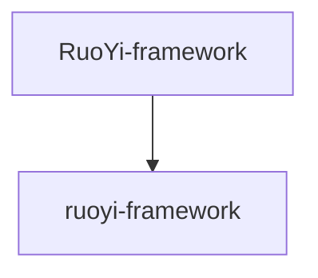

# 基础信息

|      |      |
|------|------|
| 编码语言 | .java |
| 代码路径 | RuoYi-framework |
| 包名 | RuoYi-framework |
| 概述说明 | AsyncFactory实现异步任务，ShutdownManager确保资源释放，AsyncManager高效执行任务。系统通过多种服务和过滤器管理会话、权限和安全性，动态数据源和拦截器优化资源使用和数据一致性。配置类确保框架初始化，AOP和Shiro提供全面安全防护。全局异常处理器增强系统健壮性。 |

# 说明

AsyncFactory类通过TimerTask实现异步任务处理，具备同步会话、记录操作日志和登录信息的功能，提升系统可维护性和安全性。ShutdownManager类在销毁时关闭会话验证、异步任务和缓存管理，确保资源合理释放和系统稳定性。AsyncManager类采用单例模式，延迟10毫秒执行异步任务，提供任务执行和线程池关闭功能，确保任务高效执行和资源合理释放。动态数据源类继承自抽象路由数据源，主要负责设置默认数据源和目标数据源，并通过特定方法获取当前所使用的数据源类型，实现数据源动态切换。拦截器类SameUrlDataInterceptor通过比较请求参数和时间间隔判断是否为重复请求，有效避免用户多次提交相同数据，提高系统稳定性和数据一致性。MyBatis配置类用于设置别名包、Mapper位置和SqlSessionFactory，确保框架正确初始化和运行。Shiro配置类集成会话管理、缓存、验证码处理和过滤器设置，提供全面的安全防护基础。全局异常处理器捕获和处理各类异常，生成错误信息返回给调用方，提高系统健壮性和用户体验。LogAspect类用于记录操作日志，确保系统操作的可追踪性和安全性。DataSourceAspect类负责动态切换数据源，适用于多数据源环境。DataScopeAspect类实现数据权限过滤，灵活管理用户数据访问范围。PermissionsAspect类处理权限相关注解，确保只有具备相应权限的用户或系统能执行受保护的方法，增强系统安全性和可控性。

### 包内部结构视图

这段流程图展示了RuoYi-framework项目的路径层级关系。RuoYi-framework是顶级目录，其下包含一个名为ruoyi-framework的子目录。这种结构通常用于组织框架的核心代码或模块，便于管理和维护。

# 文件列表 File List

| 名称   | 类型  | 说明 |
|-------|------|-------------|
| [ruoyi-framework](ruoyi-framework/src/main/java/com/_module.md) | module | AsyncFactory实现异步任务，ShutdownManager确保资源释放，AsyncManager高效执行任务。系统通过多种服务和过滤器管理会话、权限和安全性，动态数据源和拦截器优化资源使用和数据一致性。配置类确保框架初始化，AOP和Shiro提供全面安全防护。全局异常处理器增强系统健壮性。 |

