# 基础信息

|      |      |
|------|------|
| 编码语言 | .java |
| 代码路径 | RuoYi-framework/ruoyi-framework/src/main/java/com/ruoyi/framework |
| 包名 | RuoYi-framework.ruoyi-framework.src.main.java.com.ruoyi.framework |
| 概述说明 | AsyncFactory实现异步任务，ShutdownManager确保资源释放，AsyncManager高效执行任务。系统通过多种服务和过滤器管理会话、权限和安全性，动态数据源和拦截器优化资源使用和数据一致性。配置类确保框架初始化，AOP和Shiro提供全面安全防护。全局异常处理器增强系统健壮性。 |

# 说明

AsyncFactory类通过TimerTask实现异步任务处理，具备同步会话、记录操作日志和登录信息的功能，提升系统可维护性和安全性。ShutdownManager类在销毁时关闭会话验证、异步任务和缓存管理，确保资源合理释放和系统稳定性。AsyncManager类采用单例模式，延迟10毫秒执行异步任务，提供任务执行和线程池关闭功能，确保任务高效执行和资源合理释放。动态数据源类继承自抽象路由数据源，主要负责设置默认数据源和目标数据源，并通过特定方法获取当前所使用的数据源类型，实现数据源动态切换。拦截器类SameUrlDataInterceptor通过比较请求参数和时间间隔判断是否为重复请求，有效避免用户多次提交相同数据，提高系统稳定性和数据一致性。MyBatis配置类用于设置别名包、Mapper位置和SqlSessionFactory，确保框架正确初始化和运行。Shiro配置类集成会话管理、缓存、验证码处理和过滤器设置，提供全面的安全防护基础。全局异常处理器捕获和处理各类异常，生成错误信息返回给调用方，提高系统健壮性和用户体验。LogAspect类用于记录操作日志，确保系统操作的可追踪性和安全性。DataSourceAspect类负责动态切换数据源，适用于多数据源环境。DataScopeAspect类实现数据权限过滤，灵活管理用户数据访问范围。PermissionsAspect类处理权限相关注解，确保只有具备相应权限的用户或系统能执行受保护的方法，增强系统安全性和可控性。

### 包内部结构视图

```mermaid
graph TD
    framework --> manager
    framework --> shiro
    framework --> datasource
    framework --> interceptor
    framework --> config
    framework --> web
    framework --> aspectj
    manager --> factory
    manager --> ShutdownManager.java
    manager --> AsyncManager.java
    factory --> AsyncFactory.java
    shiro --> util
    shiro --> rememberMe
    shiro --> realm
    shiro --> service
    shiro --> session
    shiro --> web
    util --> AuthorizationUtils.java
    rememberMe --> CustomCookieRememberMeManager.java
    realm --> UserRealm.java
    service --> SysRegisterService.java
    service --> SysShiroService.java
    service --> SysLoginService.java
    service --> SysPasswordService.java
    session --> OnlineSession.java
    session --> OnlineSessionFactory.java
    session --> OnlineSessionDAO.java
    web --> filter
    web --> CustomShiroFilterFactoryBean.java
    web --> session
    filter --> sync
    filter --> LogoutFilter.java
    filter --> captcha
    filter --> online
    filter --> kickout
    sync --> SyncOnlineSessionFilter.java
    captcha --> CaptchaValidateFilter.java
    online --> OnlineSessionFilter.java
    kickout --> KickoutSessionFilter.java
    session --> OnlineWebSessionManager.java
    session --> SpringSessionValidationScheduler.java
    datasource --> DynamicDataSource.java
    interceptor --> RepeatSubmitInterceptor.java
    interceptor --> impl
    impl --> SameUrlDataInterceptor.java
    config --> MyBatisConfig.java
    config --> CaptchaConfig.java
    config --> KaptchaTextCreator.java
    config --> I18nConfig.java
    config --> ResourcesConfig.java
    config --> properties
    config --> FilterConfig.java
    config --> DruidConfig.java
    config --> ApplicationConfig.java
    config --> ShiroConfig.java
    properties --> PermitAllUrlProperties.java
    properties --> DruidProperties.java
    web --> service
    web --> domain
    web --> exception
    service --> PermissionService.java
    service --> ConfigService.java
    service --> CacheService.java
    service --> DictService.java
    domain --> Server.java
    domain --> server
    server --> Mem.java
    server --> Sys.java
    server --> SysFile.java
    server --> Cpu.java
    server --> Jvm.java
    exception --> GlobalExceptionHandler.java
    aspectj --> LogAspect.java
    aspectj --> DataSourceAspect.java
    aspectj --> DataScopeAspect.java
    aspectj --> PermissionsAspect.java
```

该流程图展示了RuoYi框架中各个模块的层级关系，从顶层模块如`manager`、`shiro`、`datasource`等，逐步细化到具体的类文件，如`AsyncFactory.java`、`UserRealm.java`等。每个模块下的子模块和类文件都清晰地展示了其所属关系，帮助开发者快速理解项目的结构。

# 文件列表 File List

| 名称   | 类型  | 说明 |
|-------|------|-------------|
| [manager](manager/_module.md) | package | AsyncFactory类同步会话并记录日志，TimerTask处理异步任务。ShutdownManager类销毁时关闭会话、任务和缓存。AsyncManager类单例设计，延迟执行异步任务，管理线程池。 |
| [aspectj](aspectj/_module.md) | package | LogAspect记录操作日志，DataSourceAspect动态切换数据源，DataScopeAspect过滤数据权限，PermissionsAspect处理权限注解。 |
| [web](web/_module.md) | package | 权限、配置、缓存、字典服务管理资源；服务器、内存、系统、CPU、JVM类监控优化；全局异常处理器提升系统健壮性。 |
| [config](config/_module.md) | package | MyBatis配置类设置别名包、Mapper位置和SqlSessionFactory。验证码生成器配置灵活生成。KaptchaTextCreator生成数学表达式验证码。I18nConfig管理语言切换。配置类设置首页、资源路径和拦截器。收集Anonymous注解URL路径。DruidProperties配置数据源参数。XSS过滤器防护跨站脚本攻击。DruidConfig管理主从数据源。AOP代理自动扫描Mapper类。Shiro配置类集成安全管理功能。 |
| [interceptor](interceptor/_module.md) | package | 抽象类实现拦截器功能，防止重复提交，确保请求唯一性，提升系统稳定性和数据一致性。 |
| [datasource](datasource/_module.md) | package | 动态数据源类继承抽象路由数据源，设置默认和目标数据源，获取当前类型。 |
| [shiro](shiro/_module.md) | package | 清理授权缓存和获取自定义Realm确保权限更新。各类服务管理登录、注册、会话和密码验证，优化系统安全与性能。会话管理工具同步、验证和清理会话数据，确保一致性和安全性。 |

