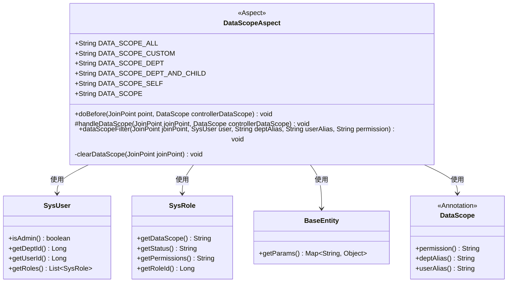
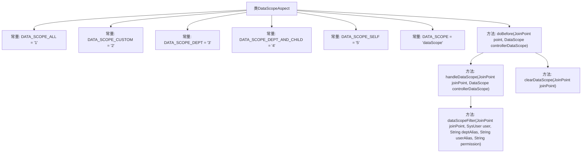

# 基础信息

|      |      |
|------|------|
| 编码语言 | .java |
| 代码路径 | RuoYi-framework/ruoyi-framework/src/main/java/com/ruoyi/framework/aspectj/DataScopeAspect.java |
| 包名 | com.ruoyi.framework.aspectj |
| 依赖项 | ['java.util.ArrayList', 'java.util.List', 'org.aspectj.lang.JoinPoint', 'org.aspectj.lang.annotation.Aspect', 'org.aspectj.lang.annotation.Before', 'org.springframework.stereotype.Component', 'com.ruoyi.common.annotation.DataScope', 'com.ruoyi.common.constant.UserConstants', 'com.ruoyi.common.core.context.PermissionContextHolder', 'com.ruoyi.common.core.domain.BaseEntity', 'com.ruoyi.common.core.domain.entity.SysRole', 'com.ruoyi.common.core.domain.entity.SysUser', 'com.ruoyi.common.core.text.Convert', 'com.ruoyi.common.utils.ShiroUtils', 'com.ruoyi.common.utils.StringUtils'] |
| 概述说明 | DataScopeAspect类实现数据权限过滤，支持多种权限范围。 |

# 说明

DataScopeAspect类用于实现数据权限过滤功能，支持多种权限控制模式，包括全部数据访问、自定义权限、部门内数据访问、部门及以下层级数据访问，以及仅限本人数据访问。通过这些模式，可以灵活地控制不同用户对数据的访问范围，确保数据安全性和权限管理的有效性。

# 类列表 Class Summary

| 名称   | 类型  | 说明 |
|-------|------|-------------|
| DataScopeAspect | class | DataScopeAspect类实现数据权限过滤，支持全部、自定义、部门、部门及以下、仅本人权限。 |

## 类 DataScopeAspect

|      |      |
|------|------|
| 访问范围 | @Aspect;@Component;public |
| 类型 | class |
| 名称 | DataScopeAspect |
| 说明 | DataScopeAspect类实现数据权限过滤，支持全部、自定义、部门、部门及以下、仅本人权限。 |

### UML类图

**描述：**  
`DataScopeAspect` 是一个切面类，用于处理数据权限的过滤逻辑。它通过注解 `@Before` 在方法执行前进行拦截，并根据用户角色和数据权限配置生成相应的 SQL 过滤条件。该类依赖于 `SysUser` 和 `SysRole` 类来获取用户信息和角色权限，并通过 `BaseEntity` 类将生成的 SQL 条件注入到查询参数中。`DataScope` 注解用于标识需要处理的数据权限范围。

### 内部方法调用关系图

**描述**：该代码定义了一个名为`DataScopeAspect`的切面类，用于处理数据权限的过滤。类中包含了多个常量定义，表示不同的数据权限范围。`doBefore`方法在切点执行前调用，负责清除数据权限并处理数据范围。`handleDataScope`方法根据当前用户的角色和权限，调用`dataScopeFilter`方法生成SQL过滤条件。`clearDataScope`方法用于清空数据权限参数，防止注入。整个流程通过切面机制实现数据权限的动态控制。

### 字段列表 Field List

| 名称  | 类型  | 说明 |
|-------|-------|------|
| DATA_SCOPE_ALL = "1" | String | 定义常量DATA_SCOPE_ALL，值为"1"。 |
| DATA_SCOPE_DEPT = "3" | String | 定义常量DATA_SCOPE_DEPT，值为"3"。 |
| DATA_SCOPE_CUSTOM = "2" | String | 定义常量DATA_SCOPE_CUSTOM，值为"2"。 |
| DATA_SCOPE_SELF = "5" | String | 定义常量DATA_SCOPE_SELF，值为"5"。 |
| DATA_SCOPE_DEPT_AND_CHILD = "4" | String | DATA_SCOPE_DEPT_AND_CHILD常量为字符串"4"。 |
| DATA_SCOPE = "dataScope" | String | 定义常量DATA_SCOPE，值为"dataScope"。 |

### 方法列表 Method List

| 名称  | 类型  | 说明 |
|-------|-------|------|
| doBefore | void | 方法在执行前清除并处理数据范围。 |
| clearDataScope | void | 清除数据范围，检查参数并更新BaseEntity的DATA_SCOPE为空。 |
| dataScopeFilter | void | 根据用户角色和数据权限动态生成SQL过滤条件。 |
| handleDataScope | void | 处理数据范围，管理员不过滤，非管理员根据权限过滤。 |

