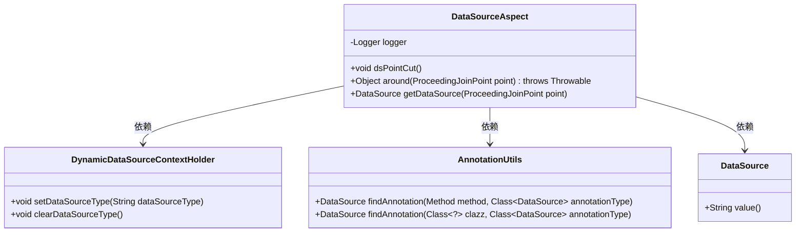
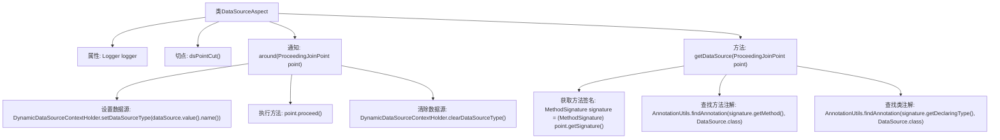

# 基础信息

|      |      |
|------|------|
| 编码语言 | .java |
| 代码路径 | RuoYi-framework/ruoyi-framework/src/main/java/com/ruoyi/framework/aspectj/DataSourceAspect.java |
| 包名 | com.ruoyi.framework.aspectj |
| 依赖项 | ['java.util.Objects', 'org.aspectj.lang.ProceedingJoinPoint', 'org.aspectj.lang.annotation.Around', 'org.aspectj.lang.annotation.Aspect', 'org.aspectj.lang.annotation.Pointcut', 'org.aspectj.lang.reflect.MethodSignature', 'org.slf4j.Logger', 'org.slf4j.LoggerFactory', 'org.springframework.core.annotation.AnnotationUtils', 'org.springframework.core.annotation.Order', 'org.springframework.stereotype.Component', 'com.ruoyi.common.annotation.DataSource', 'com.ruoyi.common.config.datasource.DynamicDataSourceContextHolder', 'com.ruoyi.common.utils.StringUtils'] |
| 概述说明 | DataSourceAspect类通过注解实现数据源动态切换和清理。 |

# 说明

DataSourceAspect类负责实现数据源的动态切换功能，通过注解机制来控制数据源的选择和切换。该类的核心职责包括在运行时根据注解配置自动选择合适的数据源，并在操作完成后进行必要的清理工作，以确保系统资源的高效管理和数据一致性。这一设计使得数据源的管理更加灵活和可控，适用于多数据源环境下的复杂业务场景。

# 类列表 Class Summary

| 名称   | 类型  | 说明 |
|-------|------|-------------|
| DataSourceAspect | class | DataSourceAspect类实现数据源动态切换，使用注解控制并清理。 |

## 类 DataSourceAspect

|      |      |
|------|------|
| 访问范围 | @Aspect;@Order(1);@Component;public |
| 类型 | class |
| 名称 | DataSourceAspect |
| 说明 | DataSourceAspect类实现数据源动态切换，使用注解控制并清理。 |

### UML类图

**描述：**
`DataSourceAspect` 是一个切面类，用于处理数据源的动态切换。它通过 `@Around` 注解在方法执行前后进行数据源的设置和清理。`DynamicDataSourceContextHolder` 用于管理当前线程的数据源类型，`AnnotationUtils` 用于查找方法或类上的 `@DataSource` 注解。该切面类依赖于这些工具类来实现数据源的动态切换功能。

### 内部方法调用关系图

这段代码定义了一个名为 `DataSourceAspect` 的切面类，用于处理数据源的动态切换。代码通过 `@Around` 注解实现了环绕通知，在执行目标方法前后分别设置了数据源和清除了数据源。`getDataSource` 方法用于获取需要切换的数据源，通过查找方法或类上的 `@DataSource` 注解来确定数据源类型。整个流程确保了在执行目标方法时，数据源的切换和清理操作能够正确进行。

### 字段列表 Field List

| 名称  | 类型  | 说明 |
|-------|-------|------|
| logger = LoggerFactory.getLogger(getClass()) | Logger | 保护日志记录器实例化，使用当前类名作为标识。 |

### 方法列表 Method List

| 名称  | 类型  | 说明 |
|-------|-------|------|
| dsPointCut | void | 定义切点，匹配带有DataSource注解的方法或类。 |
| around | Object | 环绕切面设置并清除动态数据源类型。 |
| getDataSource | DataSource | 方法获取数据源注解，优先从方法获取，其次从类获取。 |

