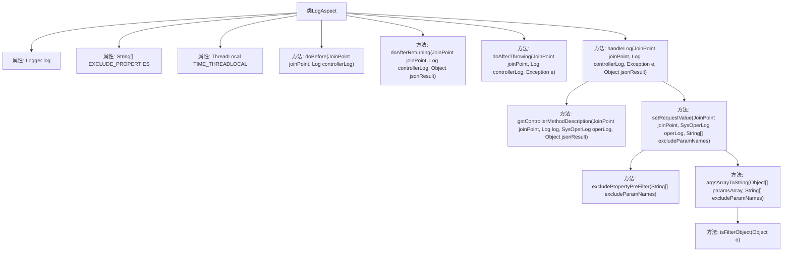

# 基础信息

|      |      |
|------|------|
| 编码语言 | .java |
| 代码路径 | RuoYi-framework/ruoyi-framework/src/main/java/com/ruoyi/framework/aspectj/LogAspect.java |
| 包名 | com.ruoyi.framework.aspectj |
| 依赖项 | ['java.util.Collection', 'java.util.Map', 'javax.servlet.http.HttpServletRequest', 'javax.servlet.http.HttpServletResponse', 'org.apache.commons.lang3.ArrayUtils', 'org.aspectj.lang.JoinPoint', 'org.aspectj.lang.annotation.AfterReturning', 'org.aspectj.lang.annotation.AfterThrowing', 'org.aspectj.lang.annotation.Aspect', 'org.aspectj.lang.annotation.Before', 'org.slf4j.Logger', 'org.slf4j.LoggerFactory', 'org.springframework.core.NamedThreadLocal', 'org.springframework.stereotype.Component', 'org.springframework.validation.BindingResult', 'org.springframework.web.multipart.MultipartFile', 'com.alibaba.fastjson.JSONObject', 'com.alibaba.fastjson.support.spring.PropertyPreFilters', 'com.ruoyi.common.annotation.Log', 'com.ruoyi.common.core.domain.entity.SysUser', 'com.ruoyi.common.core.text.Convert', 'com.ruoyi.common.enums.BusinessStatus', 'com.ruoyi.common.utils.ExceptionUtil', 'com.ruoyi.common.utils.ServletUtils', 'com.ruoyi.common.utils.ShiroUtils', 'com.ruoyi.common.utils.StringUtils', 'com.ruoyi.framework.manager.AsyncManager', 'com.ruoyi.framework.manager.factory.AsyncFactory', 'com.ruoyi.system.domain.SysOperLog'] |
| 概述说明 | LogAspect类记录操作日志，处理请求、异常，排除敏感字段，计算耗时并保存日志。 |

# 说明

LogAspect类主要用于记录操作日志，其功能包括在请求处理前后进行日志记录，捕获并处理异常情况，自动排除敏感字段信息，计算请求处理的总耗时，并将最终的日志信息保存到数据库中。该类通过全面的日志管理，确保系统操作的可追踪性和安全性。

# 类列表 Class Summary

| 名称   | 类型  | 说明 |
|-------|------|-------------|
| LogAspect | class | LogAspect类用于记录操作日志，处理请求前后及异常，排除敏感字段，计算耗时，保存日志到数据库。 |


## 类 LogAspect

|      |      |
|------|------|
| 访问范围 | @Aspect;@Component;public |
| 类型 | class |
| 名称 | LogAspect |
| 说明 | LogAspect类用于记录操作日志，处理请求前后及异常，排除敏感字段，计算耗时，保存日志到数据库。 |


### UML类图

```mermaid
classDiagram
    class LogAspect {
        -Logger log
        -String[] EXCLUDE_PROPERTIES
        -ThreadLocal~Long~ TIME_THREADLOCAL
        +LogAspect()
        +void doBefore(JoinPoint joinPoint, Log controllerLog)
        +void doAfterReturning(JoinPoint joinPoint, Log controllerLog, Object jsonResult)
        +void doAfterThrowing(JoinPoint joinPoint, Log controllerLog, Exception e)
        #void handleLog(JoinPoint joinPoint, Log controllerLog, Exception e, Object jsonResult)
        +void getControllerMethodDescription(JoinPoint joinPoint, Log log, SysOperLog operLog, Object jsonResult)
        -void setRequestValue(JoinPoint joinPoint, SysOperLog operLog, String[] excludeParamNames)
        +PropertyPreFilters.MySimplePropertyPreFilter excludePropertyPreFilter(String[] excludeParamNames)
        -String argsArrayToString(Object[] paramsArray, String[] excludeParamNames)
        +boolean isFilterObject(Object o)
    }

    class Log {
        <<Interface>>
        +BusinessType businessType()
        +String title()
        +OperatorType operatorType()
        +boolean isSaveRequestData()
        +boolean isSaveResponseData()
        +String[] excludeParamNames()
    }

    class SysOperLog {
        +void setStatus(int status)
        +void setOperIp(String ip)
        +void setOperUrl(String url)
        +void setOperName(String name)
        +void setDeptName(String deptName)
        +void setErrorMsg(String errorMsg)
        +void setMethod(String method)
        +void setRequestMethod(String requestMethod)
        +void setCostTime(long costTime)
        +void setOperParam(String param)
        +void setJsonResult(String jsonResult)
        +void setBusinessType(int businessType)
        +void setTitle(String title)
        +void setOperatorType(int operatorType)
    }

    class PropertyPreFilters {
        +MySimplePropertyPreFilter addFilter()
        +MySimplePropertyPreFilter addExcludes(String[] excludes)
        class MySimplePropertyPreFilter {
            <<Interface>>
        }
    }

    LogAspect --> Log : 依赖
    LogAspect --> SysOperLog : 依赖
    LogAspect --> PropertyPreFilters : 依赖
```

### 描述
`LogAspect` 是一个切面类，用于处理日志记录。它通过 `@Before`、`@AfterReturning` 和 `@AfterThrowing` 注解在方法执行的不同阶段记录日志。`Log` 是一个接口，定义了日志记录所需的操作。`SysOperLog` 是一个操作日志类，用于存储日志信息。`PropertyPreFilters` 用于过滤敏感属性。该类图展示了 `LogAspect` 如何依赖 `Log`、`SysOperLog` 和 `PropertyPreFilters` 来完成日志记录功能。


### 内部方法调用关系图



这段代码是一个使用AOP（面向切面编程）的日志切面类，主要用于在方法执行前后记录操作日志。它通过`@Before`、`@AfterReturning`和`@AfterThrowing`注解分别在方法执行前、执行后和抛出异常时执行相应的日志记录操作。`handleLog`方法是核心，负责获取用户信息、操作日志信息，并将日志保存到数据库中。代码中还包含了对敏感属性的过滤和请求参数的处理，确保日志记录的安全性和完整性。

### 字段列表 Field List

| 名称  | 类型  | 说明 |
|-------|-------|------|
| log = LoggerFactory.getLogger(LogAspect.class) | Logger | LogAspect类中定义了一个私有的静态日志记录器。 |
| EXCLUDE_PROPERTIES = { "password", "oldPassword", "newPassword", "confirmPassword" } | String[] | 代码定义排除属性数组，包含密码相关字段。 |
| TIME_THREADLOCAL = new NamedThreadLocal<Long>("Cost Time") | ThreadLocal<Long> | 定义线程局部变量TIME_THREADLOCAL，用于存储耗时。 |

### 方法列表 Method List

| 名称  | 类型  | 说明 |
|-------|-------|------|
| doBefore | void | 方法在执行前记录当前时间到线程本地变量。 |
| argsArrayToString | String | 将对象数组转换为字符串，排除指定参数，返回结果。 |
| doAfterReturning | void | 方法在控制器日志注解后执行，处理日志并返回结果。 |
| setRequestValue | void | 方法从请求中提取参数并设置日志操作参数，限制长度为2000字符。 |
| doAfterThrowing | void | 切面方法捕获异常并处理日志。 |
| excludePropertyPreFilter | PropertyPreFilters.MySimplePropertyPreFilter | 方法生成属性预过滤器，排除指定参数名。 |
| handleLog | void | 处理日志记录，包括用户信息、操作状态、IP地址、方法名称、请求方式及异常信息，并保存至数据库。 |
| getControllerMethodDescription | void | 设置操作日志信息，包括动作、标题、操作人类别，并保存请求和响应数据。 |
| isFilterObject | boolean | 方法判断对象是否为过滤对象，支持数组、集合、映射及特定类型检查。 |


