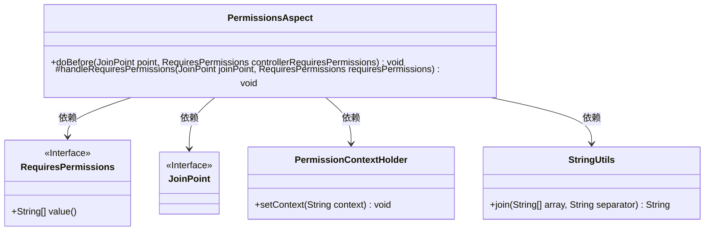
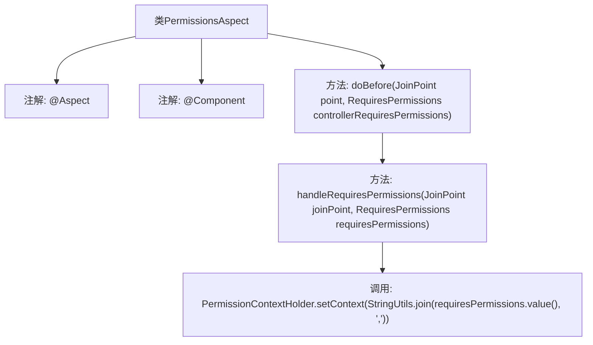

# 基础信息

|      |      |
|------|------|
| 编码语言 | .java |
| 代码路径 | RuoYi-framework/ruoyi-framework/src/main/java/com/ruoyi/framework/aspectj/PermissionsAspect.java |
| 包名 | com.ruoyi.framework.aspectj |
| 依赖项 | ['org.apache.shiro.authz.annotation.RequiresPermissions', 'org.aspectj.lang.JoinPoint', 'org.aspectj.lang.annotation.Aspect', 'org.aspectj.lang.annotation.Before', 'org.springframework.stereotype.Component', 'com.ruoyi.common.core.context.PermissionContextHolder', 'com.ruoyi.common.utils.StringUtils'] |
| 概述说明 | PermissionsAspect类处理权限注解并设置权限上下文。 |

# 说明

PermissionsAspect类主要负责处理与权限相关的注解，并在方法执行之前设置相应的权限上下文。该类的作用是确保在执行特定方法时，系统能够根据注解中定义的权限要求进行适当的权限检查和配置。通过这种方式，PermissionsAspect类帮助实现权限管理的自动化，确保只有具备相应权限的用户或系统能够执行受保护的方法，从而增强系统的安全性和可控性。

# 类列表 Class Summary

| 名称   | 类型  | 说明 |
|-------|------|-------------|
| PermissionsAspect | class | PermissionsAspect类用于处理权限注解，并在方法执行前设置权限上下文。 |

## 类 PermissionsAspect

|      |      |
|------|------|
| 访问范围 | @Aspect;@Component;public |
| 类型 | class |
| 名称 | PermissionsAspect |
| 说明 | PermissionsAspect类用于处理权限注解，并在方法执行前设置权限上下文。 |

### UML类图

**描述：**  
`PermissionsAspect` 类是一个切面类，用于在方法执行前处理权限检查。它依赖于 `RequiresPermissions` 接口获取权限信息，使用 `JoinPoint` 获取方法执行的上下文，并通过 `PermissionContextHolder` 设置权限上下文。`StringUtils` 工具类用于将权限数组拼接为字符串。该切面通过 `@Before` 注解在目标方法执行前调用 `doBefore` 方法，进而调用 `handleRequiresPermissions` 方法处理权限逻辑。

### 内部方法调用关系图

这段代码定义了一个名为`PermissionsAspect`的类，它是一个切面类，使用了`@Aspect`和`@Component`注解。类中包含两个方法：`doBefore`和`handleRequiresPermissions`。`doBefore`方法在带有`@RequiresPermissions`注解的方法执行前被调用，它会调用`handleRequiresPermissions`方法。`handleRequiresPermissions`方法将`RequiresPermissions`注解中的权限值拼接成字符串，并通过`PermissionContextHolder.setContext`方法设置到上下文中。整个流程展示了如何在方法执行前处理权限验证的逻辑。

### 字段列表 Field List

| 名称  | 类型  | 说明 |
|-------|-------|------|

### 方法列表 Method List

| 名称  | 类型  | 说明 |
|-------|-------|------|
| doBefore | void | 方法doBefore处理权限注解，调用handleRequiresPermissions。 |
| handleRequiresPermissions | void | 处理权限请求，设置权限上下文。 |

