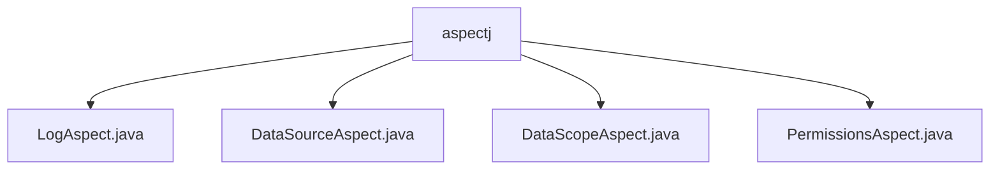

# 基础信息

|      |      |
|------|------|
| 编码语言 | .java |
| 代码路径 | RuoYi-framework/ruoyi-framework/src/main/java/com/ruoyi/framework/aspectj |
| 包名 | RuoYi-framework.ruoyi-framework.src.main.java.com.ruoyi.framework.aspectj |
| 概述说明 | LogAspect记录操作日志，DataSourceAspect动态切换数据源，DataScopeAspect过滤数据权限，PermissionsAspect处理权限注解。 |

# 说明

LogAspect类用于记录操作日志，包括请求处理前后的日志记录、异常捕获、敏感字段排除、耗时计算及日志保存，确保系统操作的可追踪性和安全性。DataSourceAspect类负责动态切换数据源，通过注解机制在运行时选择合适的数据源并进行清理，适用于多数据源环境。DataScopeAspect类实现数据权限过滤，支持多种权限控制模式，灵活管理用户数据访问范围。PermissionsAspect类处理权限相关注解，在方法执行前设置权限上下文，确保只有具备相应权限的用户或系统能执行受保护的方法，增强系统安全性和可控性。

### 包内部结构视图

该流程图展示了RuoYi框架中`aspectj`目录下的四个Aspect类文件的层级关系。`aspectj`作为父节点，包含了`LogAspect.java`、`DataSourceAspect.java`、`DataScopeAspect.java`和`PermissionsAspect.java`四个子节点，这些文件分别用于处理日志、数据源、数据范围和权限相关的切面逻辑。

# 文件列表 File List

| 名称   | 类型  | 说明 |
|-------|------|-------------|
| [PermissionsAspect.java](PermissionsAspect.md) | file | PermissionsAspect类处理权限注解并设置权限上下文。 |
| [DataScopeAspect.java](DataScopeAspect.md) | file | DataScopeAspect类实现数据权限过滤，支持多种权限范围。 |
| [DataSourceAspect.java](DataSourceAspect.md) | file | DataSourceAspect类通过注解实现数据源动态切换和清理。 |
| [LogAspect.java](LogAspect.md) | file | LogAspect类记录操作日志，处理请求、异常，排除敏感字段，计算耗时并保存日志。 |

