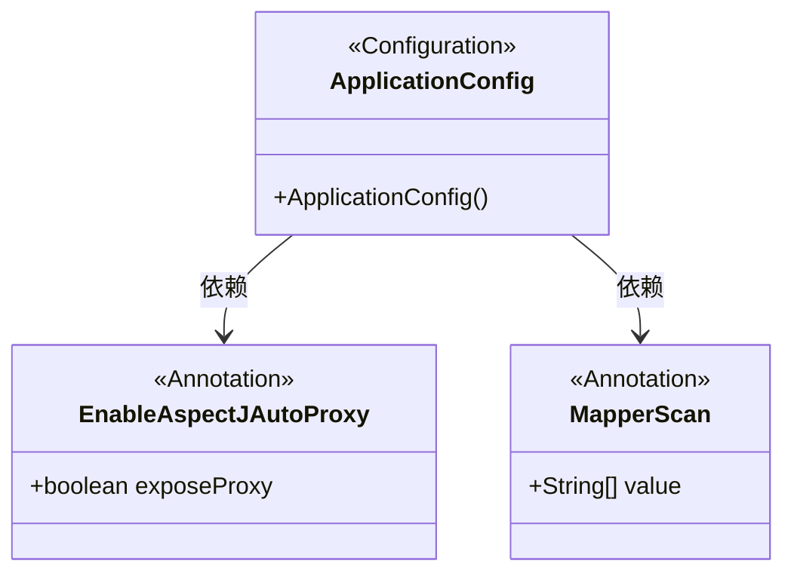
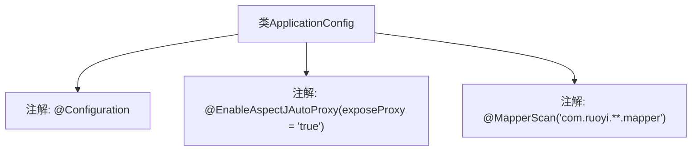

# 基础信息

|      |      |
|------|------|
| 编码语言 | .java |
| 代码路径 | RuoYi-framework/ruoyi-framework/src/main/java/com/ruoyi/framework/config/ApplicationConfig.java |
| 包名 | com.ruoyi.framework.config |
| 依赖项 | ['org.mybatis.spring.annotation.MapperScan', 'org.springframework.context.annotation.Configuration', 'org.springframework.context.annotation.EnableAspectJAutoProxy'] |
| 概述说明 | 配置类启用AOP代理并扫描指定包中的Mapper类。 |

# 说明

该配置类的主要功能是启用AOP（面向切面编程）代理，并自动扫描指定包路径下的Mapper类。通过启用AOP代理，可以在运行时动态地为这些Mapper类添加额外的行为或功能，如事务管理、日志记录等。同时，扫描指定包的功能确保所有符合条件的Mapper类都能被自动识别和处理，从而提高代码的模块化和可维护性。这一配置简化了开发流程，减少了手动配置的工作量，使得系统更加灵活和易于扩展。

# 类列表 Class Summary

| 名称   | 类型  | 说明 |
|-------|------|-------------|
| ApplicationConfig | class | 配置类启用AOP代理并扫描指定包中的Mapper类。 |

## 类 ApplicationConfig

|      |      |
|------|------|
| 访问范围 | @Configuration;// 表示通过aop框架暴露该代理对象,AopContext能够访问;@EnableAspectJAutoProxy(exposeProxy = true);// 指定要扫描的Mapper类的包的路径;@MapperScan("com.ruoyi.**.mapper");public |
| 类型 | class |
| 名称 | ApplicationConfig |
| 说明 | 配置类启用AOP代理并扫描指定包中的Mapper类。 |

### UML类图

这段代码定义了一个名为 `ApplicationConfig` 的配置类，使用了 `@Configuration` 注解标记为配置类。该类通过 `@EnableAspectJAutoProxy` 注解启用了 AspectJ 自动代理，并设置了 `exposeProxy` 属性为 `true`，使得代理对象可以通过 `AopContext` 访问。同时，通过 `@MapperScan` 注解指定了要扫描的 Mapper 类的包路径。类图展示了 `ApplicationConfig` 类与 `EnableAspectJAutoProxy` 和 `MapperScan` 注解之间的依赖关系。

### 内部方法调用关系图

这段代码定义了一个名为 `ApplicationConfig` 的配置类，使用了 `@Configuration` 注解表明它是一个配置类。通过 `@EnableAspectJAutoProxy(exposeProxy = 'true')` 注解启用了AspectJ自动代理，并暴露代理对象以便 `AopContext` 可以访问。`@MapperScan('com.ruoyi.**.mapper')` 注解指定了要扫描的Mapper类所在的包路径，确保这些类能够被正确识别和加载。

### 字段列表 Field List

| 名称  | 类型  | 说明 |
|-------|-------|------|

### 方法列表 Method List

| 名称  | 类型  | 说明 |
|-------|-------|------|

