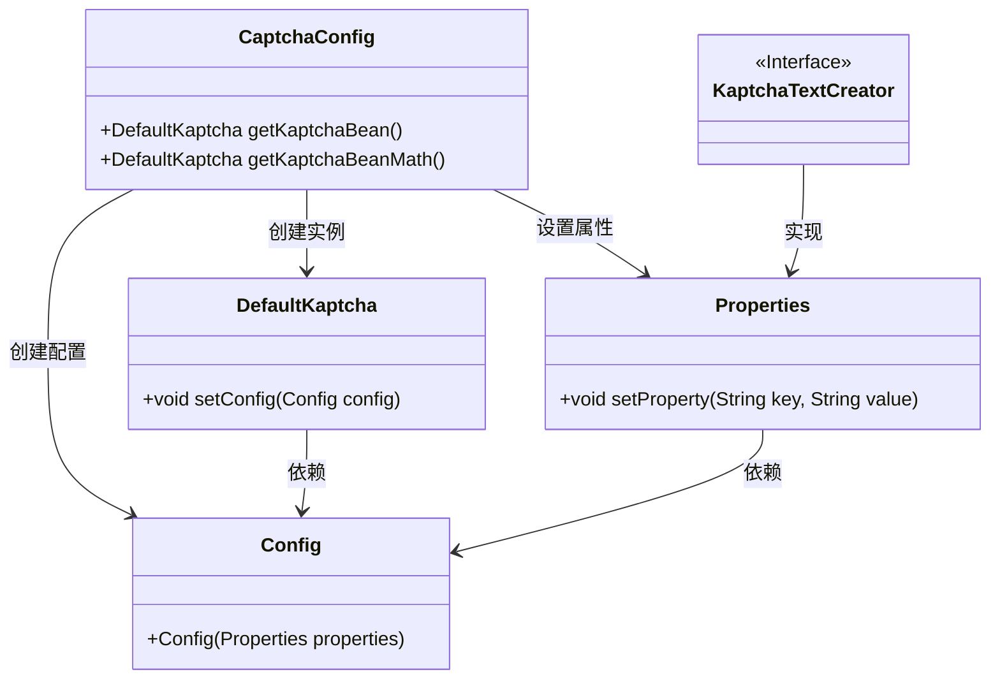

# 基础信息

|      |      |
|------|------|
| 编码语言 | .java |
| 代码路径 | RuoYi-framework/ruoyi-framework/src/main/java/com/ruoyi/framework/config/CaptchaConfig.java |
| 包名 | com.ruoyi.framework.config |
| 依赖项 | ['java.util.Properties', 'org.springframework.context.annotation.Bean', 'org.springframework.context.annotation.Configuration', 'com.google.code.kaptcha.impl.DefaultKaptcha', 'com.google.code.kaptcha.util.Config', 'com.google.code.kaptcha.Constants'] |
| 概述说明 | CaptchaConfig类定义两个验证码生成器Bean，配置边框、颜色、尺寸、字体等属性。 |

# 说明

配置类CaptchaConfig定义了两个验证码生成器的Bean，这些Bean分别配置了边框、颜色、尺寸、字体和样式等属性。通过这种方式，可以灵活地生成具有不同外观和特性的验证码，以满足不同的安全需求和应用场景。

# 类列表 Class Summary

| 名称   | 类型  | 说明 |
|-------|------|-------------|
| CaptchaConfig | class | 配置类CaptchaConfig定义了两个验证码生成器Bean，分别设置边框、颜色、尺寸、字体、样式等属性。 |

## 类 CaptchaConfig

|      |      |
|------|------|
| 访问范围 | @Configuration;public |
| 类型 | class |
| 名称 | CaptchaConfig |
| 说明 | 配置类CaptchaConfig定义了两个验证码生成器Bean，分别设置边框、颜色、尺寸、字体、样式等属性。 |

### UML类图

这段代码定义了一个 `CaptchaConfig` 类，用于配置和生成验证码的 `DefaultKaptcha` 实例。`CaptchaConfig` 类包含两个方法 `getKaptchaBean` 和 `getKaptchaBeanMath`，分别用于生成不同类型的验证码。通过 `Properties` 类设置验证码的各种属性，并使用 `Config` 类将这些属性应用到 `DefaultKaptcha` 实例中。`KaptchaTextCreator` 是一个接口，用于自定义验证码文本生成器。

### 内部方法调用关系图

```mermaid
graph TD
    A["类CaptchaConfig"]
    B["方法: getKaptchaBean()"]
    C["方法: getKaptchaBeanMath()"]
    D["创建对象: DefaultKaptcha defaultKaptcha"]
    E["创建对象: Properties properties"]
    F["设置属性: properties.setProperty(KAPTCHA_BORDER, 'yes')"]
    G["设置属性: properties.setProperty(KAPTCHA_TEXTPRODUCER_FONT_COLOR, 'black')"]
    H["设置属性: properties.setProperty(KAPTCHA_IMAGE_WIDTH, '160')"]
    I["设置属性: properties.setProperty(KAPTCHA_IMAGE_HEIGHT, '60')"]
    J["设置属性: properties.setProperty(KAPTCHA_TEXTPRODUCER_FONT_SIZE, '38')"]
    K["设置属性: properties.setProperty(KAPTCHA_SESSION_CONFIG_KEY, 'kaptchaCode')"]
    L["设置属性: properties.setProperty(KAPTCHA_TEXTPRODUCER_CHAR_LENGTH, '4')"]
    M["设置属性: properties.setProperty(KAPTCHA_TEXTPRODUCER_FONT_NAMES, 'Arial,Courier')"]
    N["设置属性: properties.setProperty(KAPTCHA_OBSCURIFICATOR_IMPL, 'com.google.code.kaptcha.impl.ShadowGimpy')"]
    O["创建对象: Config config"]
    P["设置配置: defaultKaptcha.setConfig(config)"]
    Q["返回对象: defaultKaptcha"]
    R["设置属性: properties.setProperty(KAPTCHA_BORDER_COLOR, '105,179,90')"]
    S["设置属性: properties.setProperty(KAPTCHA_TEXTPRODUCER_FONT_COLOR, 'blue')"]
    T["设置属性: properties.setProperty(KAPTCHA_TEXTPRODUCER_FONT_SIZE, '35')"]
    U["设置属性: properties.setProperty(KAPTCHA_SESSION_CONFIG_KEY, 'kaptchaCodeMath')"]
    V["设置属性: properties.setProperty(KAPTCHA_TEXTPRODUCER_IMPL, 'com.ruoyi.framework.config.KaptchaTextCreator')"]
    W["设置属性: properties.setProperty(KAPTCHA_TEXTPRODUCER_CHAR_SPACE, '3')"]
    X["设置属性: properties.setProperty(KAPTCHA_TEXTPRODUCER_CHAR_LENGTH, '6')"]
    Y["设置属性: properties.setProperty(KAPTCHA_NOISE_COLOR, 'white')"]
    Z["设置属性: properties.setProperty(KAPTCHA_NOISE_IMPL, 'com.google.code.kaptcha.impl.NoNoise')"]

    A --> B
    A --> C
    B --> D
    B --> E
    B --> F
    B --> G
    B --> H
    B --> I
    B --> J
    B --> K
    B --> L
    B --> M
    B --> N
    B --> O
    B --> P
    B --> Q
    C --> D
    C --> E
    C --> F
    C --> R
    C --> S
    C --> H
    C --> I
    C --> T
    C --> U
    C --> V
    C --> W
    C --> X
    C --> M
    C --> Y
    C --> Z
    C --> N
    C --> O
    C --> P
    C --> Q
```

这段代码定义了一个Spring配置类`CaptchaConfig`，其中包含两个Bean方法`getKaptchaBean()`和`getKaptchaBeanMath()`，分别用于生成不同类型的验证码配置。每个方法都创建了一个`DefaultKaptcha`对象，并通过`Properties`对象设置了一系列验证码的属性，如边框、字体颜色、图片尺寸、字符长度等。最后，这些属性被封装到`Config`对象中，并设置到`DefaultKaptcha`实例中，最终返回该实例。这些配置可以用于生成不同类型的验证码图片，适用于不同的业务场景。

### 字段列表 Field List

| 名称  | 类型  | 说明 |
|-------|-------|------|

### 方法列表 Method List

| 名称  | 类型  | 说明 |
|-------|-------|------|
| getKaptchaBeanMath | DefaultKaptcha | 配置数学验证码生成器，设置边框、颜色、尺寸、字体、字符长度等属性。 |
| getKaptchaBean | DefaultKaptcha | 定义Kaptcha验证码Bean，设置边框、颜色、尺寸、字体等属性。 |

