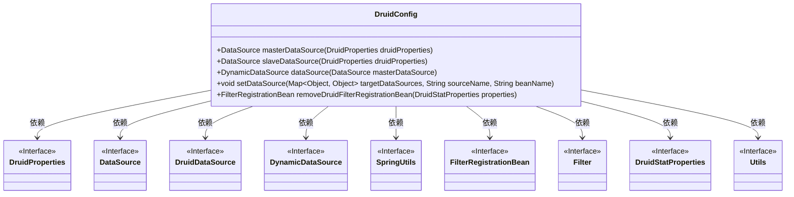

# 基础信息

|      |      |
|------|------|
| 编码语言 | .java |
| 代码路径 | RuoYi-framework/ruoyi-framework/src/main/java/com/ruoyi/framework/config/DruidConfig.java |
| 包名 | com.ruoyi.framework.config |
| 依赖项 | ['java.io.IOException', 'java.util.HashMap', 'java.util.Map', 'javax.servlet.Filter', 'javax.servlet.FilterChain', 'javax.servlet.ServletException', 'javax.servlet.ServletRequest', 'javax.servlet.ServletResponse', 'javax.sql.DataSource', 'org.springframework.boot.autoconfigure.condition.ConditionalOnProperty', 'org.springframework.boot.context.properties.ConfigurationProperties', 'org.springframework.boot.web.servlet.FilterRegistrationBean', 'org.springframework.context.annotation.Bean', 'org.springframework.context.annotation.Configuration', 'org.springframework.context.annotation.Primary', 'com.alibaba.druid.pool.DruidDataSource', 'com.alibaba.druid.spring.boot.autoconfigure.DruidDataSourceBuilder', 'com.alibaba.druid.spring.boot.autoconfigure.properties.DruidStatProperties', 'com.alibaba.druid.util.Utils', 'com.ruoyi.common.enums.DataSourceType', 'com.ruoyi.common.utils.spring.SpringUtils', 'com.ruoyi.framework.config.properties.DruidProperties', 'com.ruoyi.framework.datasource.DynamicDataSource'] |
| 概述说明 | DruidConfig类配置主从数据源，动态管理并移除监控广告。 |

# 说明

DruidConfig类用于配置主从数据源，实现动态数据源管理，确保系统能够灵活切换和使用不同的数据源。此外，该类还移除了监控页面的广告，提升了用户体验和页面整洁度。通过这一配置，系统在数据源管理和监控功能上得到了优化和增强。

# 类列表 Class Summary

| 名称   | 类型  | 说明 |
|-------|------|-------------|
| DruidConfig | class | DruidConfig类配置主从数据源，动态数据源管理，并移除监控页面广告。 |

## 类 DruidConfig

|      |      |
|------|------|
| 访问范围 | @Configuration;public |
| 类型 | class |
| 名称 | DruidConfig |
| 说明 | DruidConfig类配置主从数据源，动态数据源管理，并移除监控页面广告。 |

### UML类图

### 描述
`DruidConfig`类是一个Spring配置类，用于配置Druid数据源和相关的过滤器。它包含了多个`@Bean`方法，用于创建和管理数据源对象，如`masterDataSource`和`slaveDataSource`。此外，`DruidConfig`还负责创建`DynamicDataSource`对象，并通过`setDataSource`方法动态设置数据源。`removeDruidFilterRegistrationBean`方法用于移除Druid监控页面底部的广告。该类依赖于多个接口和工具类，如`DruidProperties`、`DataSource`、`SpringUtils`等，以实现其功能。

### 内部方法调用关系图

这段代码是一个Spring Boot配置类，用于配置和管理Druid数据源。它定义了多个Bean方法，包括主数据源、从数据源、动态数据源以及一个用于去除Druid监控页面广告的过滤器。代码通过注解和条件配置来灵活地创建和管理数据源，并通过动态数据源类来支持主从数据源的切换。此外，代码还通过自定义过滤器来修改Druid监控页面的内容，去除不需要的广告信息。

### 字段列表 Field List

| 名称  | 类型  | 说明 |
|-------|-------|------|

### 方法列表 Method List

| 名称  | 类型  | 说明 |
|-------|-------|------|
| masterDataSource | DataSource | 创建主数据源，基于Druid配置属性初始化。 |
| slaveDataSource | DataSource | 配置Druid从数据源，启用条件为slave.enabled=true。 |
| removeDruidFilterRegistrationBean | FilterRegistrationBean | 基于条件创建过滤器，替换Druid监控页面中的广告信息。 |
| setDataSource | void | 设置数据源，将beanName对应数据源存入targetDataSources。 |
| dataSource | DynamicDataSource | 定义主从数据源，主数据源为masterDataSource，从数据源为slaveDataSource。 |

