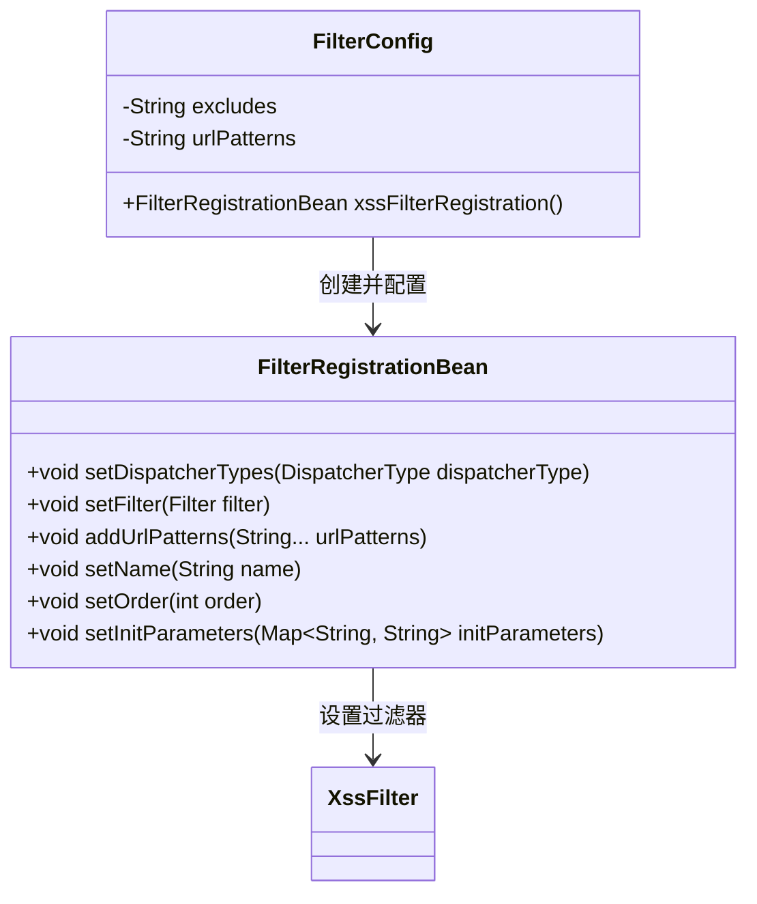
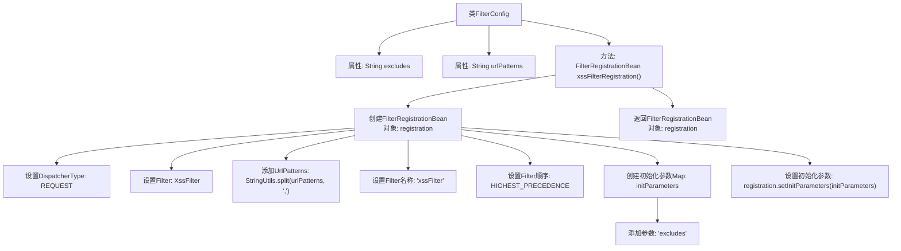

# 基础信息

|      |      |
|------|------|
| 编码语言 | .java |
| 代码路径 | RuoYi-framework/ruoyi-framework/src/main/java/com/ruoyi/framework/config/FilterConfig.java |
| 包名 | com.ruoyi.framework.config |
| 依赖项 | ['java.util.HashMap', 'java.util.Map', 'javax.servlet.DispatcherType', 'org.springframework.beans.factory.annotation.Value', 'org.springframework.boot.autoconfigure.condition.ConditionalOnProperty', 'org.springframework.boot.web.servlet.FilterRegistrationBean', 'org.springframework.context.annotation.Bean', 'org.springframework.context.annotation.Configuration', 'com.ruoyi.common.utils.StringUtils', 'com.ruoyi.common.xss.XssFilter'] |
| 概述说明 | 配置类启用XSS过滤器，设置URL模式及排除项。 |

# 说明

配置类启用了XSS过滤器，旨在防止跨站脚本攻击。该配置允许设置特定的URL模式，以便过滤器仅对符合这些模式的请求进行处理。同时，还支持配置排除项，即某些URL或请求类型可以绕过XSS过滤器的检查。这种灵活的配置方式确保了安全性与功能性的平衡，既有效防护了潜在的安全威胁，又避免了不必要的资源消耗和误拦截。

# 类列表 Class Summary

| 名称   | 类型  | 说明 |
|-------|------|-------------|
| FilterConfig | class | 配置类启用XSS过滤器，设置URL模式和排除项。 |

## 类 FilterConfig

|      |      |
|------|------|
| 访问范围 | @Configuration;@ConditionalOnProperty(value = "xss.enabled", havingValue = "true");public |
| 类型 | class |
| 名称 | FilterConfig |
| 说明 | 配置类启用XSS过滤器，设置URL模式和排除项。 |

### UML类图

**描述：**
`FilterConfig` 类是一个配置类，用于注册和配置 `XssFilter` 过滤器。它通过 `xssFilterRegistration` 方法创建一个 `FilterRegistrationBean` 实例，并设置过滤器的调度类型、URL 模式、名称、顺序和初始化参数。`FilterRegistrationBean` 类负责管理过滤器的注册和配置，而 `XssFilter` 类是实现具体过滤逻辑的过滤器。

### 内部方法调用关系图

这段代码定义了一个Spring配置类`FilterConfig`，用于配置XSS过滤器。类中包含两个属性`excludes`和`urlPatterns`，分别用于指定排除的URL和需要过滤的URL模式。`xssFilterRegistration`方法创建并配置了一个`FilterRegistrationBean`对象，设置了过滤器的类型、URL模式、名称、顺序以及初始化参数，最后返回该对象。该配置类仅在`xss.enabled`属性为`true`时生效。

### 字段列表 Field List

| 名称  | 类型  | 说明 |
|-------|-------|------|
| urlPatterns | String | xss配置中定义URL模式的私有字符串变量。 |
| excludes | String | 配置项xss.excludes用于定义排除XSS防护的路径。 |

### 方法列表 Method List

| 名称  | 类型  | 说明 |
|-------|-------|------|
| xssFilterRegistration | FilterRegistrationBean | 注册XSS过滤器，设置请求类型、URL模式、名称、优先级和初始化参数。 |

