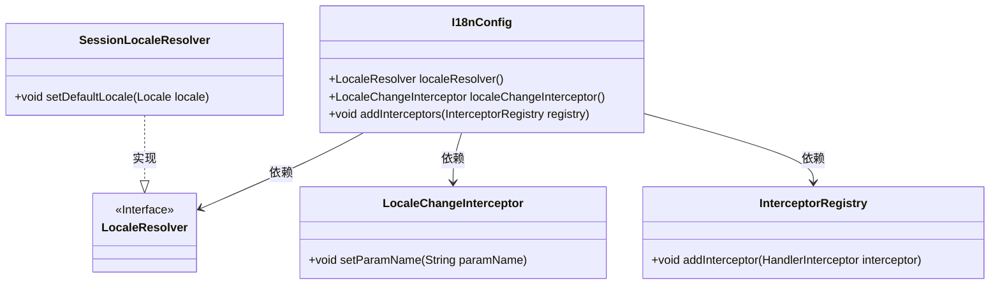
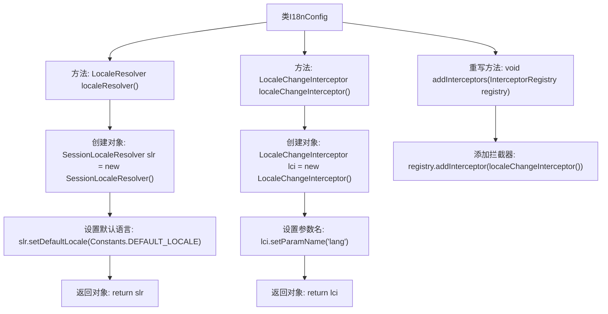

# 基础信息

|      |      |
|------|------|
| 编码语言 | .java |
| 代码路径 | RuoYi-framework/ruoyi-framework/src/main/java/com/ruoyi/framework/config/I18nConfig.java |
| 包名 | com.ruoyi.framework.config |
| 依赖项 | ['org.springframework.context.annotation.Bean', 'org.springframework.context.annotation.Configuration', 'org.springframework.web.servlet.LocaleResolver', 'org.springframework.web.servlet.config.annotation.InterceptorRegistry', 'org.springframework.web.servlet.config.annotation.WebMvcConfigurer', 'org.springframework.web.servlet.i18n.LocaleChangeInterceptor', 'org.springframework.web.servlet.i18n.SessionLocaleResolver', 'com.ruoyi.common.constant.Constants'] |
| 概述说明 | I18nConfig类通过SessionLocaleResolver和LocaleChangeInterceptor配置默认语言和语言切换拦截器。 |

# 说明

I18nConfig类负责配置默认语言和语言切换拦截器，通过SessionLocaleResolver和LocaleChangeInterceptor实现。SessionLocaleResolver用于管理会话中的语言设置，LocaleChangeInterceptor则负责拦截并处理语言切换请求。这种配置方式确保了应用程序能够根据用户需求动态切换语言，同时保持语言设置的持久性。

# 类列表 Class Summary

| 名称   | 类型  | 说明 |
|-------|------|-------------|
| I18nConfig | class | I18nConfig类配置了默认语言和语言切换拦截器，使用SessionLocaleResolver和LocaleChangeInterceptor实现。 |

## 类 I18nConfig

|      |      |
|------|------|
| 访问范围 | @Configuration;public |
| 类型 | class |
| 名称 | I18nConfig |
| 说明 | I18nConfig类配置了默认语言和语言切换拦截器，使用SessionLocaleResolver和LocaleChangeInterceptor实现。 |

### UML类图

这段代码定义了一个名为 `I18nConfig` 的配置类，用于处理国际化（i18n）相关的配置。该类实现了 `WebMvcConfigurer` 接口，并定义了两个 Bean：`localeResolver` 和 `localeChangeInterceptor`。`localeResolver` 用于设置默认的语言环境，而 `localeChangeInterceptor` 用于根据请求参数动态更改语言环境。`addInterceptors` 方法将 `localeChangeInterceptor` 注册到拦截器链中，以便在请求处理过程中应用语言环境更改。

### 内部方法调用关系图

这段代码定义了一个Spring配置类`I18nConfig`，用于配置国际化和拦截器。`localeResolver()`方法创建并配置了一个`SessionLocaleResolver`对象，设置默认语言并返回该对象。`localeChangeInterceptor()`方法创建并配置了一个`LocaleChangeInterceptor`对象，设置语言参数名并返回该对象。`addInterceptors()`方法将`LocaleChangeInterceptor`添加到拦截器注册表中。这些配置使得应用程序能够根据请求参数动态切换语言。

### 字段列表 Field List

| 名称  | 类型  | 说明 |
|-------|-------|------|

### 方法列表 Method List

| 名称  | 类型  | 说明 |
|-------|-------|------|
| addInterceptors | void | 重写方法，添加语言切换拦截器到注册表。 |
| localeResolver | LocaleResolver | 创建LocaleResolver Bean，默认语言设为Constants.DEFAULT_LOCALE。 |
| localeChangeInterceptor | LocaleChangeInterceptor | 创建LocaleChangeInterceptor实例，设置参数名为"lang"，并返回该实例。 |

