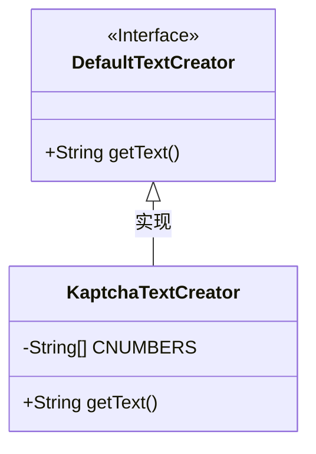
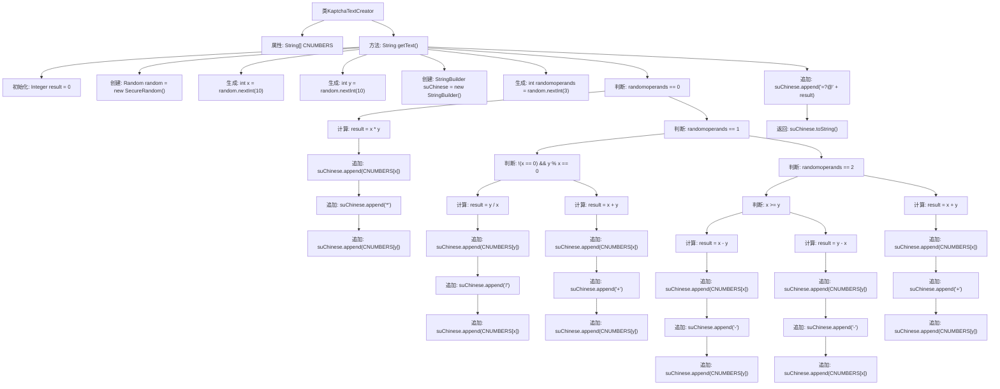

# 基础信息

|      |      |
|------|------|
| 编码语言 | .java |
| 代码路径 | RuoYi-framework/ruoyi-framework/src/main/java/com/ruoyi/framework/config/KaptchaTextCreator.java |
| 包名 | com.ruoyi.framework.config |
| 依赖项 | ['java.security.SecureRandom', 'java.util.Random', 'com.google.code.kaptcha.text.impl.DefaultTextCreator'] |
| 概述说明 | KaptchaTextCreator类用于生成随机数学表达式及其结果。 |

# 说明

KaptchaTextCreator类用于生成随机的数学表达式及其计算结果。该类的主要功能是创建包含基本数学运算的表达式，如加法、减法、乘法和除法，并自动计算出这些表达式的结果。生成的表达式通常用于验证码系统，以确保用户输入的准确性。通过随机生成不同的数学表达式，KaptchaTextCreator增强了系统的安全性和抗自动化攻击的能力。

# 类列表 Class Summary

| 名称   | 类型  | 说明 |
|-------|------|-------------|
| KaptchaTextCreator | class | KaptchaTextCreator类生成随机数学表达式及结果。 |

## 类 KaptchaTextCreator

|      |      |
|------|------|
| 访问范围 | public |
| 类型 | class |
| 名称 | KaptchaTextCreator |
| 说明 | KaptchaTextCreator类生成随机数学表达式及结果。 |

### UML类图

这段代码定义了一个 `KaptchaTextCreator` 类，它继承自 `DefaultTextCreator` 接口。`KaptchaTextCreator` 类的主要功能是生成随机的数学表达式及其结果，并将其格式化为字符串返回。该类使用了一个包含数字的字符串数组 `CNUMBERS`，并通过随机数生成器创建两个随机数 `x` 和 `y`，然后根据随机操作数生成不同的数学表达式（如乘法、除法、加法或减法），最后将表达式和结果拼接成字符串返回。

### 内部方法调用关系图

这段代码定义了一个`KaptchaTextCreator`类，继承自`DefaultTextCreator`，用于生成随机的数学表达式文本。代码通过随机生成两个数字和一个操作符（乘法、除法、加法或减法），计算表达式的结果，并将表达式和结果拼接成字符串返回。流程图展示了代码的执行流程，包括随机数的生成、操作符的判断、表达式的计算以及最终字符串的拼接和返回。

### 字段列表 Field List

| 名称  | 类型  | 说明 |
|-------|-------|------|
| CNUMBERS = "0,1,2,3,4,5,6,7,8,9,10".split(",") | String[] | 定义字符串数组CNUMBERS，包含0到10的数字。 |

### 方法列表 Method List

| 名称  | 类型  | 说明 |
|-------|-------|------|
| getText | String | 生成随机数学表达式并返回中文形式和结果。 |

