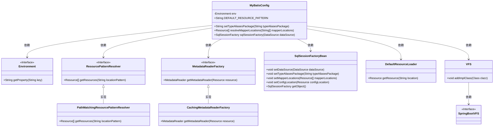

# 基础信息

|      |      |
|------|------|
| 编码语言 | .java |
| 代码路径 | RuoYi-framework/ruoyi-framework/src/main/java/com/ruoyi/framework/config/MyBatisConfig.java |
| 包名 | com.ruoyi.framework.config |
| 依赖项 | ['java.io.IOException', 'java.util.ArrayList', 'java.util.Arrays', 'java.util.HashSet', 'java.util.List', 'javax.sql.DataSource', 'org.apache.ibatis.io.VFS', 'org.apache.ibatis.session.SqlSessionFactory', 'org.mybatis.spring.SqlSessionFactoryBean', 'org.mybatis.spring.boot.autoconfigure.SpringBootVFS', 'org.springframework.beans.factory.annotation.Autowired', 'org.springframework.context.annotation.Bean', 'org.springframework.context.annotation.Configuration', 'org.springframework.core.env.Environment', 'org.springframework.core.io.DefaultResourceLoader', 'org.springframework.core.io.Resource', 'org.springframework.core.io.support.PathMatchingResourcePatternResolver', 'org.springframework.core.io.support.ResourcePatternResolver', 'org.springframework.core.type.classreading.CachingMetadataReaderFactory', 'org.springframework.core.type.classreading.MetadataReader', 'org.springframework.core.type.classreading.MetadataReaderFactory', 'org.springframework.util.ClassUtils', 'com.ruoyi.common.utils.StringUtils'] |
| 概述说明 | MyBatis配置类设置别名包、Mapper位置和SqlSessionFactory。 |

# 说明

MyBatis配置类用于设置别名包、Mapper位置和SqlSessionFactory。别名包用于简化映射文件中的类型引用，Mapper位置指定了Mapper接口或XML文件的位置，SqlSessionFactory是MyBatis的核心组件，负责创建SqlSession实例以执行数据库操作。通过这些配置，可以确保MyBatis框架正确初始化和运行。

# 类列表 Class Summary

| 名称   | 类型  | 说明 |
|-------|------|-------------|
| MyBatisConfig | class | MyBatis配置类，设置别名包、Mapper位置和SqlSessionFactory。 |

## 类 MyBatisConfig

|      |      |
|------|------|
| 访问范围 | @Configuration;public |
| 类型 | class |
| 名称 | MyBatisConfig |
| 说明 | MyBatis配置类，设置别名包、Mapper位置和SqlSessionFactory。 |

### UML类图

类图描述：`MyBatisConfig`类负责配置MyBatis框架，依赖于`Environment`接口获取配置属性，使用`ResourcePatternResolver`和`MetadataReaderFactory`接口解析资源路径和读取元数据。`SqlSessionFactoryBean`类用于创建`SqlSessionFactory`实例，`DefaultResourceLoader`用于加载资源文件，`VFS`类用于添加虚拟文件系统实现。整个类图展示了MyBatis配置的核心组件及其依赖关系。

### 内部方法调用关系图

```mermaid
graph TD
    A["类MyBatisConfig"]
    B["属性: Environment env"]
    C["静态常量: DEFAULT_RESOURCE_PATTERN = '**/*.class'"]
    D["方法: setTypeAliasesPackage(String typeAliasesPackage)"]
    E["方法: resolveMapperLocations(String[] mapperLocations)"]
    F["方法: sqlSessionFactory(DataSource dataSource)"]
    G["初始化: ResourcePatternResolver resolver = new PathMatchingResourcePatternResolver()"]
    H["初始化: MetadataReaderFactory metadataReaderFactory = new CachingMetadataReaderFactory(resolver)"]
    I["初始化: List<String> allResult = new ArrayList<String>()"]
    J["循环: for (String aliasesPackage : typeAliasesPackage.split(','))"]
    K["初始化: List<String> result = new ArrayList<String>()"]
    L["构造路径: aliasesPackage = CLASSPATH_ALL_URL_PREFIX + ClassUtils.convertClassNameToResourcePath(aliasesPackage.trim()) + '/' + DEFAULT_RESOURCE_PATTERN"]
    M["获取资源: Resource[] resources = resolver.getResources(aliasesPackage)"]
    N["判断: if (resources != null && resources.length > 0)"]
    O["循环: for (Resource resource : resources)"]
    P["判断: if (resource.isReadable())"]
    Q["获取元数据: MetadataReader metadataReader = metadataReaderFactory.getMetadataReader(resource)"]
    R["尝试: result.add(Class.forName(metadataReader.getClassMetadata().getClassName()).getPackage().getName())"]
    S["捕获: catch (ClassNotFoundException e)"]
    T["判断: if (result.size() > 0)"]
    U["去重: HashSet<String> hashResult = new HashSet<String>(result)"]
    V["合并: allResult.addAll(hashResult)"]
    W["判断: if (allResult.size() > 0)"]
    X["拼接: typeAliasesPackage = String.join(',', (String[]) allResult.toArray(new String[0]))"]
    Y["抛出异常: throw new RuntimeException('mybatis typeAliasesPackage 路径扫描错误,参数typeAliasesPackage:' + typeAliasesPackage + '未找到任何包')"]
    Z["捕获: catch (IOException e)"]
    AA["返回: return typeAliasesPackage"]
    AB["初始化: ResourcePatternResolver resourceResolver = new PathMatchingResourcePatternResolver()"]
    AC["初始化: List<Resource> resources = new ArrayList<Resource>()"]
    AD["判断: if (mapperLocations != null)"]
    AE["循环: for (String mapperLocation : mapperLocations)"]
    AF["尝试: Resource[] mappers = resourceResolver.getResources(mapperLocation)"]
    AG["合并: resources.addAll(Arrays.asList(mappers))"]
    AH["捕获: catch (IOException e)"]
    AI["返回: return resources.toArray(new Resource[resources.size()])"]
    AJ["获取属性: typeAliasesPackage = env.getProperty('mybatis.typeAliasesPackage')"]
    AK["获取属性: mapperLocations = env.getProperty('mybatis.mapperLocations')"]
    AL["获取属性: configLocation = env.getProperty('mybatis.configLocation')"]
    AM["调用: typeAliasesPackage = setTypeAliasesPackage(typeAliasesPackage)"]
    AN["添加实现类: VFS.addImplClass(SpringBootVFS.class)"]
    AO["初始化: SqlSessionFactoryBean sessionFactory = new SqlSessionFactoryBean()"]
    AP["设置数据源: sessionFactory.setDataSource(dataSource)"]
    AQ["设置类型别名包: sessionFactory.setTypeAliasesPackage(typeAliasesPackage)"]
    AR["设置映射器位置: sessionFactory.setMapperLocations(resolveMapperLocations(StringUtils.split(mapperLocations, ',')))"]
    AS["设置配置位置: sessionFactory.setConfigLocation(new DefaultResourceLoader().getResource(configLocation))"]
    AT["返回: return sessionFactory.getObject()"]

    A --> B
    A --> C
    A --> D
    A --> E
    A --> F
    D --> G
    D --> H
    D --> I
    D --> J
    J --> K
    J --> L
    J --> M
    M --> N
    N --> O
    O --> P
    P --> Q
    Q --> R
    R --> S
    N --> T
    T --> U
    U --> V
    J --> W
    W --> X
    W --> Y
    D --> Z
    D --> AA
    E --> AB
    E --> AC
    E --> AD
    AD --> AE
    AE --> AF
    AF --> AG
    AE --> AH
    E --> AI
    F --> AJ
    F --> AK
    F --> AL
    F --> AM
    F --> AN
    F --> AO
    AO --> AP
    AO --> AQ
    AO --> AR
    AO --> AS
    F --> AT
```

这段代码是一个MyBatis配置类，主要用于配置MyBatis的SqlSessionFactory。它包含了两个主要方法：`setTypeAliasesPackage`用于扫描并设置类型别名包，`resolveMapperLocations`用于解析映射器文件的位置。`sqlSessionFactory`方法则整合了这些配置，最终生成并返回SqlSessionFactory对象。该代码通过处理环境变量中的配置参数，确保MyBatis能够正确加载类型别名和映射器文件，从而完成数据库操作的初始化。

### 字段列表 Field List

| 名称  | 类型  | 说明 |
|-------|-------|------|
| DEFAULT_RESOURCE_PATTERN = "**/*.class" | String | 默认资源模式为"**/*.class"。 |
| env | Environment | 自动注入环境变量实例。 |

### 方法列表 Method List

| 名称  | 类型  | 说明 |
|-------|-------|------|
| resolveMapperLocations | Resource[] | 方法解析并返回指定路径的资源数组。 |
| sqlSessionFactory | SqlSessionFactory | 创建SqlSessionFactory，配置数据源、类型别名、映射文件和配置位置。 |
| setTypeAliasesPackage | String | 该方法扫描指定包路径，获取类名并返回包名，处理异常并返回结果。 |

