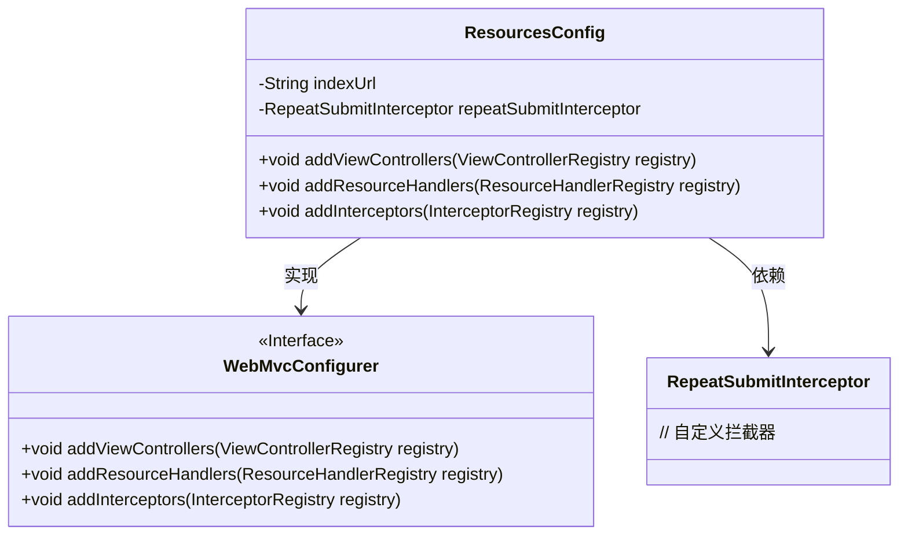
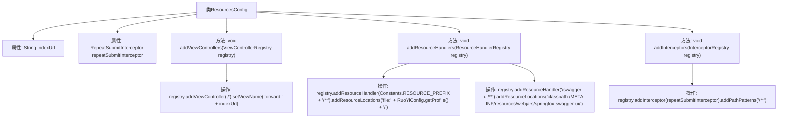

# 基础信息

|      |      |
|------|------|
| 编码语言 | .java |
| 代码路径 | RuoYi-framework/ruoyi-framework/src/main/java/com/ruoyi/framework/config/ResourcesConfig.java |
| 包名 | com.ruoyi.framework.config |
| 依赖项 | ['org.springframework.beans.factory.annotation.Autowired', 'org.springframework.beans.factory.annotation.Value', 'org.springframework.context.annotation.Configuration', 'org.springframework.web.servlet.config.annotation.InterceptorRegistry', 'org.springframework.web.servlet.config.annotation.ResourceHandlerRegistry', 'org.springframework.web.servlet.config.annotation.ViewControllerRegistry', 'org.springframework.web.servlet.config.annotation.WebMvcConfigurer', 'com.ruoyi.common.config.RuoYiConfig', 'com.ruoyi.common.constant.Constants', 'com.ruoyi.framework.interceptor.RepeatSubmitInterceptor'] |
| 概述说明 | 配置类设置默认首页、资源路径和拦截器。 |

# 说明

配置类实现了默认首页、资源路径和拦截器的设置。通过配置类，系统能够定义和加载默认首页，确保用户在访问根路径时能够正确跳转到指定页面。同时，配置类还负责管理静态资源的路径，确保这些资源能够被正确访问和加载。此外，配置类还设置了拦截器，用于在请求处理过程中进行拦截和处理，以实现诸如权限验证、日志记录等功能。这些配置共同确保了系统的正常运行和安全性。

# 类列表 Class Summary

| 名称   | 类型  | 说明 |
|-------|------|-------------|
| ResourcesConfig | class | 配置类实现默认首页、资源路径和拦截器设置。 |

## 类 ResourcesConfig

|      |      |
|------|------|
| 访问范围 | @Configuration;public |
| 类型 | class |
| 名称 | ResourcesConfig |
| 说明 | 配置类实现默认首页、资源路径和拦截器设置。 |

### UML类图

这段代码定义了一个 `ResourcesConfig` 类，它实现了 `WebMvcConfigurer` 接口。`ResourcesConfig` 类通过 `@Configuration` 注解标记为配置类，并重写了 `addViewControllers`、`addResourceHandlers` 和 `addInterceptors` 方法，分别用于设置默认首页、配置资源处理器和添加自定义拦截器。`ResourcesConfig` 类依赖于 `RepeatSubmitInterceptor` 拦截器，并通过 `@Autowired` 注入该拦截器实例。整体结构展示了 Spring 配置类的典型用法，用于自定义 Web MVC 的行为。

### 内部方法调用关系图

这段代码是一个Spring Boot配置类，名为`ResourcesConfig`，实现了`WebMvcConfigurer`接口。它主要配置了默认首页、资源处理器和自定义拦截器。`addViewControllers`方法设置了默认首页的跳转地址，`addResourceHandlers`方法配置了本地文件上传路径和Swagger UI的资源路径，`addInterceptors`方法添加了自定义的重复提交拦截器。通过这些配置，实现了对Web MVC的定制化设置。

### 字段列表 Field List

| 名称  | 类型  | 说明 |
|-------|-------|------|
| indexUrl | String | Shiro配置中定义用户主页URL的私有字符串变量。 |
| repeatSubmitInterceptor | RepeatSubmitInterceptor | 自动注入重复提交拦截器实例。 |

### 方法列表 Method List

| 名称  | 类型  | 说明 |
|-------|-------|------|
| addInterceptors | void | 重写方法，添加拦截器并设置路径匹配规则。 |
| addResourceHandlers | void | 配置本地文件上传路径和Swagger资源处理。 |
| addViewControllers | void | 重写方法，将根路径请求转发至指定视图。 |

