# 基础信息

|      |      |
|------|------|
| 编码语言 | .java |
| 代码路径 | RuoYi-framework/ruoyi-framework/src/main/java/com/ruoyi/framework/config/ShiroConfig.java |
| 包名 | com.ruoyi.framework.config |
| 依赖项 | ['java.io.ByteArrayInputStream', 'java.io.IOException', 'java.io.InputStream', 'java.util.LinkedHashMap', 'java.util.List', 'java.util.Map', 'javax.servlet.Filter', 'org.apache.commons.io.IOUtils', 'org.apache.shiro.cache.ehcache.EhCacheManager', 'org.apache.shiro.codec.Base64', 'org.apache.shiro.config.ConfigurationException', 'org.apache.shiro.io.ResourceUtils', 'org.apache.shiro.mgt.SecurityManager', 'org.apache.shiro.spring.security.interceptor.AuthorizationAttributeSourceAdvisor', 'org.apache.shiro.spring.web.ShiroFilterFactoryBean', 'org.apache.shiro.web.mgt.DefaultWebSecurityManager', 'org.apache.shiro.web.servlet.SimpleCookie', 'org.springframework.beans.factory.annotation.Qualifier', 'org.springframework.beans.factory.annotation.Value', 'org.springframework.context.annotation.Bean', 'org.springframework.context.annotation.Configuration', 'com.ruoyi.common.constant.Constants', 'com.ruoyi.common.utils.StringUtils', 'com.ruoyi.common.utils.security.CipherUtils', 'com.ruoyi.common.utils.spring.SpringUtils', 'com.ruoyi.framework.config.properties.PermitAllUrlProperties', 'com.ruoyi.framework.shiro.realm.UserRealm', 'com.ruoyi.framework.shiro.rememberMe.CustomCookieRememberMeManager', 'com.ruoyi.framework.shiro.session.OnlineSessionDAO', 'com.ruoyi.framework.shiro.session.OnlineSessionFactory', 'com.ruoyi.framework.shiro.web.CustomShiroFilterFactoryBean', 'com.ruoyi.framework.shiro.web.filter.LogoutFilter', 'com.ruoyi.framework.shiro.web.filter.captcha.CaptchaValidateFilter', 'com.ruoyi.framework.shiro.web.filter.kickout.KickoutSessionFilter', 'com.ruoyi.framework.shiro.web.filter.online.OnlineSessionFilter', 'com.ruoyi.framework.shiro.web.filter.sync.SyncOnlineSessionFilter', 'com.ruoyi.framework.shiro.web.session.OnlineWebSessionManager', 'com.ruoyi.framework.shiro.web.session.SpringSessionValidationScheduler', 'at.pollux.thymeleaf.shiro.dialect.ShiroDialect'] |
| 概述说明 | Shiro配置类，管理会话、缓存、验证码及过滤器等安全设置。 |

# 说明

Shiro配置类是一个用于安全管理的关键组件，集成了会话管理、缓存机制、验证码处理以及过滤器设置等功能。它通过统一的配置确保系统在身份验证、授权、会话控制等方面的安全性。会话管理模块负责维护用户会话状态，缓存机制优化了权限信息的存储与访问，验证码处理增强了用户身份验证的可靠性，而过滤器设置则用于拦截和处理请求，确保系统资源的安全访问。该配置类为系统提供了全面的安全防护基础。

# 类列表 Class Summary

| 名称   | 类型  | 说明 |
|-------|------|-------------|
| ShiroConfig | class | Shiro配置类，包含会话管理、缓存、验证码、过滤器等安全相关设置。 |

## 类 ShiroConfig

|      |      |
|------|------|
| 访问范围 | @Configuration;public |
| 类型 | class |
| 名称 | ShiroConfig |
| 说明 | Shiro配置类，包含会话管理、缓存、验证码、过滤器等安全相关设置。 |

### UML类图

```mermaid
classDiagram
    class ShiroConfig {
        -int expireTime
        -int validationInterval
        -int maxSession
        -boolean kickoutAfter
        -boolean captchaEnabled
        -String captchaType
        -String domain
        -String path
        -boolean httpOnly
        -int maxAge
        -String cipherKey
        -String loginUrl
        -String unauthorizedUrl
        -boolean rememberMe
        +EhCacheManager getEhCacheManager()
        +InputStream getCacheManagerConfigFileInputStream()
        +UserRealm userRealm(EhCacheManager cacheManager)
        +OnlineSessionDAO sessionDAO()
        +OnlineSessionFactory sessionFactory()
        +OnlineWebSessionManager sessionManager()
        +SecurityManager securityManager(UserRealm userRealm)
        +LogoutFilter logoutFilter()
        +ShiroFilterFactoryBean shiroFilterFactoryBean(SecurityManager securityManager)
        +OnlineSessionFilter onlineSessionFilter()
        +SyncOnlineSessionFilter syncOnlineSessionFilter()
        +CaptchaValidateFilter captchaValidateFilter()
        +SimpleCookie rememberMeCookie()
        +CustomCookieRememberMeManager rememberMeManager()
        +KickoutSessionFilter kickoutSessionFilter()
        +ShiroDialect shiroDialect()
        +AuthorizationAttributeSourceAdvisor authorizationAttributeSourceAdvisor(SecurityManager securityManager)
    }

    class EhCacheManager {
        +void setCacheManager(net.sf.ehcache.CacheManager cacheManager)
    }

    class UserRealm {
        +void setAuthorizationCacheName(String cacheName)
        +void setCacheManager(EhCacheManager cacheManager)
    }

    class OnlineSessionDAO {
    }

    class OnlineSessionFactory {
    }

    class OnlineWebSessionManager {
        +void setCacheManager(EhCacheManager cacheManager)
        +void setDeleteInvalidSessions(boolean deleteInvalidSessions)
        +void setGlobalSessionTimeout(long globalSessionTimeout)
        +void setSessionIdUrlRewritingEnabled(boolean sessionIdUrlRewritingEnabled)
        +void setSessionValidationScheduler(SessionValidationScheduler sessionValidationScheduler)
        +void setSessionValidationSchedulerEnabled(boolean sessionValidationSchedulerEnabled)
        +void setSessionDAO(OnlineSessionDAO sessionDAO)
        +void setSessionFactory(OnlineSessionFactory sessionFactory)
    }

    class SecurityManager {
        +void setRealm(UserRealm userRealm)
        +void setRememberMeManager(RememberMeManager rememberMeManager)
        +void setCacheManager(EhCacheManager cacheManager)
        +void setSessionManager(OnlineWebSessionManager sessionManager)
    }

    class LogoutFilter {
        +void setLoginUrl(String loginUrl)
    }

    class ShiroFilterFactoryBean {
        +void setSecurityManager(SecurityManager securityManager)
        +void setLoginUrl(String loginUrl)
        +void setUnauthorizedUrl(String unauthorizedUrl)
        +void setFilters(Map<String, Filter> filters)
        +void setFilterChainDefinitionMap(LinkedHashMap<String, String> filterChainDefinitionMap)
    }

    class OnlineSessionFilter {
        +void setLoginUrl(String loginUrl)
        +void setOnlineSessionDAO(OnlineSessionDAO sessionDAO)
    }

    class SyncOnlineSessionFilter {
        +void setOnlineSessionDAO(OnlineSessionDAO sessionDAO)
    }

    class CaptchaValidateFilter {
        +void setCaptchaEnabled(boolean captchaEnabled)
        +void setCaptchaType(String captchaType)
    }

    class SimpleCookie {
        +void setDomain(String domain)
        +void setPath(String path)
        +void setHttpOnly(boolean httpOnly)
        +void setMaxAge(int maxAge)
    }

    class CustomCookieRememberMeManager {
        +void setCookie(SimpleCookie cookie)
        +void setCipherKey(byte[] cipherKey)
    }

    class KickoutSessionFilter {
        +void setCacheManager(EhCacheManager cacheManager)
        +void setSessionManager(OnlineWebSessionManager sessionManager)
        +void setMaxSession(int maxSession)
        +void setKickoutAfter(boolean kickoutAfter)
        +void setKickoutUrl(String kickoutUrl)
    }

    class ShiroDialect {
    }

    class AuthorizationAttributeSourceAdvisor {
        +void setSecurityManager(SecurityManager securityManager)
    }

    ShiroConfig --> EhCacheManager : 依赖
    ShiroConfig --> UserRealm : 依赖
    ShiroConfig --> OnlineSessionDAO : 依赖
    ShiroConfig --> OnlineSessionFactory : 依赖
    ShiroConfig --> OnlineWebSessionManager : 依赖
    ShiroConfig --> SecurityManager : 依赖
    ShiroConfig --> LogoutFilter : 依赖
    ShiroConfig --> ShiroFilterFactoryBean : 依赖
    ShiroConfig --> OnlineSessionFilter : 依赖
    ShiroConfig --> SyncOnlineSessionFilter : 依赖
    ShiroConfig --> CaptchaValidateFilter : 依赖
    ShiroConfig --> SimpleCookie : 依赖
    ShiroConfig --> CustomCookieRememberMeManager : 依赖
    ShiroConfig --> KickoutSessionFilter : 依赖
    ShiroConfig --> ShiroDialect : 依赖
    ShiroConfig --> AuthorizationAttributeSourceAdvisor : 依赖
```

这段代码定义了一个名为 `ShiroConfig` 的配置类，用于配置 Apache Shiro 安全框架的各种组件。该类通过注解和依赖注入的方式，配置了缓存管理器、会话管理、安全管理器、过滤器等组件，并定义了各种过滤器、Cookie 设置、验证码处理等功能。代码通过读取配置文件中的参数，动态配置 Shiro 的各项功能，确保系统的安全性和灵活性。

### 内部方法调用关系图

```mermaid
graph TD
    A["类ShiroConfig"]
    B["属性: int expireTime"]
    C["属性: int validationInterval"]
    D["属性: int maxSession"]
    E["属性: boolean kickoutAfter"]
    F["属性: boolean captchaEnabled"]
    G["属性: String captchaType"]
    H["属性: String domain"]
    I["属性: String path"]
    J["属性: boolean httpOnly"]
    K["属性: int maxAge"]
    L["属性: String cipherKey"]
    M["属性: String loginUrl"]
    N["属性: String unauthorizedUrl"]
    O["属性: boolean rememberMe"]
    P["方法: EhCacheManager getEhCacheManager()"]
    Q["方法: InputStream getCacheManagerConfigFileInputStream()"]
    R["方法: UserRealm userRealm(EhCacheManager cacheManager)"]
    S["方法: OnlineSessionDAO sessionDAO()"]
    T["方法: OnlineSessionFactory sessionFactory()"]
    U["方法: OnlineWebSessionManager sessionManager()"]
    V["方法: SecurityManager securityManager(UserRealm userRealm)"]
    W["方法: LogoutFilter logoutFilter()"]
    X["方法: ShiroFilterFactoryBean shiroFilterFactoryBean(SecurityManager securityManager)"]
    Y["方法: OnlineSessionFilter onlineSessionFilter()"]
    Z["方法: SyncOnlineSessionFilter syncOnlineSessionFilter()"]
    AA["方法: CaptchaValidateFilter captchaValidateFilter()"]
    AB["方法: SimpleCookie rememberMeCookie()"]
    AC["方法: CustomCookieRememberMeManager rememberMeManager()"]
    AD["方法: KickoutSessionFilter kickoutSessionFilter()"]
    AE["方法: ShiroDialect shiroDialect()"]
    AF["方法: AuthorizationAttributeSourceAdvisor authorizationAttributeSourceAdvisor(SecurityManager securityManager)"]

    A --> B
    A --> C
    A --> D
    A --> E
    A --> F
    A --> G
    A --> H
    A --> I
    A --> J
    A --> K
    A --> L
    A --> M
    A --> N
    A --> O
    A --> P
    A --> Q
    A --> R
    A --> S
    A --> T
    A --> U
    A --> V
    A --> W
    A --> X
    A --> Y
    A --> Z
    A --> AA
    A --> AB
    A --> AC
    A --> AD
    A --> AE
    A --> AF
```

该流程图展示了`ShiroConfig`类的结构和内部方法调用关系。`ShiroConfig`类主要负责配置Shiro框架的相关参数和组件，包括会话管理、安全管理、过滤器配置等。通过流程图可以清晰地看到各个属性与方法的关联关系，帮助理解Shiro配置的整体逻辑和功能实现。

### 字段列表 Field List

| 名称  | 类型  | 说明 |
|-------|-------|------|
| expireTime | int | Shiro会话过期时间配置。 |
| validationInterval | int | Shiro会话验证间隔配置参数。 |
| captchaEnabled | boolean | Shiro用户验证码启用状态配置。 |
| rememberMe | boolean | Shiro配置中rememberMe默认禁用。 |
| path | String | Shiro配置中定义了Cookie的路径属性。 |
| maxAge | int | Shiro配置中设置Cookie最大存活时间。 |
| httpOnly | boolean | Shiro配置中Cookie的HttpOnly属性设置为布尔值。 |
| domain | String | Shiro配置中定义cookie域名的私有字符串变量。 |
| captchaType | String | Shiro用户验证码类型配置为captchaType。 |
| unauthorizedUrl | String | Shiro配置中未授权页面的URL变量。 |
| maxSession | int | Shiro配置中设置最大会话数。 |
| kickoutAfter | boolean | Shiro会话配置：是否在超时后踢出用户。 |
| loginUrl | String | Shiro配置中定义了用户登录URL路径。 |
| cipherKey | String | Shiro配置中定义cookie加密密钥。 |

### 方法列表 Method List

| 名称  | 类型  | 说明 |
|-------|-------|------|
| sessionDAO | OnlineSessionDAO | 创建并返回一个OnlineSessionDAO实例。 |
| shiroDialect | ShiroDialect | 定义Bean方法返回ShiroDialect实例。 |
| sessionFactory | OnlineSessionFactory | 定义一个Bean方法，返回OnlineSessionFactory实例。 |
| logoutFilter | LogoutFilter | 创建并配置LogoutFilter，设置登录URL后返回。 |
| getCacheManagerConfigFileInputStream | InputStream | 从类路径获取ehcache配置文件输入流，处理异常并关闭资源。 |
| getEhCacheManager | EhCacheManager | 创建EhCacheManager实例，检查并设置缓存管理器。 |
| captchaValidateFilter | CaptchaValidateFilter | 创建并配置验证码过滤器实例。 |
| onlineSessionFilter | OnlineSessionFilter | 创建并配置在线会话过滤器，设置登录URL和会话DAO后返回。 |
| userRealm | UserRealm | 创建UserRealm实例，设置授权缓存名称并绑定缓存管理器。 |
| syncOnlineSessionFilter | SyncOnlineSessionFilter | 创建并配置SyncOnlineSessionFilter对象，返回配置后的实例。 |
| authorizationAttributeSourceAdvisor | AuthorizationAttributeSourceAdvisor | 创建授权属性源顾问并设置安全管理器。 |
| securityManager | SecurityManager | 配置安全管理器，设置realm、记住我、缓存和会话管理器。 |
| rememberMeManager | CustomCookieRememberMeManager | 创建并配置自定义Cookie记住我管理器，设置Cookie和加密密钥。 |
| rememberMeCookie | SimpleCookie | 创建并配置名为“rememberMe”的SimpleCookie对象。 |
| sessionManager | OnlineWebSessionManager | 创建并配置OnlineWebSessionManager，设置缓存、超时、调度器及自定义SessionDao和Factory。 |
| kickoutSessionFilter | KickoutSessionFilter | 创建KickoutSessionFilter，设置缓存、会话管理、最大会话数、踢出顺序及重定向地址。 |
| shiroFilterFactoryBean | ShiroFilterFactoryBean | Shiro过滤器配置，设置登录、权限失败跳转，定义匿名访问资源，添加自定义过滤器。 |

