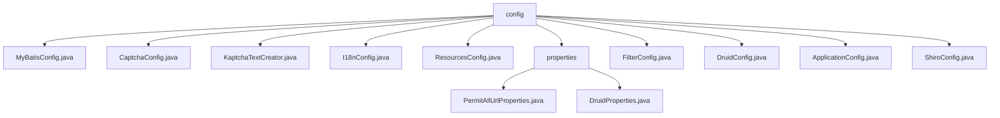

# 基础信息

|      |      |
|------|------|
| 编码语言 | .java |
| 代码路径 | RuoYi-framework/ruoyi-framework/src/main/java/com/ruoyi/framework/config |
| 包名 | RuoYi-framework.ruoyi-framework.src.main.java.com.ruoyi.framework.config |
| 概述说明 | MyBatis配置类设置别名包、Mapper位置和SqlSessionFactory。验证码生成器配置灵活生成。KaptchaTextCreator生成数学表达式验证码。I18nConfig管理语言切换。配置类设置首页、资源路径和拦截器。收集Anonymous注解URL路径。DruidProperties配置数据源参数。XSS过滤器防护跨站脚本攻击。DruidConfig管理主从数据源。AOP代理自动扫描Mapper类。Shiro配置类集成安全管理功能。 |

# 说明

MyBatis配置类用于设置别名包、Mapper位置和SqlSessionFactory，确保框架正确初始化和运行。CaptchaConfig类定义验证码生成器Bean，配置边框、颜色等属性，满足不同安全需求。KaptchaTextCreator生成随机数学表达式及其结果，增强验证码系统的安全性。I18nConfig类管理默认语言和语言切换拦截器，实现动态语言切换。配置类设置默认首页、资源路径和拦截器，确保系统正常运行和安全性。InitializingBean和ApplicationContextAware接口用于收集Anonymous注解的URL路径，DruidProperties类配置Druid数据源参数，优化数据库连接。XSS过滤器配置防止跨站脚本攻击，平衡安全性与功能性。DruidConfig类配置主从数据源，移除监控页面广告，优化数据源管理和用户体验。AOP配置启用AOP代理，自动扫描Mapper类，简化开发流程。Shiro配置类集成会话管理、缓存、验证码处理和过滤器设置，提供全面的安全防护基础。

### 包内部结构视图

该流程图展示了RuoYi框架中配置模块的层级关系。`config`作为根节点，包含了多个配置文件，如`MyBatisConfig.java`、`CaptchaConfig.java`等。其中，`properties`文件夹下又包含了`PermitAllUrlProperties.java`和`DruidProperties.java`两个配置文件。整个结构清晰地展示了配置文件的组织方式及其依赖关系。

# 文件列表 File List

| 名称   | 类型  | 说明 |
|-------|------|-------------|
| [ShiroConfig.java](ShiroConfig.md) | file | Shiro配置类，管理会话、缓存、验证码及过滤器等安全设置。 |
| [ApplicationConfig.java](ApplicationConfig.md) | file | 配置类启用AOP代理并扫描指定包中的Mapper类。 |
| [DruidConfig.java](DruidConfig.md) | file | DruidConfig类配置主从数据源，动态管理并移除监控广告。 |
| [FilterConfig.java](FilterConfig.md) | file | 配置类启用XSS过滤器，设置URL模式及排除项。 |
| [ResourcesConfig.java](ResourcesConfig.md) | file | 配置类设置默认首页、资源路径和拦截器。 |
| [I18nConfig.java](I18nConfig.md) | file | I18nConfig类通过SessionLocaleResolver和LocaleChangeInterceptor配置默认语言和语言切换拦截器。 |
| [KaptchaTextCreator.java](KaptchaTextCreator.md) | file | KaptchaTextCreator类用于生成随机数学表达式及其结果。 |
| [CaptchaConfig.java](CaptchaConfig.md) | file | CaptchaConfig类定义两个验证码生成器Bean，配置边框、颜色、尺寸、字体等属性。 |
| [MyBatisConfig.java](MyBatisConfig.md) | file | MyBatis配置类设置别名包、Mapper位置和SqlSessionFactory。 |
| [properties](properties/_module.md) | package | 类收集Anonymous注解URL路径，DruidProperties配置数据源参数。 |

