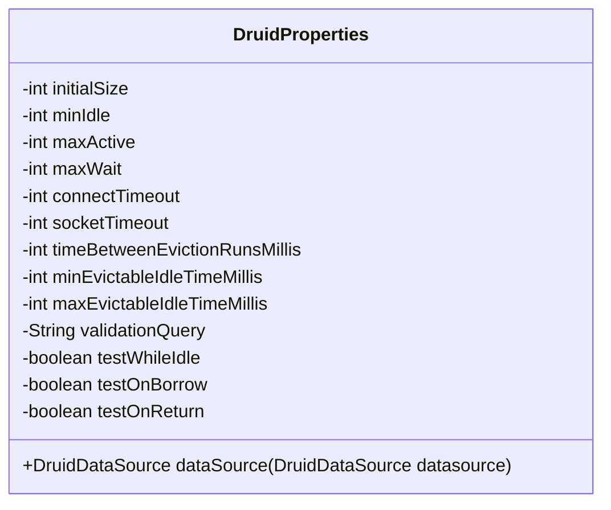

# 基础信息

|      |      |
|------|------|
| 编码语言 | .java |
| 代码路径 | RuoYi-framework/ruoyi-framework/src/main/java/com/ruoyi/framework/config/properties/DruidProperties.java |
| 包名 | com.ruoyi.framework.config.properties |
| 依赖项 | ['org.springframework.beans.factory.annotation.Value', 'org.springframework.context.annotation.Configuration', 'com.alibaba.druid.pool.DruidDataSource'] |
| 概述说明 | DruidProperties类配置数据源参数，如连接池大小、超时、空闲检测及验证。 |

# 说明

DruidProperties类用于配置Druid数据源的相关参数，主要涉及连接池的大小设置、连接超时时间的管理、空闲连接的检测机制以及连接的有效性验证。这些配置项共同确保数据源的高效运行和稳定性，优化数据库连接的利用率和可靠性。

# 类列表 Class Summary

| 名称   | 类型  | 说明 |
|-------|------|-------------|
| DruidProperties | class | DruidProperties类配置Druid数据源参数，包括连接池大小、超时时间、空闲检测及连接验证。 |

## 类 DruidProperties

|      |      |
|------|------|
| 访问范围 | @Configuration;public |
| 类型 | class |
| 名称 | DruidProperties |
| 说明 | DruidProperties类配置Druid数据源参数，包括连接池大小、超时时间、空闲检测及连接验证。 |

### UML类图

这段代码定义了一个名为 `DruidProperties` 的配置类，用于配置 Druid 数据源的各项参数。类中包含多个私有字段，这些字段通过 `@Value` 注解从配置文件中注入值。`dataSource` 方法接收一个 `DruidDataSource` 对象，并根据类中的配置项对其进行设置，最终返回配置后的数据源对象。该类主要用于在 Spring 应用中配置和管理 Druid 数据库连接池的各项参数。

### 内部方法调用关系图

```mermaid
graph TD
    A["类DruidProperties"]
    B["属性: int initialSize"]
    C["属性: int minIdle"]
    D["属性: int maxActive"]
    E["属性: int maxWait"]
    F["属性: int connectTimeout"]
    G["属性: int socketTimeout"]
    H["属性: int timeBetweenEvictionRunsMillis"]
    I["属性: int minEvictableIdleTimeMillis"]
    J["属性: int maxEvictableIdleTimeMillis"]
    K["属性: String validationQuery"]
    L["属性: boolean testWhileIdle"]
    M["属性: boolean testOnBorrow"]
    N["属性: boolean testOnReturn"]
    O["方法: DruidDataSource dataSource(DruidDataSource datasource)"]

    A --> B
    A --> C
    A --> D
    A --> E
    A --> F
    A --> G
    A --> H
    A --> I
    A --> J
    A --> K
    A --> L
    A --> M
    A --> N
    A --> O

    O --> P["datasource.setInitialSize(initialSize)"]
    O --> Q["datasource.setMaxActive(maxActive)"]
    O --> R["datasource.setMinIdle(minIdle)"]
    O --> S["datasource.setMaxWait(maxWait)"]
    O --> T["datasource.setConnectTimeout(connectTimeout)"]
    O --> U["datasource.setSocketTimeout(socketTimeout)"]
    O --> V["datasource.setTimeBetweenEvictionRunsMillis(timeBetweenEvictionRunsMillis)"]
    O --> W["datasource.setMinEvictableIdleTimeMillis(minEvictableIdleTimeMillis)"]
    O --> X["datasource.setMaxEvictableIdleTimeMillis(maxEvictableIdleTimeMillis)"]
    O --> Y["datasource.setValidationQuery(validationQuery)"]
    O --> Z["datasource.setTestWhileIdle(testWhileIdle)"]
    O --> AA["datasource.setTestOnBorrow(testOnBorrow)"]
    O --> AB["datasource.setTestOnReturn(testOnReturn)"]
    O --> AC["return datasource"]
```

这段代码定义了一个名为`DruidProperties`的配置类，用于配置Druid数据源的各项参数。类中包含多个属性，分别对应Druid数据源的不同配置项，如初始化大小、最小空闲连接数、最大活跃连接数等。`dataSource`方法接收一个`DruidDataSource`对象，并根据类中的属性值对其进行配置，最终返回配置后的数据源对象。流程图展示了类的属性与方法之间的调用关系，以及`dataSource`方法内部对数据源对象的具体配置步骤。

### 字段列表 Field List

| 名称  | 类型  | 说明 |
|-------|-------|------|
| initialSize | int | Spring配置中Druid数据源初始连接池大小。 |
| validationQuery | String | Spring配置中定义了Druid数据源的验证查询语句。 |
| connectTimeout | int | Spring配置Druid连接超时时间。 |
| minEvictableIdleTimeMillis | int | 配置Druid连接池最小空闲时间。 |
| socketTimeout | int | 配置Spring数据源Druid的socket超时时间。 |
| maxActive | int | Spring配置Druid连接池最大活动连接数。 |
| timeBetweenEvictionRunsMillis | int | 配置Druid数据源连接池的清理间隔时间。 |
| testWhileIdle | boolean | Druid数据源配置：启用空闲时连接测试。 |
| maxEvictableIdleTimeMillis | int | Spring配置Druid连接池最大空闲可回收时间。 |
| maxWait | int | 配置Druid数据源的最大等待时间。 |
| testOnReturn | boolean | Spring配置中设置Druid数据源返回时测试。 |
| testOnBorrow | boolean | Spring配置Druid数据源时，设置testOnBorrow属性。 |
| minIdle | int | Spring配置中设置Druid连接池最小空闲连接数。 |

### 方法列表 Method List

| 名称  | 类型  | 说明 |
|-------|-------|------|
| dataSource | DruidDataSource | 配置Druid数据源的连接池参数，包括大小、超时、检测间隔及连接有效性验证。 |

