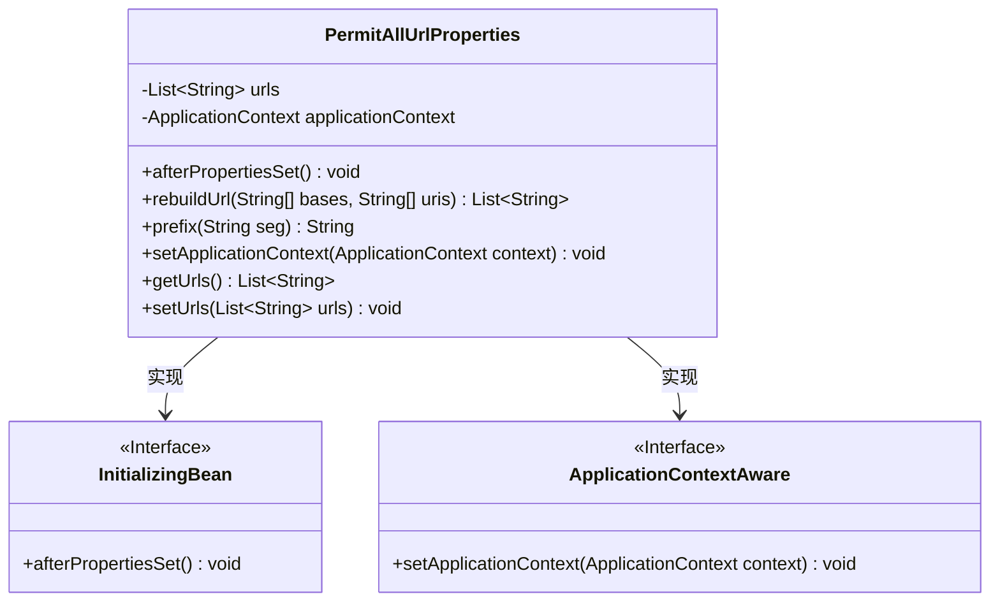
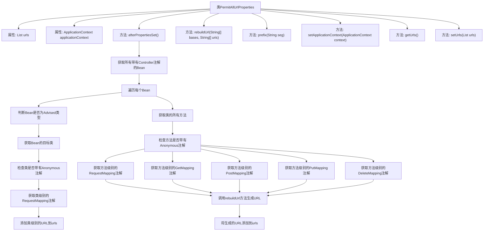

# 基础信息

|      |      |
|------|------|
| 编码语言 | .java |
| 代码路径 | RuoYi-framework/ruoyi-framework/src/main/java/com/ruoyi/framework/config/properties/PermitAllUrlProperties.java |
| 包名 | com.ruoyi.framework.config.properties |
| 依赖项 | ['java.lang.reflect.Method', 'java.util.ArrayList', 'java.util.List', 'java.util.Map', 'java.util.Objects', 'org.springframework.aop.framework.Advised', 'org.springframework.beans.BeansException', 'org.springframework.beans.factory.InitializingBean', 'org.springframework.context.ApplicationContext', 'org.springframework.context.ApplicationContextAware', 'org.springframework.context.annotation.Configuration', 'org.springframework.stereotype.Controller', 'org.springframework.web.bind.annotation.DeleteMapping', 'org.springframework.web.bind.annotation.GetMapping', 'org.springframework.web.bind.annotation.PostMapping', 'org.springframework.web.bind.annotation.PutMapping', 'org.springframework.web.bind.annotation.RequestMapping', 'com.ruoyi.common.annotation.Anonymous'] |
| 概述说明 | 该类实现接口，收集带Anonymous注解的URL路径。 |

# 说明

该类实现了InitializingBean和ApplicationContextAware接口，主要用于收集带有Anonymous注解的URL路径。通过实现InitializingBean接口，该类可以在初始化时执行特定的逻辑，而实现ApplicationContextAware接口则使其能够获取应用上下文信息。该类的主要功能是扫描并汇总所有标记了Anonymous注解的URL路径，以便在系统中进行统一管理或处理。

# 类列表 Class Summary

| 名称   | 类型  | 说明 |
|-------|------|-------------|
| PermitAllUrlProperties | class | 该类实现InitializingBean和ApplicationContextAware，用于收集带有Anonymous注解的URL路径。 |

## 类 PermitAllUrlProperties

|      |      |
|------|------|
| 访问范围 | @Configuration;public |
| 类型 | class |
| 名称 | PermitAllUrlProperties |
| 说明 | 该类实现InitializingBean和ApplicationContextAware，用于收集带有Anonymous注解的URL路径。 |

### UML类图

**描述：**
`PermitAllUrlProperties` 类实现了 `InitializingBean` 和 `ApplicationContextAware` 接口，用于在 Spring 应用启动时自动处理带有 `Anonymous` 注解的控制器和方法，并生成允许匿名访问的 URL 列表。该类通过 `afterPropertiesSet` 方法扫描所有控制器，解析类级别和方法级别的 `RequestMapping` 注解，并构建完整的 URL 路径。`rebuildUrl` 方法用于拼接基础路径和具体路径，`prefix` 方法确保路径以斜杠开头。

### 内部方法调用关系图

这段代码是一个Spring配置类，用于收集所有带有`Anonymous`注解的Controller类或方法的URL，并将其存储在`urls`列表中。`afterPropertiesSet`方法在Spring容器初始化完成后执行，通过`ApplicationContext`获取所有带有`Controller`注解的Bean，并遍历这些Bean的类和方法，检查是否带有`Anonymous`注解。如果类或方法带有`Anonymous`注解，则根据`RequestMapping`、`GetMapping`、`PostMapping`、`PutMapping`或`DeleteMapping`注解生成URL，并将其添加到`urls`列表中。`rebuildUrl`方法用于根据基础URL和URI生成完整的URL，`prefix`方法用于确保URL以斜杠开头。

### 字段列表 Field List

| 名称  | 类型  | 说明 |
|-------|-------|------|
| urls = new ArrayList<>() | List<String> | 定义了一个存储字符串的私有列表变量urls。 |
| applicationContext | ApplicationContext | 私有成员变量applicationContext，类型为ApplicationContext。 |

### 方法列表 Method List

| 名称  | 类型  | 说明 |
|-------|-------|------|
| setApplicationContext | void | 重写方法，设置应用上下文为传入参数。 |
| getUrls | List<String> | 获取URL列表的方法。 |
| setUrls | void | 设置URL列表的方法，将传入的URL列表赋值给当前对象。 |
| prefix | String | 该方法为字符串添加前缀斜杠，若字符串已以斜杠开头则不添加。 |
| afterPropertiesSet | void | 扫描控制器，处理匿名访问注解，生成URL列表。 |
| rebuildUrl | List<String> | 方法rebuildUrl拼接bases和uris生成URL列表并返回。 |

