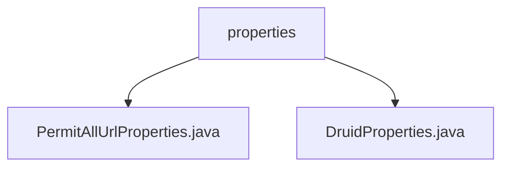

# 基础信息

|      |      |
|------|------|
| 编码语言 | .java |
| 代码路径 | RuoYi-framework/ruoyi-framework/src/main/java/com/ruoyi/framework/config/properties |
| 包名 | RuoYi-framework.ruoyi-framework.src.main.java.com.ruoyi.framework.config.properties |
| 概述说明 | 类收集Anonymous注解URL路径，DruidProperties配置数据源参数。 |

# 说明

该类实现了InitializingBean和ApplicationContextAware接口，主要用于收集带有Anonymous注解的URL路径。通过InitializingBean接口，它在初始化时执行特定逻辑，而ApplicationContextAware接口使其能够获取应用上下文信息。其主要功能是扫描并汇总所有标记了Anonymous注解的URL路径，以便在系统中统一管理或处理。DruidProperties类则用于配置Druid数据源的相关参数，包括连接池大小、连接超时时间、空闲连接检测和连接有效性验证，确保数据源的高效运行和稳定性，优化数据库连接的利用率和可靠性。

### 包内部结构视图

该流程图展示了RuoYi框架中配置文件的结构关系。`properties`文件夹下包含两个Java文件：`PermitAllUrlProperties.java`和`DruidProperties.java`，分别用于处理不同的配置属性。这种结构有助于清晰地管理和维护配置相关的代码。

# 文件列表 File List

| 名称   | 类型  | 说明 |
|-------|------|-------------|
| [DruidProperties.java](DruidProperties.md) | file | DruidProperties类配置数据源参数，如连接池大小、超时、空闲检测及验证。 |
| [PermitAllUrlProperties.java](PermitAllUrlProperties.md) | file | 该类实现接口，收集带Anonymous注解的URL路径。 |

