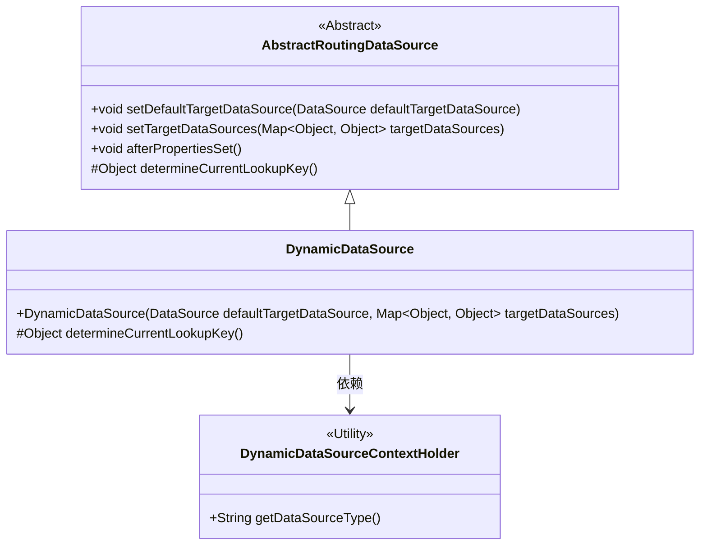
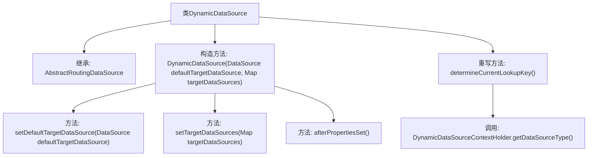

# 基础信息

|      |      |
|------|------|
| 编码语言 | .java |
| 代码路径 | RuoYi-framework/ruoyi-framework/src/main/java/com/ruoyi/framework/datasource/DynamicDataSource.java |
| 包名 | com.ruoyi.framework.datasource |
| 依赖项 | ['java.util.Map', 'javax.sql.DataSource', 'org.springframework.jdbc.datasource.lookup.AbstractRoutingDataSource', 'com.ruoyi.common.config.datasource.DynamicDataSourceContextHolder'] |
| 概述说明 | 动态数据源类继承抽象路由数据源，设置默认和目标数据源，获取当前类型。 |

# 说明

动态数据源类继承自抽象路由数据源，主要负责设置默认数据源和目标数据源，并通过特定方法获取当前所使用的数据源类型。该类通过继承抽象路由数据源，实现了对不同数据源的管理和切换功能，确保系统能够根据需求动态选择合适的数据源。

# 类列表 Class Summary

| 名称   | 类型  | 说明 |
|-------|------|-------------|
| DynamicDataSource | class | 动态数据源类继承抽象路由数据源，设置默认和目标数据源，并获取当前数据源类型。 |

## 类 DynamicDataSource

|      |      |
|------|------|
| 访问范围 | public |
| 类型 | class |
| 名称 | DynamicDataSource |
| 说明 | 动态数据源类继承抽象路由数据源，设置默认和目标数据源，并获取当前数据源类型。 |

### UML类图

这段代码描述了一个动态数据源（`DynamicDataSource`）的实现，它继承自抽象类 `AbstractRoutingDataSource`。`DynamicDataSource` 通过构造函数设置默认数据源和目标数据源，并重写了 `determineCurrentLookupKey` 方法，该方法从 `DynamicDataSourceContextHolder` 中获取当前数据源类型。`DynamicDataSourceContextHolder` 是一个工具类，用于管理当前线程的数据源类型。这种设计允许在运行时动态切换数据源，适用于多数据源场景。

### 内部方法调用关系图

这段代码定义了一个名为`DynamicDataSource`的类，它继承自`AbstractRoutingDataSource`。类的构造方法接收一个默认数据源和一个目标数据源映射，并通过调用父类的方法进行初始化。`determineCurrentLookupKey`方法被重写，用于返回当前数据源类型，该方法通过调用`DynamicDataSourceContextHolder.getDataSourceType()`来获取数据源类型。

### 字段列表 Field List

| 名称  | 类型  | 说明 |
|-------|-------|------|

### 方法列表 Method List

| 名称  | 类型  | 说明 |
|-------|-------|------|
| determineCurrentLookupKey | Object | 重写方法，返回当前数据源类型。 |

