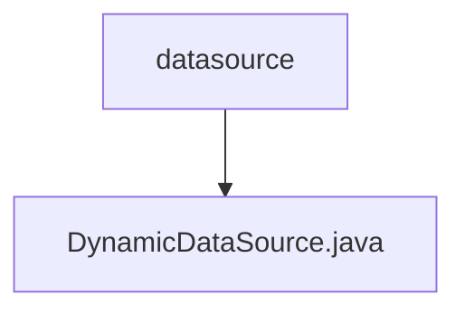

# 基础信息

|      |      |
|------|------|
| 编码语言 | .java |
| 代码路径 | RuoYi-framework/ruoyi-framework/src/main/java/com/ruoyi/framework/datasource |
| 包名 | RuoYi-framework.ruoyi-framework.src.main.java.com.ruoyi.framework.datasource |
| 概述说明 | 动态数据源类继承抽象路由数据源，设置默认和目标数据源，获取当前类型。 |

# 说明

动态数据源类继承自抽象路由数据源，主要负责设置默认数据源和目标数据源，并通过特定方法获取当前所使用的数据源类型。该类通过继承抽象路由数据源，实现了对不同数据源的管理和切换功能，确保系统能够根据需求动态选择合适的数据源。

### 包内部结构视图

该流程图展示了RuoYi框架中数据源模块的层级关系。`datasource`文件夹包含一个名为`DynamicDataSource.java`的文件，该文件用于实现动态数据源的功能。

# 文件列表 File List

| 名称   | 类型  | 说明 |
|-------|------|-------------|
| [DynamicDataSource.java](DynamicDataSource.md) | file | 动态数据源类继承抽象路由数据源，设置默认和目标数据源，获取当前类型。 |

