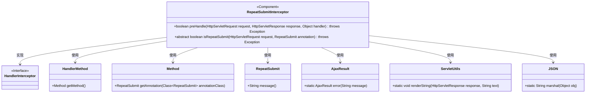
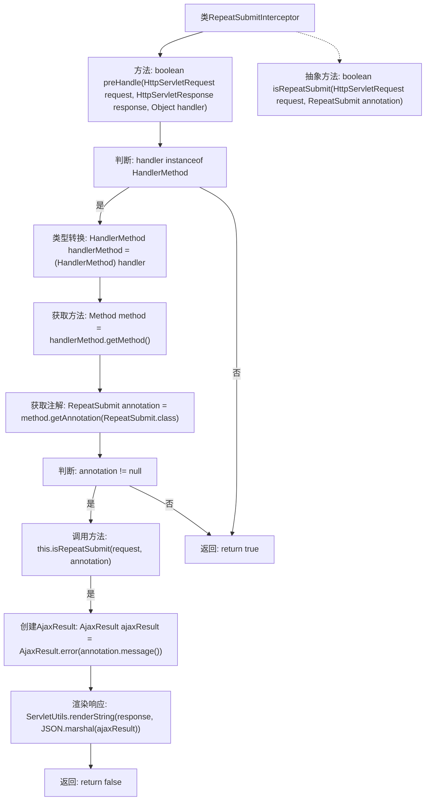

# 基础信息

|      |      |
|------|------|
| 编码语言 | .java |
| 代码路径 | RuoYi-framework/ruoyi-framework/src/main/java/com/ruoyi/framework/interceptor/RepeatSubmitInterceptor.java |
| 包名 | com.ruoyi.framework.interceptor |
| 依赖项 | ['java.lang.reflect.Method', 'javax.servlet.http.HttpServletRequest', 'javax.servlet.http.HttpServletResponse', 'org.springframework.stereotype.Component', 'org.springframework.web.method.HandlerMethod', 'org.springframework.web.servlet.HandlerInterceptor', 'com.ruoyi.common.json.JSON', 'com.ruoyi.common.annotation.RepeatSubmit', 'com.ruoyi.common.core.domain.AjaxResult', 'com.ruoyi.common.utils.ServletUtils'] |
| 概述说明 | 抽象类实现拦截器，防止请求重复提交。 |

# 说明

抽象类实现拦截器功能，主要用于防止重复提交请求。该拦截器通过抽象类的设计，能够灵活地应用于不同的场景，确保在请求处理过程中避免重复提交的情况发生。拦截器的核心作用是拦截并检查请求，确保每个请求的唯一性，从而防止因重复提交导致的数据不一致或资源浪费。该设计提高了系统的稳定性和数据的一致性。

# 类列表 Class Summary

| 名称   | 类型  | 说明 |
|-------|------|-------------|
| RepeatSubmitInterceptor | class | 抽象类实现拦截器，防止重复提交请求。 |

## 类 RepeatSubmitInterceptor

|      |      |
|------|------|
| 访问范围 | @Component;public abstract |
| 类型 | class |
| 名称 | RepeatSubmitInterceptor |
| 说明 | 抽象类实现拦截器，防止重复提交请求。 |

### UML类图

这段代码定义了一个名为 `RepeatSubmitInterceptor` 的抽象类，它实现了 `HandlerInterceptor` 接口。该类的主要功能是拦截请求并检查是否重复提交。`preHandle` 方法用于在请求处理前进行拦截，通过 `HandlerMethod` 获取方法并检查是否存在 `RepeatSubmit` 注解。如果存在且判定为重复提交，则返回错误信息并阻止请求继续处理。`isRepeatSubmit` 方法是一个抽象方法，由子类实现具体的防重复提交规则。

### 内部方法调用关系图

这段代码描述了一个抽象类 `RepeatSubmitInterceptor`，它实现了 `HandlerInterceptor` 接口，用于拦截请求并检查是否重复提交。`preHandle` 方法首先判断处理器是否为 `HandlerMethod` 类型，如果是则获取方法并检查是否存在 `RepeatSubmit` 注解。如果存在注解且判断为重复提交，则返回错误响应；否则继续执行。抽象方法 `isRepeatSubmit` 由子类实现具体的重复提交验证规则。

### 字段列表 Field List

| 名称  | 类型  | 说明 |
|-------|-------|------|

### 方法列表 Method List

| 名称  | 类型  | 说明 |
|-------|-------|------|
| preHandle | boolean | 方法检查请求是否重复提交，若重复则返回错误信息，否则继续处理。 |
| isRepeatSubmit | boolean | 抽象方法判断请求是否重复提交，需传入请求对象和注解，可能抛出异常。 |

