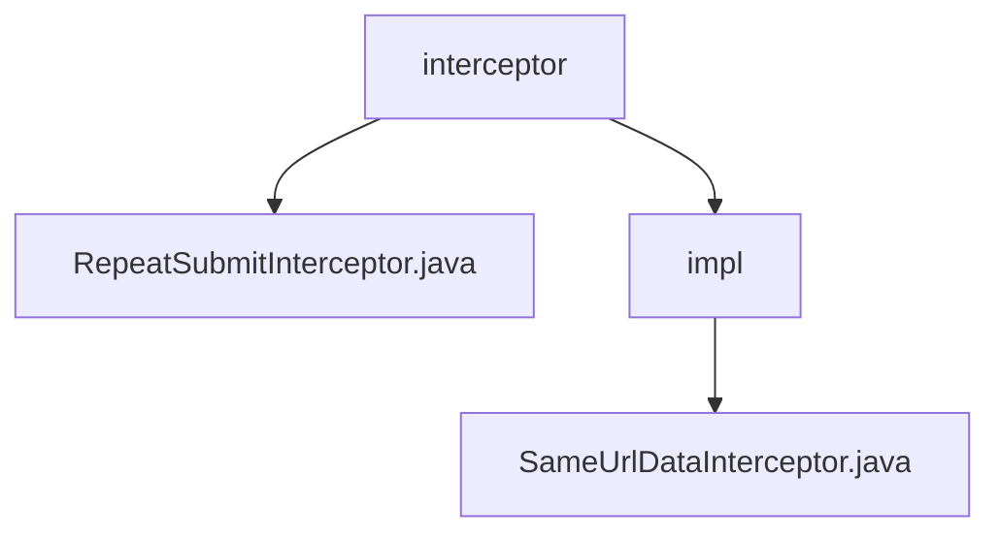

# 基础信息

|      |      |
|------|------|
| 编码语言 | .java |
| 代码路径 | RuoYi-framework/ruoyi-framework/src/main/java/com/ruoyi/framework/interceptor |
| 包名 | RuoYi-framework.ruoyi-framework.src.main.java.com.ruoyi.framework.interceptor |
| 概述说明 | 抽象类实现拦截器功能，防止重复提交，确保请求唯一性，提升系统稳定性和数据一致性。 |

# 说明

抽象类实现的拦截器功能主要用于防止重复提交请求，适用于多种场景，确保请求处理过程中避免重复提交。拦截器通过检查请求的唯一性，防止数据不一致和资源浪费，提高系统稳定性和数据一致性。拦截器类SameUrlDataInterceptor通过比较请求参数和时间间隔判断是否为重复请求，有效避免用户多次提交相同数据。该拦截器在Web应用中确保数据唯一性和一致性，提升系统稳定性和用户体验。

### 包内部结构视图

该流程图展示了RuoYi框架中拦截器模块的层级关系。`interceptor`文件夹包含`RepeatSubmitInterceptor.java`文件和`impl`子文件夹，`impl`子文件夹中又包含`SameUrlDataInterceptor.java`文件。这种结构清晰地反映了代码的组织方式，便于理解和维护。

# 文件列表 File List

| 名称   | 类型  | 说明 |
|-------|------|-------------|
| [RepeatSubmitInterceptor.java](RepeatSubmitInterceptor.md) | file | 抽象类实现拦截器，防止请求重复提交。 |
| [impl](impl/_module.md) | package | 拦截器防止重复提交，比较请求参数和时间间隔。 |

