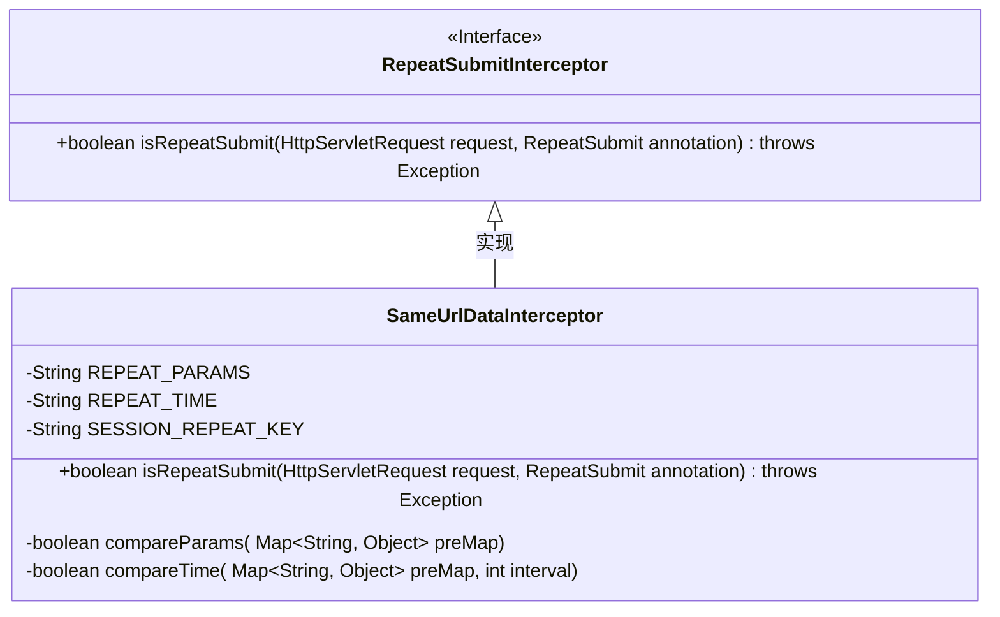
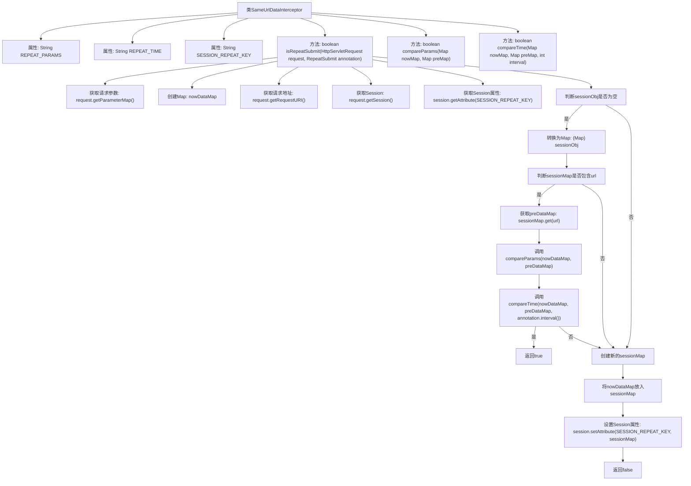

# 基础信息

|      |      |
|------|------|
| 编码语言 | .java |
| 代码路径 | RuoYi-framework/ruoyi-framework/src/main/java/com/ruoyi/framework/interceptor/impl/SameUrlDataInterceptor.java |
| 包名 | com.ruoyi.framework.interceptor.impl |
| 依赖项 | ['java.util.HashMap', 'java.util.Map', 'javax.servlet.http.HttpServletRequest', 'javax.servlet.http.HttpSession', 'org.springframework.stereotype.Component', 'com.ruoyi.common.annotation.RepeatSubmit', 'com.ruoyi.common.json.JSON', 'com.ruoyi.framework.interceptor.RepeatSubmitInterceptor'] |
| 概述说明 | 拦截器防止重复提交，比较请求参数和时间间隔。 |

# 说明

拦截器类SameUrlDataInterceptor的主要功能是防止重复提交。它通过比较请求参数和时间间隔来判断是否为重复请求，从而有效避免用户多次提交相同数据。该拦截器在Web应用中起到关键作用，确保数据的唯一性和一致性，提升系统的稳定性和用户体验。

# 类列表 Class Summary

| 名称   | 类型  | 说明 |
|-------|------|-------------|
| SameUrlDataInterceptor | class | 拦截器类SameUrlDataInterceptor用于防止重复提交，通过比较请求参数和时间间隔。 |

## 类 SameUrlDataInterceptor

|      |      |
|------|------|
| 访问范围 | @Component;public |
| 类型 | class |
| 名称 | SameUrlDataInterceptor |
| 说明 | 拦截器类SameUrlDataInterceptor用于防止重复提交，通过比较请求参数和时间间隔。 |

### UML类图

这段代码定义了一个名为 `SameUrlDataInterceptor` 的类，它继承了 `RepeatSubmitInterceptor` 接口。该类用于拦截重复提交的请求，通过比较当前请求参数与上一次请求参数以及时间间隔来判断是否为重复提交。`SameUrlDataInterceptor` 类中包含了三个常量字符串 `REPEAT_PARAMS`、`REPEAT_TIME` 和 `SESSION_REPEAT_KEY`，分别用于标识请求参数、请求时间和会话中的重复数据键。`isRepeatSubmit` 方法是核心逻辑，它通过比较当前请求与上一次请求的参数和时间间隔来判断是否为重复提交。`compareParams` 和 `compareTime` 是两个私有方法，分别用于比较参数和时间间隔。

### 内部方法调用关系图

该流程图展示了`SameUrlDataInterceptor`类的主要流程，特别是`isRepeatSubmit`方法的执行步骤。该方法首先获取请求参数和系统时间，然后检查Session中是否存在相同URL的重复提交数据。如果存在，则比较参数和时间间隔，判断是否为重复提交。如果是重复提交，返回`true`，否则将当前数据存入Session并返回`false`。整个过程通过多个步骤确保了对重复提交的准确判断和处理。

### 字段列表 Field List

| 名称  | 类型  | 说明 |
|-------|-------|------|
| REPEAT_PARAMS = "repeatParams" | String | 定义了一个不可变字符串常量REPEAT_PARAMS，值为"repeatParams"。 |
| SESSION_REPEAT_KEY = "repeatData" | String | SESSION_REPEAT_KEY常量用于存储重复数据。 |
| REPEAT_TIME = "repeatTime" | String | 定义常量REPEAT_TIME，值为"repeatTime"。 |

### 方法列表 Method List

| 名称  | 类型  | 说明 |
|-------|-------|------|
| isRepeatSubmit | boolean | 检查请求是否重复提交，比较参数和时间间隔，返回结果。 |
| compareTime | boolean | 比较两个时间差是否小于指定间隔，返回布尔值。 |
| compareParams | boolean | 比较两个映射中指定键的值是否相等。 |

