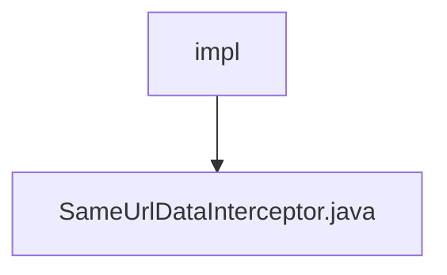

# 基础信息

|      |      |
|------|------|
| 编码语言 | .java |
| 代码路径 | RuoYi-framework/ruoyi-framework/src/main/java/com/ruoyi/framework/interceptor/impl |
| 包名 | RuoYi-framework.ruoyi-framework.src.main.java.com.ruoyi.framework.interceptor.impl |
| 概述说明 | 拦截器防止重复提交，比较请求参数和时间间隔。 |

# 说明

拦截器类SameUrlDataInterceptor的主要功能是防止重复提交。它通过比较请求参数和时间间隔来判断是否为重复请求，从而有效避免用户多次提交相同数据。该拦截器在Web应用中起到关键作用，确保数据的唯一性和一致性，提升系统的稳定性和用户体验。

### 包内部结构视图

该流程图展示了`RuoYi-framework`项目中`interceptor`模块下的`impl`文件夹与其包含的`SameUrlDataInterceptor.java`文件之间的层级关系。`impl`文件夹是`interceptor`模块的一部分，而`SameUrlDataInterceptor.java`文件则是`impl`文件夹中的一个具体实现类。

# 文件列表 File List

| 名称   | 类型  | 说明 |
|-------|------|-------------|
| [SameUrlDataInterceptor.java](SameUrlDataInterceptor.md) | file | 拦截器防止重复提交，比较请求参数和时间间隔。 |

