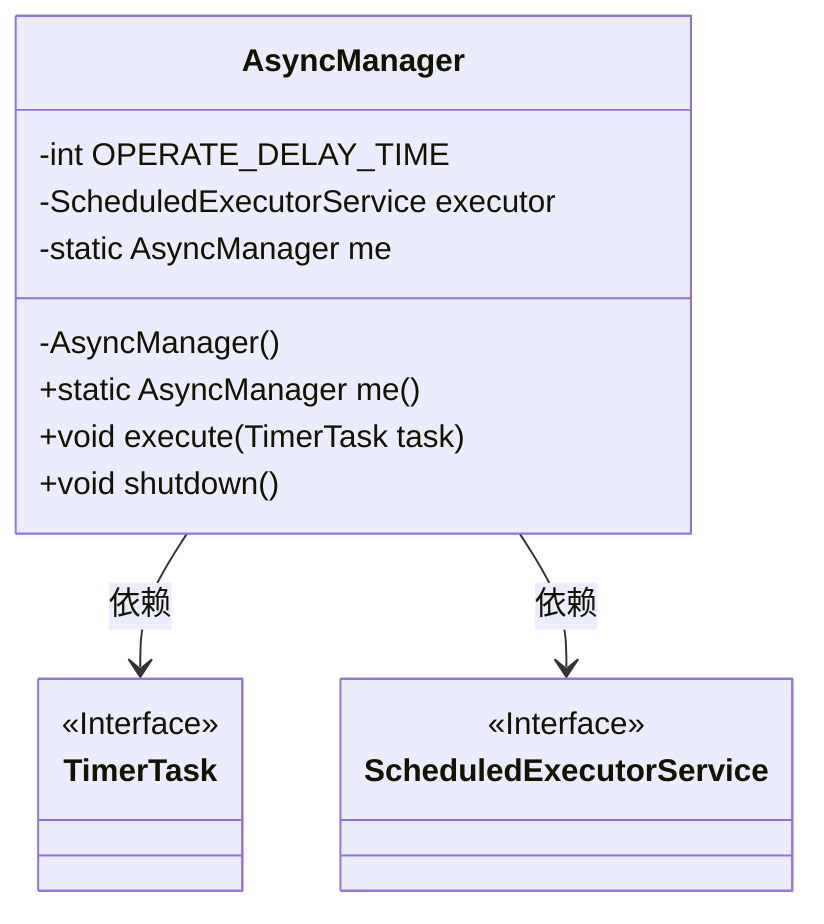
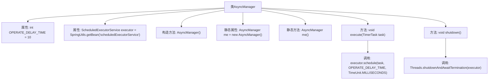

# 基础信息

|      |      |
|------|------|
| 编码语言 | .java |
| 代码路径 | RuoYi-framework/ruoyi-framework/src/main/java/com/ruoyi/framework/manager/AsyncManager.java |
| 包名 | com.ruoyi.framework.manager |
| 依赖项 | ['java.util.TimerTask', 'java.util.concurrent.ScheduledExecutorService', 'java.util.concurrent.TimeUnit', 'com.ruoyi.common.utils.Threads', 'com.ruoyi.common.utils.spring.SpringUtils'] |
| 概述说明 | AsyncManager类实现单例模式，延迟10毫秒执行异步任务，支持任务执行和线程池关闭。 |

# 说明

AsyncManager类采用单例模式设计，确保全局唯一实例。该类延迟10毫秒执行异步任务，提供任务执行和线程池关闭功能，确保任务高效执行和资源合理释放。

# 类列表 Class Summary

| 名称   | 类型  | 说明 |
|-------|------|-------------|
| AsyncManager | class | AsyncManager类实现单例模式，延迟10毫秒执行异步任务，提供任务执行和线程池关闭功能。 |

## 类 AsyncManager

|      |      |
|------|------|
| 访问范围 | public |
| 类型 | class |
| 名称 | AsyncManager |
| 说明 | AsyncManager类实现单例模式，延迟10毫秒执行异步任务，提供任务执行和线程池关闭功能。 |

### UML类图

这段代码定义了一个 `AsyncManager` 类，用于管理异步任务的执行。该类使用单例模式，通过 `me()` 方法获取实例。`AsyncManager` 依赖于 `TimerTask` 和 `ScheduledExecutorService` 接口，分别用于定义任务和调度任务。`execute` 方法用于在延迟 10 毫秒后执行任务，`shutdown` 方法用于停止任务线程池。

### 内部方法调用关系图

这段代码定义了一个名为`AsyncManager`的类，用于管理异步任务的执行和停止。类中包含一个延迟时间常量`OPERATE_DELAY_TIME`和一个线程池`executor`，通过`execute`方法可以调度任务在指定延迟后执行，`shutdown`方法用于停止线程池。类采用单例模式，通过静态方法`me`获取实例。流程图展示了类的结构及其方法之间的调用关系。

### 字段列表 Field List

| 名称  | 类型  | 说明 |
|-------|-------|------|
| me = new AsyncManager() | AsyncManager | 私有静态AsyncManager实例初始化为新对象。 |
| OPERATE_DELAY_TIME = 10 | int | 定义私有常量OPERATE_DELAY_TIME，值为10。 |
| executor = SpringUtils.getBean("scheduledExecutorService") | ScheduledExecutorService | 使用SpringUtils获取ScheduledExecutorService实例。 |

### 方法列表 Method List

| 名称  | 类型  | 说明 |
|-------|-------|------|
| shutdown | void | 关闭线程池并等待其终止。 |
| me | AsyncManager | 静态方法返回AsyncManager实例。 |
| execute | void | 该方法延迟执行指定任务，使用毫秒单位。 |

