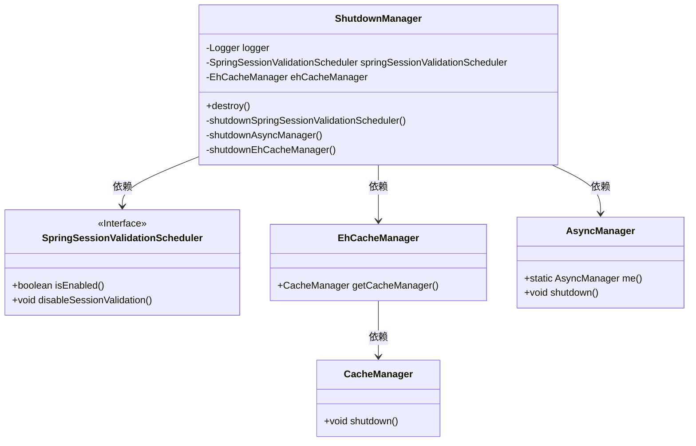
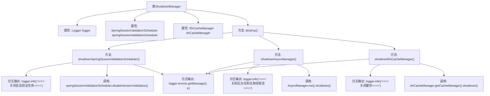

# 基础信息

|      |      |
|------|------|
| 编码语言 | .java |
| 代码路径 | RuoYi-framework/ruoyi-framework/src/main/java/com/ruoyi/framework/manager/ShutdownManager.java |
| 包名 | com.ruoyi.framework.manager |
| 依赖项 | ['com.ruoyi.framework.shiro.web.session.SpringSessionValidationScheduler', 'net.sf.ehcache.CacheManager', 'org.apache.shiro.cache.ehcache.EhCacheManager', 'org.slf4j.Logger', 'org.slf4j.LoggerFactory', 'org.springframework.beans.factory.annotation.Autowired', 'org.springframework.stereotype.Component', 'javax.annotation.PreDestroy'] |
| 概述说明 | ShutdownManager类销毁时关闭会话、异步任务和缓存。 |

# 说明

ShutdownManager类在销毁时负责关闭会话验证、异步任务和缓存管理。该类的主要功能是确保在系统关闭或销毁时，所有相关的会话验证机制、正在执行的异步任务以及缓存管理系统都能够被正确地终止和清理，以避免资源泄漏或数据不一致的问题。通过这一机制，ShutdownManager类有效地维护了系统的稳定性和资源的合理管理。

# 类列表 Class Summary

| 名称   | 类型  | 说明 |
|-------|------|-------------|
| ShutdownManager | class | ShutdownManager类在销毁时关闭会话验证、异步任务和缓存管理。 |

## 类 ShutdownManager

|      |      |
|------|------|
| 访问范围 | @Component;public |
| 类型 | class |
| 名称 | ShutdownManager |
| 说明 | ShutdownManager类在销毁时关闭会话验证、异步任务和缓存管理。 |

### UML类图

类图描述：`ShutdownManager`类负责在应用程序关闭时执行清理任务，包括停止会话验证、关闭异步任务线程池和缓存管理器。它依赖于`SpringSessionValidationScheduler`、`EhCacheManager`和`AsyncManager`等类来完成这些任务。`SpringSessionValidationScheduler`是一个接口，负责管理会话验证任务，而`EhCacheManager`和`CacheManager`则负责缓存的管理和关闭。`AsyncManager`负责管理异步任务的线程池。

### 内部方法调用关系图

这段代码的流程图展示了`ShutdownManager`类的结构及其内部方法的调用关系。`destroy()`方法在类销毁时被调用，依次执行`shutdownSpringSessionValidationScheduler()`、`shutdownAsyncManager()`和`shutdownEhCacheManager()`三个方法，分别用于关闭会话验证任务、后台任务线程池和缓存管理器。每个方法在执行过程中会记录日志，并在出现异常时捕获并记录错误信息。

### 字段列表 Field List

| 名称  | 类型  | 说明 |
|-------|-------|------|
| springSessionValidationScheduler | SpringSessionValidationScheduler | 自动注入可选的Spring会话验证调度器。 |
| logger = LoggerFactory.getLogger("sys-user") | Logger | 定义名为logger的私有静态日志记录器，用于sys-user模块。 |
| ehCacheManager | EhCacheManager | 自动注入可选的EhCacheManager实例。 |

### 方法列表 Method List

| 名称  | 类型  | 说明 |
|-------|-------|------|
| shutdownEhCacheManager | void | 关闭EhCache缓存管理器，处理异常并记录日志。 |
| shutdownAsyncManager | void | 关闭后台任务线程池并处理异常。 |
| destroy | void | PreDestroy方法用于销毁时关闭Spring会话验证、异步管理和EhCache管理器。 |
| shutdownSpringSessionValidationScheduler | void | 关闭会话验证任务，处理异常并记录日志。 |

