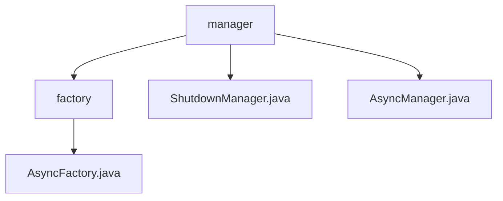

# 基础信息

|      |      |
|------|------|
| 编码语言 | .java |
| 代码路径 | RuoYi-framework/ruoyi-framework/src/main/java/com/ruoyi/framework/manager |
| 包名 | RuoYi-framework.ruoyi-framework.src.main.java.com.ruoyi.framework.manager |
| 概述说明 | AsyncFactory类同步会话并记录日志，TimerTask处理异步任务。ShutdownManager类销毁时关闭会话、任务和缓存。AsyncManager类单例设计，延迟执行异步任务，管理线程池。 |

# 说明

AsyncFactory类通过TimerTask实现异步任务处理，具备同步会话、记录操作日志和登录信息的功能，提升系统可维护性和安全性。ShutdownManager类在销毁时关闭会话验证、异步任务和缓存管理，确保资源合理释放和系统稳定性。AsyncManager类采用单例模式，延迟10毫秒执行异步任务，提供任务执行和线程池关闭功能，确保任务高效执行和资源合理释放。

### 包内部结构视图

该流程图展示了RuoYi框架中`manager`模块的层级结构。`manager`包含三个子节点：`factory`、`ShutdownManager.java`和`AsyncManager.java`。其中，`factory`又包含一个子节点`AsyncFactory.java`。该图清晰地反映了路径中的文件与文件夹之间的从属关系。

# 文件列表 File List

| 名称   | 类型  | 说明 |
|-------|------|-------------|
| [AsyncManager.java](AsyncManager.md) | file | AsyncManager类实现单例模式，延迟10毫秒执行异步任务，支持任务执行和线程池关闭。 |
| [ShutdownManager.java](ShutdownManager.md) | file | ShutdownManager类销毁时关闭会话、异步任务和缓存。 |
| [factory](factory/_module.md) | package | AsyncFactory类支持同步会话、日志记录和登录功能，采用TimerTask处理异步任务。 |

