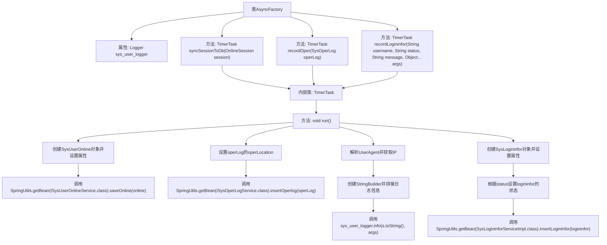

# 基础信息

|      |      |
|------|------|
| 编码语言 | .java |
| 代码路径 | RuoYi-framework/ruoyi-framework/src/main/java/com/ruoyi/framework/manager/factory/AsyncFactory.java |
| 包名 | com.ruoyi.framework.manager.factory |
| 依赖项 | ['java.util.TimerTask', 'org.slf4j.Logger', 'org.slf4j.LoggerFactory', 'com.ruoyi.common.constant.Constants', 'com.ruoyi.common.utils.AddressUtils', 'com.ruoyi.common.utils.LogUtils', 'com.ruoyi.common.utils.ServletUtils', 'com.ruoyi.common.utils.ShiroUtils', 'com.ruoyi.common.utils.StringUtils', 'com.ruoyi.common.utils.spring.SpringUtils', 'com.ruoyi.framework.shiro.session.OnlineSession', 'com.ruoyi.system.domain.SysLogininfor', 'com.ruoyi.system.domain.SysOperLog', 'com.ruoyi.system.domain.SysUserOnline', 'com.ruoyi.system.service.ISysOperLogService', 'com.ruoyi.system.service.ISysUserOnlineService', 'com.ruoyi.system.service.impl.SysLogininforServiceImpl', 'eu.bitwalker.useragentutils.UserAgent'] |
| 概述说明 | AsyncFactory类支持同步会话、日志记录和登录功能，采用TimerTask处理异步任务。 |

# 说明

AsyncFactory类具备同步会话、记录操作日志和登录信息的功能。该类通过TimerTask实现异步任务处理，确保在同步操作的同时能够高效地执行后台任务。这一设计使得系统能够在处理用户请求的同时，记录关键操作和登录信息，提升了系统的可维护性和安全性。

# 类列表 Class Summary

| 名称   | 类型  | 说明 |
|-------|------|-------------|
| AsyncFactory | class | AsyncFactory类提供同步会话、记录操作日志和登录信息的功能，使用TimerTask实现异步任务。 |

## 类 AsyncFactory

|      |      |
|------|------|
| 访问范围 | public |
| 类型 | class |
| 名称 | AsyncFactory |
| 说明 | AsyncFactory类提供同步会话、记录操作日志和登录信息的功能，使用TimerTask实现异步任务。 |

### UML类图

```mermaid
classDiagram
    class AsyncFactory {
        -Logger sys_user_logger
        +TimerTask syncSessionToDb(OnlineSession session)
        +TimerTask recordOper(SysOperLog operLog)
        +TimerTask recordLogininfor(String username, String status, String message, Object... args)
    }

    class TimerTask {
        <<Interface>>
        +void run()
    }

    class OnlineSession {
        +String getId()
        +String getDeptName()
        +String getLoginName()
        +Date getStartTimestamp()
        +Date getLastAccessTime()
        +long getTimeout()
        +String getHost()
        +String getBrowser()
        +String getOs()
        +String getStatus()
    }

    class SysUserOnline {
        +void setSessionId(String sessionId)
        +void setDeptName(String deptName)
        +void setLoginName(String loginName)
        +void setStartTimestamp(Date startTimestamp)
        +void setLastAccessTime(Date lastAccessTime)
        +void setExpireTime(long expireTime)
        +void setIpaddr(String ipaddr)
        +void setLoginLocation(String loginLocation)
        +void setBrowser(String browser)
        +void setOs(String os)
        +void setStatus(String status)
    }

    class ISysUserOnlineService {
        <<Interface>>
        +void saveOnline(SysUserOnline online)
    }

    class SysOperLog {
        +void setOperLocation(String operLocation)
        +String getOperIp()
    }

    class ISysOperLogService {
        <<Interface>>
        +void insertOperlog(SysOperLog operLog)
    }

    class SysLogininfor {
        +void setLoginName(String loginName)
        +void setIpaddr(String ipaddr)
        +void setLoginLocation(String loginLocation)
        +void setBrowser(String browser)
        +void setOs(String os)
        +void setMsg(String msg)
        +void setStatus(String status)
    }

    class SysLogininforServiceImpl {
        +void insertLogininfor(SysLogininfor logininfor)
    }

    class SpringUtils {
        +~T~ getBean(Class~T~ clazz)
    }

    class AddressUtils {
        +String getRealAddressByIP(String ip)
    }

    class UserAgent {
        +OperatingSystem getOperatingSystem()
        +Browser getBrowser()
    }

    class ServletUtils {
        +HttpServletRequest getRequest()
    }

    class ShiroUtils {
        +String getIp()
    }

    class LogUtils {
        +String getBlock(String str)
    }

    class Constants {
        <<Interface>>
        +String LOGIN_SUCCESS
        +String LOGOUT
        +String REGISTER
        +String LOGIN_FAIL
        +String SUCCESS
        +String FAIL
    }

    AsyncFactory --> TimerTask : 生成任务
    AsyncFactory --> OnlineSession : 处理会话
    AsyncFactory --> SysUserOnline : 封装在线用户信息
    AsyncFactory --> ISysUserOnlineService : 保存在线用户信息
    AsyncFactory --> SysOperLog : 处理操作日志
    AsyncFactory --> ISysOperLogService : 插入操作日志
    AsyncFactory --> SysLogininfor : 封装登录信息
    AsyncFactory --> SysLogininforServiceImpl : 插入登录信息
    AsyncFactory --> SpringUtils : 获取Bean
    AsyncFactory --> AddressUtils : 获取真实地址
    AsyncFactory --> UserAgent : 解析用户代理
    AsyncFactory --> ServletUtils : 获取请求
    AsyncFactory --> ShiroUtils : 获取IP
    AsyncFactory --> LogUtils : 格式化日志块
    AsyncFactory --> Constants : 使用常量
```

### 描述
`AsyncFactory` 类是一个工厂类，用于生成不同类型的异步任务。它提供了三个静态方法：`syncSessionToDb` 用于同步会话到数据库，`recordOper` 用于记录操作日志，`recordLogininfor` 用于记录登录信息。每个方法都返回一个 `TimerTask` 对象，该对象在运行时执行相应的操作。`AsyncFactory` 依赖于多个其他类，如 `OnlineSession`、`SysUserOnline`、`ISysUserOnlineService` 等，来完成其功能。这些类分别用于封装会话信息、在线用户信息、操作日志信息等，并通过 `SpringUtils` 获取服务类实例来保存数据。

### 内部方法调用关系图

**描述：**
这段代码定义了一个名为 `AsyncFactory` 的类，主要用于异步处理任务。类中包含三个静态方法，分别用于同步会话到数据库、记录操作日志和记录登录信息。每个方法返回一个 `TimerTask` 对象，该对象在 `run` 方法中执行具体的任务逻辑。通过调用 `SpringUtils.getBean` 方法获取相应的服务类实例，并将数据保存到数据库中。流程图展示了类中各个方法的调用关系以及 `TimerTask` 内部的具体执行步骤。

### 字段列表 Field List

| 名称  | 类型  | 说明 |
|-------|-------|------|
| sys_user_logger = LoggerFactory.getLogger("sys-user") | Logger | 定义名为sys_user_logger的私有静态日志记录器。 |

### 方法列表 Method List

| 名称  | 类型  | 说明 |
|-------|-------|------|
| syncSessionToDb | TimerTask | 定时任务同步在线会话信息到数据库。 |
| recordOper | TimerTask | 创建定时任务记录操作日志，包括查询操作地点并插入日志。 |
| recordLogininfor | TimerTask | 记录用户登录信息，包括IP、地址、用户名、状态、消息、操作系统和浏览器，并插入日志。 |

