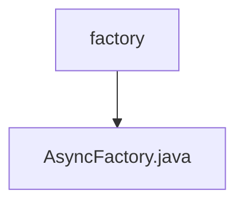

# 基础信息

|      |      |
|------|------|
| 编码语言 | .java |
| 代码路径 | RuoYi-framework/ruoyi-framework/src/main/java/com/ruoyi/framework/manager/factory |
| 包名 | RuoYi-framework.ruoyi-framework.src.main.java.com.ruoyi.framework.manager.factory |
| 概述说明 | AsyncFactory类支持同步会话、日志记录和登录功能，采用TimerTask处理异步任务。 |

# 说明

AsyncFactory类具备同步会话、记录操作日志和登录信息的功能。该类通过TimerTask实现异步任务处理，确保在同步操作的同时能够高效地执行后台任务。这一设计使得系统能够在处理用户请求的同时，记录关键操作和登录信息，提升了系统的可维护性和安全性。

### 包内部结构视图

该流程图展示了路径中的层级关系，顶层节点为`factory`，它包含一个子节点`AsyncFactory.java`。图中清晰地表示了`factory`文件夹与`AsyncFactory.java`文件之间的父子关系，简洁明了地展示了文件结构。

# 文件列表 File List

| 名称   | 类型  | 说明 |
|-------|------|-------------|
| [AsyncFactory.java](AsyncFactory.md) | file | AsyncFactory类支持同步会话、日志记录和登录功能，采用TimerTask处理异步任务。 |

