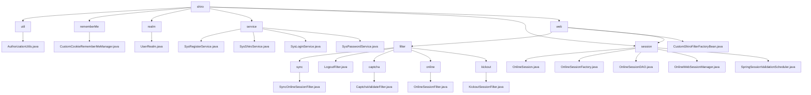

# 基础信息

|      |      |
|------|------|
| 编码语言 | .java |
| 代码路径 | RuoYi-framework/ruoyi-framework/src/main/java/com/ruoyi/framework/shiro |
| 包名 | RuoYi-framework.ruoyi-framework.src.main.java.com.ruoyi.framework.shiro |
| 概述说明 | 清理授权缓存和获取自定义Realm确保权限更新。各类服务管理登录、注册、会话和密码验证，优化系统安全与性能。会话管理工具同步、验证和清理会话数据，确保一致性和安全性。 |

# 说明

该描述涉及多个关键操作和类，主要围绕用户授权、会话管理和登录安全展开。清理用户授权缓存和获取自定义Realm确保系统使用最新的权限配置。自定义Cookie记住我管理器优化用户登录状态的持久化，提升网络传输效率。UserRealm类处理授权和登录认证，支持清理缓存。SysRegisterService、SysShiroService、SysLoginService和SysPasswordService分别负责用户注册、会话管理、登录流程和密码验证，确保安全性和数据完整性。OnlineSession类及其相关类管理用户在线会话信息，确保数据一致性和及时清理。多个过滤器如SyncOnlineSessionFilter、LogoutFilter、CaptchaValidateFilter等分别处理会话同步、退出、验证码校验和访问控制，提升系统性能和安全性。CustomShiroFilterFactoryBean和OnlineWebSessionManager增强系统稳定性和会话管理灵活性。SpringSessionValidationScheduler类定时验证会话有效性，维护系统安全性和稳定性。

### 包内部结构视图

该流程图展示了RuoYi框架中shiro模块的层级结构。shiro作为根节点，包含了util、rememberMe、realm、service、session和web等子模块。每个子模块下又有具体的文件或进一步的分支，如filter模块下又分为sync、LogoutFilter、captcha、online和kickout等子模块。整体结构清晰，展示了shiro模块的复杂性和功能划分。

# 文件列表 File List

| 名称   | 类型  | 说明 |
|-------|------|-------------|
| [web](web/_module.md) | package | SyncOnlineSessionFilter避免重复同步，LogoutFilter处理退出，CaptchaValidateFilter校验验证码，OnlineSessionFilter管理访问，KickoutSessionFilter控制会话数量，CustomShiroFilterFactoryBean解决URL中文校验，OnlineWebSessionManager增强会话管理，SpringSessionValidationScheduler定时验证会话。 |
| [session](session/_module.md) | package | OnlineSession类管理用户在线会话信息，包含用户、设备和状态数据。OnlineSessionFactory类根据SessionContext创建包含客户端环境数据的OnlineSession实例。OnlineSessionDAO类负责会话同步与删除，确保数据一致性和及时清理。 |
| [service](service/_module.md) | package | 系统服务类负责用户注册、会话管理、登录流程和密码验证，确保安全性和数据完整性。 |
| [realm](realm/_module.md) | package | UserRealm类处理授权与登录，管理员全权限，普通用户按角色和菜单分配权限，支持清除缓存。 |
| [rememberMe](rememberMe/_module.md) | package | 自定义Cookie管理器，优化权限控制，防止请求头过大。 |
| [util](util/_module.md) | package | 清理用户授权缓存并获取自定义Realm。 |

