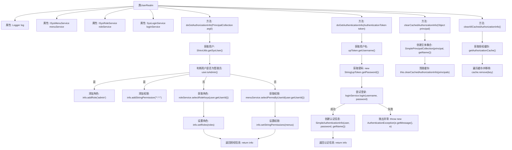

# 基础信息

|      |      |
|------|------|
| 编码语言 | .java |
| 代码路径 | RuoYi-framework/ruoyi-framework/src/main/java/com/ruoyi/framework/shiro/realm/UserRealm.java |
| 包名 | com.ruoyi.framework.shiro.realm |
| 依赖项 | ['java.util.HashSet', 'java.util.Set', 'org.apache.shiro.authc.AuthenticationException', 'org.apache.shiro.authc.AuthenticationInfo', 'org.apache.shiro.authc.AuthenticationToken', 'org.apache.shiro.authc.ExcessiveAttemptsException', 'org.apache.shiro.authc.IncorrectCredentialsException', 'org.apache.shiro.authc.LockedAccountException', 'org.apache.shiro.authc.SimpleAuthenticationInfo', 'org.apache.shiro.authc.UnknownAccountException', 'org.apache.shiro.authc.UsernamePasswordToken', 'org.apache.shiro.authz.AuthorizationInfo', 'org.apache.shiro.authz.SimpleAuthorizationInfo', 'org.apache.shiro.cache.Cache', 'org.apache.shiro.realm.AuthorizingRealm', 'org.apache.shiro.subject.PrincipalCollection', 'org.apache.shiro.subject.SimplePrincipalCollection', 'org.slf4j.Logger', 'org.slf4j.LoggerFactory', 'org.springframework.beans.factory.annotation.Autowired', 'com.ruoyi.common.core.domain.entity.SysUser', 'com.ruoyi.common.exception.user.CaptchaException', 'com.ruoyi.common.exception.user.RoleBlockedException', 'com.ruoyi.common.exception.user.UserBlockedException', 'com.ruoyi.common.exception.user.UserNotExistsException', 'com.ruoyi.common.exception.user.UserPasswordNotMatchException', 'com.ruoyi.common.exception.user.UserPasswordRetryLimitExceedException', 'com.ruoyi.common.utils.ShiroUtils', 'com.ruoyi.framework.shiro.service.SysLoginService', 'com.ruoyi.system.service.ISysMenuService', 'com.ruoyi.system.service.ISysRoleService'] |
| 概述说明 | UserRealm类处理授权与登录，管理员全权限，普通用户按角色和菜单分配权限，支持清除缓存。 |

# 说明

UserRealm类负责处理授权和登录认证功能，管理员具备所有权限，普通用户则根据其角色和菜单分配相应权限。此外，该类还支持清理授权缓存，确保权限信息的及时更新和准确性。

# 类列表 Class Summary

| 名称   | 类型  | 说明 |
|-------|------|-------------|
| UserRealm | class | UserRealm类实现授权和登录认证，管理员拥有所有权限，普通用户根据角色和菜单获取权限，支持清理授权缓存。 |

## 类 UserRealm

|      |      |
|------|------|
| 访问范围 | public |
| 类型 | class |
| 名称 | UserRealm |
| 说明 | UserRealm类实现授权和登录认证，管理员拥有所有权限，普通用户根据角色和菜单获取权限，支持清理授权缓存。 |

### UML类图

```mermaid
classDiagram
    class UserRealm {
        -Logger log
        -ISysMenuService menuService
        -ISysRoleService roleService
        -SysLoginService loginService
        +AuthorizationInfo doGetAuthorizationInfo(PrincipalCollection arg0)
        +AuthenticationInfo doGetAuthenticationInfo(AuthenticationToken token) throws AuthenticationException
        +void clearCachedAuthorizationInfo(Object principal)
        +void clearAllCachedAuthorizationInfo()
    }

    class ISysMenuService {
        <<Interface>>
        +Set~String~ selectPermsByUserId(Long userId)
    }

    class ISysRoleService {
        <<Interface>>
        +Set~String~ selectRoleKeys(Long userId)
    }

    class SysLoginService {
        +SysUser login(String username, String password) throws Exception
    }

    class SysUser {
        +boolean isAdmin()
        +Long getUserId()
    }

    class SimpleAuthorizationInfo {
        +void addRole(String role)
        +void addStringPermission(String permission)
        +void setRoles(Set~String~ roles)
        +void setStringPermissions(Set~String~ permissions)
    }

    class SimpleAuthenticationInfo {
        +SimpleAuthenticationInfo(Object principal, Object credentials, String realmName)
    }

    class SimplePrincipalCollection {
        +SimplePrincipalCollection(Object principal, String realmName)
    }

    UserRealm --> ISysMenuService : 依赖
    UserRealm --> ISysRoleService : 依赖
    UserRealm --> SysLoginService : 依赖
    UserRealm --> SysUser : 依赖
    UserRealm --> SimpleAuthorizationInfo : 依赖
    UserRealm --> SimpleAuthenticationInfo : 依赖
    UserRealm --> SimplePrincipalCollection : 依赖
```

这段代码定义了一个 `UserRealm` 类，继承自 `AuthorizingRealm`，用于处理用户的授权和认证逻辑。`UserRealm` 依赖 `ISysMenuService`、`ISysRoleService` 和 `SysLoginService` 来获取用户的角色和权限信息，并处理登录认证。`UserRealm` 通过 `SimpleAuthorizationInfo` 和 `SimpleAuthenticationInfo` 类来管理用户的授权和认证信息，并提供了清理缓存的方法。整体设计实现了用户权限管理和认证的核心功能。

### 内部方法调用关系图

**描述：**  
这段代码定义了一个`UserRealm`类，继承自`AuthorizingRealm`，主要用于用户授权和认证。`doGetAuthorizationInfo`方法根据用户角色和权限进行授权，`doGetAuthenticationInfo`方法处理用户登录认证，`clearCachedAuthorizationInfo`和`clearAllCachedAuthorizationInfo`方法用于清理用户授权信息缓存。代码通过调用不同的服务类来获取用户角色、权限和登录信息，并根据结果进行相应的处理或抛出异常。

### 字段列表 Field List

| 名称  | 类型  | 说明 |
|-------|-------|------|
| menuService | ISysMenuService | 自动注入ISysMenuService类型的menuService实例。 |
| log = LoggerFactory.getLogger(UserRealm.class) | Logger | 定义UserRealm类的日志记录器实例。 |
| roleService | ISysRoleService | 自动注入角色服务实例。 |
| loginService | SysLoginService | 自动注入SysLoginService实例。 |

### 方法列表 Method List

| 名称  | 类型  | 说明 |
|-------|-------|------|
| clearAllCachedAuthorizationInfo | void | 清除所有缓存中的授权信息。 |
| clearCachedAuthorizationInfo | void | 清除指定主体的缓存授权信息。 |
| doGetAuthenticationInfo | AuthenticationInfo | 重写认证方法，处理登录异常并返回认证信息。 |
| doGetAuthorizationInfo | AuthorizationInfo | 该方法获取用户角色和权限，管理员拥有全部权限，普通用户根据服务查询权限。 |

