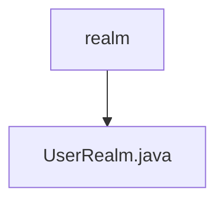

# 基础信息

|      |      |
|------|------|
| 编码语言 | .java |
| 代码路径 | RuoYi-framework/ruoyi-framework/src/main/java/com/ruoyi/framework/shiro/realm |
| 包名 | RuoYi-framework.ruoyi-framework.src.main.java.com.ruoyi.framework.shiro.realm |
| 概述说明 | UserRealm类处理授权与登录，管理员全权限，普通用户按角色和菜单分配权限，支持清除缓存。 |

# 说明

UserRealm类负责处理授权和登录认证功能，管理员具备所有权限，普通用户则根据其角色和菜单分配相应权限。此外，该类还支持清理授权缓存，确保权限信息的及时更新和准确性。

### 包内部结构视图

流程图描述：该流程图展示了RuoYi框架中shiro模块的realm文件夹及其包含的UserRealm.java文件之间的层级关系。realm文件夹是UserRealm.java文件的父级，表示UserRealm.java文件位于realm文件夹内。

# 文件列表 File List

| 名称   | 类型  | 说明 |
|-------|------|-------------|
| [UserRealm.java](UserRealm.md) | file | UserRealm类处理授权与登录，管理员全权限，普通用户按角色和菜单分配权限，支持清除缓存。 |

