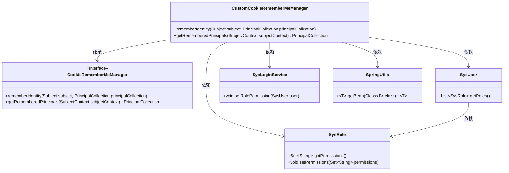
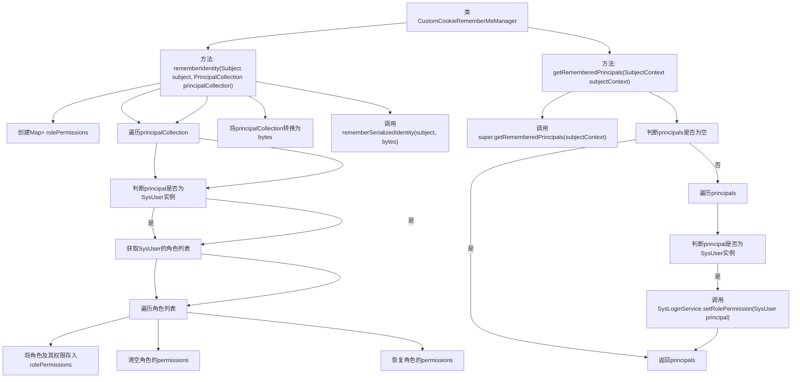

# 基础信息

|      |      |
|------|------|
| 编码语言 | .java |
| 代码路径 | RuoYi-framework/ruoyi-framework/src/main/java/com/ruoyi/framework/shiro/rememberMe/CustomCookieRememberMeManager.java |
| 包名 | com.ruoyi.framework.shiro.rememberMe |
| 依赖项 | ['java.util.HashMap', 'java.util.List', 'java.util.Map', 'java.util.Set', 'org.apache.shiro.subject.PrincipalCollection', 'org.apache.shiro.subject.Subject', 'org.apache.shiro.subject.SubjectContext', 'org.apache.shiro.web.mgt.CookieRememberMeManager', 'com.ruoyi.common.core.domain.entity.SysRole', 'com.ruoyi.common.core.domain.entity.SysUser', 'com.ruoyi.common.utils.spring.SpringUtils', 'com.ruoyi.framework.shiro.service.SysLoginService'] |
| 概述说明 | 自定义Cookie管理器，优化权限控制，防止请求头过大。 |

# 说明

自定义Cookie记住我管理器用于管理用户登录状态的持久化，通过清除和恢复角色权限来确保用户权限的正确性和安全性。该管理器还通过优化Cookie数据，防止HTTP请求头过大，从而提升网络传输效率和系统性能。

# 类列表 Class Summary

| 名称   | 类型  | 说明 |
|-------|------|-------------|
| CustomCookieRememberMeManager | class | 自定义Cookie记住我管理器，清除和恢复角色权限，防止HTTP请求头过大。 |

## 类 CustomCookieRememberMeManager

|      |      |
|------|------|
| 访问范围 | public |
| 类型 | class |
| 名称 | CustomCookieRememberMeManager |
| 说明 | 自定义Cookie记住我管理器，清除和恢复角色权限，防止HTTP请求头过大。 |

### UML类图

这段代码定义了一个 `CustomCookieRememberMeManager` 类，继承自 `CookieRememberMeManager`，用于管理“记住我”功能的身份验证。该类重写了 `rememberIdentity` 方法，在记住用户身份时临时清除角色的权限字符串，以防止HTTP请求头过大，并在处理完成后恢复这些权限。此外，`getRememberedPrincipals` 方法在获取记住的用户身份时，通过 `SysLoginService` 恢复角色的权限字符串。代码涉及 `SysUser`、`SysRole`、`SysLoginService` 和 `SpringUtils` 等类的交互。

### 内部方法调用关系图

这段代码描述了一个自定义的CookieRememberMeManager类，主要用于在记住用户身份时临时清除和恢复角色的权限字符串，以防止HTTP请求头过大。在`rememberIdentity`方法中，首先清除角色的权限字符串并将其存储在Map中，然后将用户身份信息序列化为字节数组，最后恢复角色的权限字符串并调用父类的方法保存序列化后的身份信息。在`getRememberedPrincipals`方法中，首先获取记住的用户身份信息，如果存在且不为空，则遍历用户信息并调用服务类恢复角色的权限字符串。

### 字段列表 Field List

| 名称  | 类型  | 说明 |
|-------|-------|------|

### 方法列表 Method List

| 名称  | 类型  | 说明 |
|-------|-------|------|
| rememberIdentity | void | 清除并恢复用户角色权限，保存序列化身份信息。 |
| getRememberedPrincipals | PrincipalCollection | 重写方法，获取记住的Principal，若为空返回，否则设置角色权限。 |

