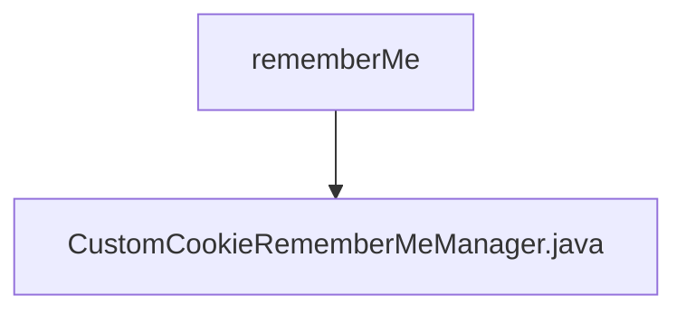

# 基础信息

|      |      |
|------|------|
| 编码语言 | .java |
| 代码路径 | RuoYi-framework/ruoyi-framework/src/main/java/com/ruoyi/framework/shiro/rememberMe |
| 包名 | RuoYi-framework.ruoyi-framework.src.main.java.com.ruoyi.framework.shiro.rememberMe |
| 概述说明 | 自定义Cookie管理器，优化权限控制，防止请求头过大。 |

# 说明

自定义Cookie记住我管理器用于管理用户登录状态的持久化，通过清除和恢复角色权限来确保用户权限的正确性和安全性。该管理器还通过优化Cookie数据，防止HTTP请求头过大，从而提升网络传输效率和系统性能。

### 包内部结构视图

该流程图展示了RuoYi框架中`rememberMe`目录与`CustomCookieRememberMeManager.java`文件之间的层级关系。`rememberMe`作为父目录，包含了一个名为`CustomCookieRememberMeManager.java`的文件，表示该文件位于`rememberMe`目录下，用于处理记住我功能的实现。

# 文件列表 File List

| 名称   | 类型  | 说明 |
|-------|------|-------------|
| [CustomCookieRememberMeManager.java](CustomCookieRememberMeManager.md) | file | 自定义Cookie管理器，优化权限控制，防止请求头过大。 |

