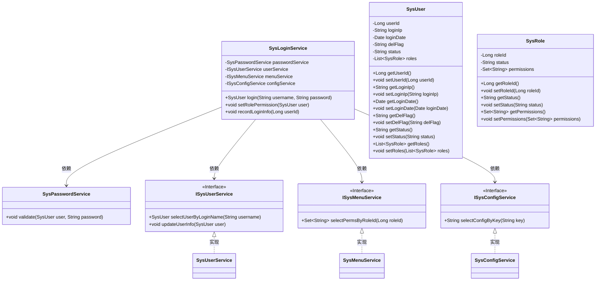
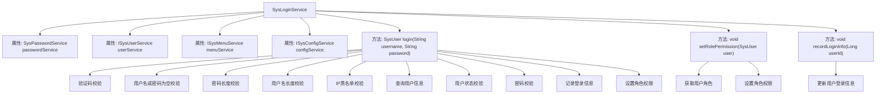

# 基础信息

|      |      |
|------|------|
| 编码语言 | .java |
| 代码路径 | RuoYi-framework/ruoyi-framework/src/main/java/com/ruoyi/framework/shiro/service/SysLoginService.java |
| 包名 | com.ruoyi.framework.shiro.service |
| 依赖项 | ['java.util.List', 'java.util.Set', 'org.springframework.beans.factory.annotation.Autowired', 'org.springframework.stereotype.Component', 'com.ruoyi.common.constant.Constants', 'com.ruoyi.common.constant.ShiroConstants', 'com.ruoyi.common.constant.UserConstants', 'com.ruoyi.common.core.domain.entity.SysRole', 'com.ruoyi.common.core.domain.entity.SysUser', 'com.ruoyi.common.enums.UserStatus', 'com.ruoyi.common.exception.user.BlackListException', 'com.ruoyi.common.exception.user.CaptchaException', 'com.ruoyi.common.exception.user.UserBlockedException', 'com.ruoyi.common.exception.user.UserDeleteException', 'com.ruoyi.common.exception.user.UserNotExistsException', 'com.ruoyi.common.exception.user.UserPasswordNotMatchException', 'com.ruoyi.common.utils.DateUtils', 'com.ruoyi.common.utils.IpUtils', 'com.ruoyi.common.utils.MessageUtils', 'com.ruoyi.common.utils.ServletUtils', 'com.ruoyi.common.utils.ShiroUtils', 'com.ruoyi.common.utils.StringUtils', 'com.ruoyi.framework.manager.AsyncManager', 'com.ruoyi.framework.manager.factory.AsyncFactory', 'com.ruoyi.system.service.ISysConfigService', 'com.ruoyi.system.service.ISysMenuService', 'com.ruoyi.system.service.ISysUserService'] |
| 概述说明 | SysLoginService处理登录，验证用户信息，设置权限并记录登录。 |

# 说明

SysLoginService负责处理用户登录流程，首先验证用户提供的用户名和密码是否正确，同时检查用户IP是否在黑名单中。如果验证通过，系统会为用户设置相应的角色权限，并记录登录的相关信息，包括登录时间和IP地址等。该服务确保登录过程的安全性和准确性，同时为后续操作提供必要的权限控制和日志记录。

# 类列表 Class Summary

| 名称   | 类型  | 说明 |
|-------|------|-------------|
| SysLoginService | class | SysLoginService处理用户登录，验证用户名、密码、IP黑名单，并设置角色权限和记录登录信息。 |

## 类 SysLoginService

|      |      |
|------|------|
| 访问范围 | @Component;public |
| 类型 | class |
| 名称 | SysLoginService |
| 说明 | SysLoginService处理用户登录，验证用户名、密码、IP黑名单，并设置角色权限和记录登录信息。 |

### UML类图

### 描述
该代码展示了一个用户登录服务类 `SysLoginService`，它依赖于密码服务 `SysPasswordService`、用户服务 `ISysUserService`、菜单服务 `ISysMenuService` 和配置服务 `ISysConfigService`。`SysLoginService` 通过 `login` 方法处理用户登录逻辑，包括验证码校验、用户名和密码验证、IP黑名单检查、用户状态检查等。登录成功后，会设置用户角色权限并记录登录信息。`ISysUserService`、`ISysMenuService` 和 `ISysConfigService` 是接口，分别由 `SysUserService`、`SysMenuService` 和 `SysConfigService` 实现。

### 内部方法调用关系图

这段代码实现了一个系统登录服务 `SysLoginService`，主要负责用户登录时的各种校验和处理。首先，代码会进行验证码、用户名、密码、IP黑名单等校验，如果校验失败则抛出相应的异常并记录日志。如果校验通过，则查询用户信息并进一步校验用户状态和密码。最后，记录登录信息并设置用户角色权限。整个流程通过多个步骤确保登录的安全性和正确性。

### 字段列表 Field List

| 名称  | 类型  | 说明 |
|-------|-------|------|
| userService | ISysUserService | 自动注入用户服务实例。 |
| passwordService | SysPasswordService | 自动注入密码服务实例。 |
| configService | ISysConfigService | 自动注入系统配置服务实例。 |
| menuService | ISysMenuService | 自动注入ISysMenuService类型的menuService实例。 |

### 方法列表 Method List

| 名称  | 类型  | 说明 |
|-------|-------|------|
| recordLoginInfo | void | 记录用户登录信息，包括用户ID、登录IP和登录时间，并更新用户信息。 |
| setRolePermission | void | 为用户的角色设置权限，仅处理状态正常且非管理员的角色。 |
| login | SysUser | 登录功能验证用户名、密码、验证码、IP黑名单，查询用户信息并校验状态，最终返回用户对象。 |

