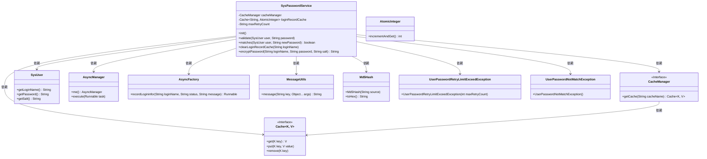
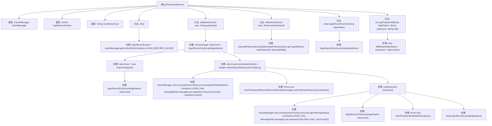

# 基础信息

|      |      |
|------|------|
| 编码语言 | .java |
| 代码路径 | RuoYi-framework/ruoyi-framework/src/main/java/com/ruoyi/framework/shiro/service/SysPasswordService.java |
| 包名 | com.ruoyi.framework.shiro.service |
| 依赖项 | ['java.util.concurrent.atomic.AtomicInteger', 'javax.annotation.PostConstruct', 'org.apache.shiro.cache.Cache', 'org.apache.shiro.cache.CacheManager', 'org.apache.shiro.crypto.hash.Md5Hash', 'org.springframework.beans.factory.annotation.Autowired', 'org.springframework.beans.factory.annotation.Value', 'org.springframework.stereotype.Component', 'com.ruoyi.common.constant.Constants', 'com.ruoyi.common.constant.ShiroConstants', 'com.ruoyi.common.core.domain.entity.SysUser', 'com.ruoyi.common.exception.user.UserPasswordNotMatchException', 'com.ruoyi.common.exception.user.UserPasswordRetryLimitExceedException', 'com.ruoyi.common.utils.MessageUtils', 'com.ruoyi.framework.manager.AsyncManager', 'com.ruoyi.framework.manager.factory.AsyncFactory'] |
| 概述说明 | SysPasswordService类负责用户登录密码验证，含重试限制与匹配检查。 |

# 说明

SysPasswordService类负责管理用户登录密码的验证流程，主要功能包括对用户输入密码的匹配检查以及限制密码重试次数，确保系统安全性。

# 类列表 Class Summary

| 名称   | 类型  | 说明 |
|-------|------|-------------|
| SysPasswordService | class | SysPasswordService类管理用户登录密码验证，包括重试次数限制和密码匹配检查。 |

## 类 SysPasswordService

|      |      |
|------|------|
| 访问范围 | @Component;public |
| 类型 | class |
| 名称 | SysPasswordService |
| 说明 | SysPasswordService类管理用户登录密码验证，包括重试次数限制和密码匹配检查。 |

### UML类图

### 描述
`SysPasswordService` 类负责用户密码的验证和管理。它通过 `CacheManager` 获取缓存实例，并使用 `Cache` 接口来存储和检索用户的登录尝试次数。`validate` 方法用于验证用户密码，如果密码错误次数超过最大重试次数，则抛出 `UserPasswordRetryLimitExceedException` 异常；如果密码不匹配，则抛出 `UserPasswordNotMatchException` 异常。`matches` 方法用于比较用户输入的密码与存储的密码是否一致，`encryptPassword` 方法用于加密密码。`AsyncManager` 和 `AsyncFactory` 用于异步记录登录信息。

### 内部方法调用关系图

这段代码是一个Spring组件类`SysPasswordService`，用于管理用户密码的验证和缓存记录。它通过`CacheManager`管理登录尝试次数的缓存，并在用户登录时验证密码。如果密码错误次数超过最大重试次数，会抛出异常并记录登录失败信息。代码还包括密码加密和缓存清理功能，确保系统的安全性和数据的准确性。

### 字段列表 Field List

| 名称  | 类型  | 说明 |
|-------|-------|------|
| cacheManager | CacheManager | 自动注入缓存管理器实例。 |
| loginRecordCache | Cache<String, AtomicInteger> | 私有缓存存储字符串键与原子整数值。 |
| maxRetryCount | String | 用户密码最大重试次数配置变量。 |

### 方法列表 Method List

| 名称  | 类型  | 说明 |
|-------|-------|------|
| clearLoginRecordCache | void | 清除指定用户登录记录的缓存。 |
| matches | boolean | 该方法检查用户密码是否与新加密密码匹配。 |
| init | void | 初始化方法，获取登录记录缓存实例。 |
| encryptPassword | String | 使用MD5加密登录名、密码和盐值生成十六进制字符串。 |
| validate | void | 验证用户登录，记录失败次数，超限抛出异常，成功清除记录。 |

