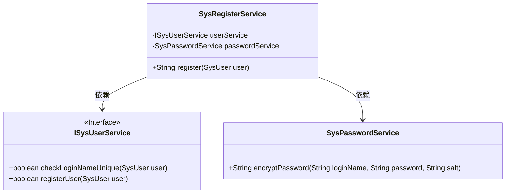
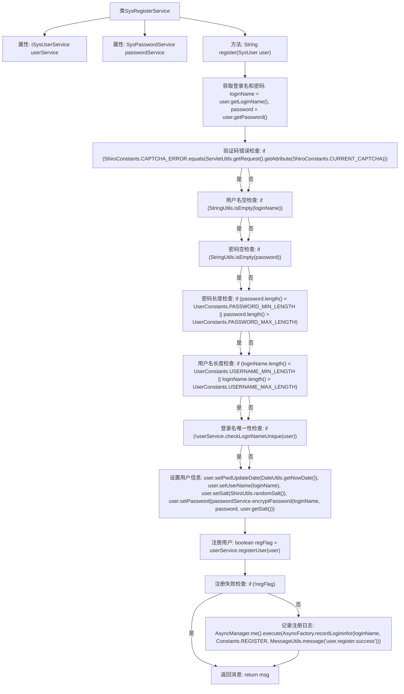

# 基础信息

|      |      |
|------|------|
| 编码语言 | .java |
| 代码路径 | RuoYi-framework/ruoyi-framework/src/main/java/com/ruoyi/framework/shiro/service/SysRegisterService.java |
| 包名 | com.ruoyi.framework.shiro.service |
| 依赖项 | ['org.springframework.beans.factory.annotation.Autowired', 'org.springframework.stereotype.Component', 'com.ruoyi.common.constant.Constants', 'com.ruoyi.common.constant.ShiroConstants', 'com.ruoyi.common.constant.UserConstants', 'com.ruoyi.common.core.domain.entity.SysUser', 'com.ruoyi.common.utils.DateUtils', 'com.ruoyi.common.utils.MessageUtils', 'com.ruoyi.common.utils.ServletUtils', 'com.ruoyi.common.utils.ShiroUtils', 'com.ruoyi.common.utils.StringUtils', 'com.ruoyi.framework.manager.AsyncManager', 'com.ruoyi.framework.manager.factory.AsyncFactory', 'com.ruoyi.system.service.ISysUserService'] |
| 概述说明 | SysRegisterService类负责用户注册，验证用户名、密码及验证码，检查唯一性并加密密码。 |

# 说明

SysRegisterService类负责用户注册功能，主要包含验证用户名、密码及验证码的合法性，确保用户名的唯一性，并对密码进行加密处理。该服务通过一系列检查步骤，确保注册过程的安全性和数据的完整性。

# 类列表 Class Summary

| 名称   | 类型  | 说明 |
|-------|------|-------------|
| SysRegisterService | class | SysRegisterService类实现用户注册，验证用户名、密码及验证码，检查唯一性并加密密码。 |

## 类 SysRegisterService

|      |      |
|------|------|
| 访问范围 | @Component;public |
| 类型 | class |
| 名称 | SysRegisterService |
| 说明 | SysRegisterService类实现用户注册，验证用户名、密码及验证码，检查唯一性并加密密码。 |

### UML类图

这段代码定义了一个 `SysRegisterService` 类，用于处理用户注册的逻辑。该类依赖于 `ISysUserService` 和 `SysPasswordService` 两个服务接口，分别用于检查登录名唯一性和加密密码。`register` 方法通过一系列条件判断来验证用户输入的有效性，并在验证通过后调用相关服务完成用户注册。如果注册过程中出现错误，将返回相应的错误信息。

### 内部方法调用关系图

这段代码是一个用户注册服务的实现，主要功能是验证用户输入的信息是否符合要求，并在验证通过后进行用户注册。代码首先检查验证码是否正确，然后依次检查用户名、密码是否为空，密码和用户名的长度是否符合要求，以及登录名是否唯一。如果所有检查都通过，则设置用户信息并尝试注册用户。如果注册成功，则记录注册日志；否则返回相应的错误信息。

### 字段列表 Field List

| 名称  | 类型  | 说明 |
|-------|-------|------|
| passwordService | SysPasswordService | 自动注入密码服务实例。 |
| userService | ISysUserService | 使用@Autowired自动注入ISysUserService实例。 |

### 方法列表 Method List

| 名称  | 类型  | 说明 |
|-------|-------|------|
| register | String | 用户注册功能，验证码、用户名、密码有效性检查，处理注册逻辑。 |

