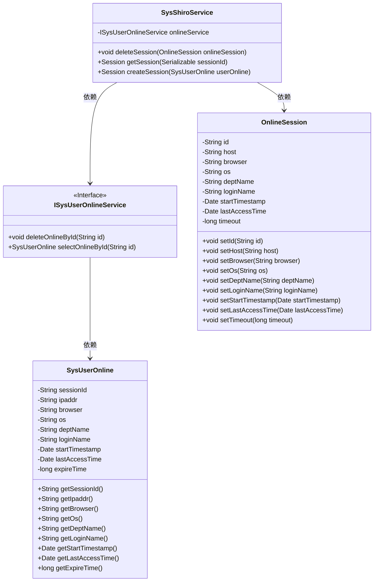
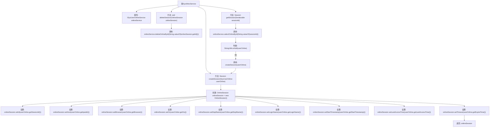

# 基础信息

|      |      |
|------|------|
| 编码语言 | .java |
| 代码路径 | RuoYi-framework/ruoyi-framework/src/main/java/com/ruoyi/framework/shiro/service/SysShiroService.java |
| 包名 | com.ruoyi.framework.shiro.service |
| 依赖项 | ['java.io.Serializable', 'org.apache.shiro.session.Session', 'org.springframework.beans.factory.annotation.Autowired', 'org.springframework.stereotype.Component', 'com.ruoyi.common.utils.StringUtils', 'com.ruoyi.framework.shiro.session.OnlineSession', 'com.ruoyi.system.domain.SysUserOnline', 'com.ruoyi.system.service.ISysUserOnlineService'] |
| 概述说明 | SysShiroService类负责会话管理，具备删除、获取和创建会话功能。 |

# 说明

SysShiroService类负责管理会话，提供删除会话、获取会话和创建会话的功能。该类通过删除会话操作来移除不再需要的会话，通过获取会话操作来检索当前会话信息，并通过创建会话操作来生成新的会话实例。这些功能共同确保会话的有效管理和维护。

# 类列表 Class Summary

| 名称   | 类型  | 说明 |
|-------|------|-------------|
| SysShiroService | class | SysShiroService类管理会话，包含删除会话、获取会话和创建会话功能。 |

## 类 SysShiroService

|      |      |
|------|------|
| 访问范围 | @Component;public |
| 类型 | class |
| 名称 | SysShiroService |
| 说明 | SysShiroService类管理会话，包含删除会话、获取会话和创建会话功能。 |

### UML类图

### 描述
`SysShiroService` 类负责管理与用户会话相关的操作，包括删除会话、获取会话信息以及创建会话。它依赖于 `ISysUserOnlineService` 接口来执行具体的在线用户操作，如删除在线用户和查询在线用户信息。`OnlineSession` 类用于存储会话的详细信息，而 `SysUserOnline` 类则代表在线用户的信息。`SysShiroService` 通过 `ISysUserOnlineService` 获取 `SysUserOnline` 对象，并将其转换为 `OnlineSession` 对象以提供会话信息。

### 内部方法调用关系图

这段代码定义了一个名为 `SysShiroService` 的类，主要用于管理会话信息。它包含三个方法：`deleteSession` 用于删除指定会话，`getSession` 用于获取会话信息，`createSession` 用于创建并初始化一个新的会话对象。代码通过调用 `onlineService` 的方法来操作会话数据，并根据会话信息设置 `OnlineSession` 对象的属性。流程图展示了类内部方法之间的调用关系以及数据流动的路径。

### 字段列表 Field List

| 名称  | 类型  | 说明 |
|-------|-------|------|
| onlineService | ISysUserOnlineService | 自动注入在线用户服务实例。 |

### 方法列表 Method List

| 名称  | 类型  | 说明 |
|-------|-------|------|
| deleteSession | void | 删除指定在线会话的方法，调用服务删除会话ID。 |
| createSession | Session | 该方法根据用户在线信息创建并返回一个在线会话对象。 |
| getSession | Session | 通过sessionId获取在线用户会话，若不存在则返回null。 |

