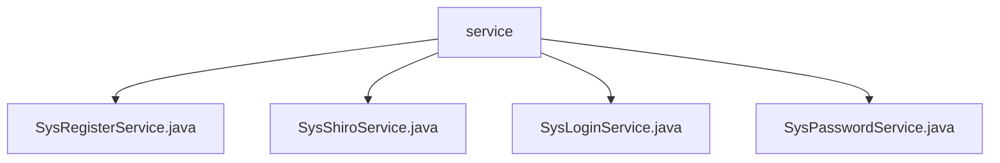

# 基础信息

|      |      |
|------|------|
| 编码语言 | .java |
| 代码路径 | RuoYi-framework/ruoyi-framework/src/main/java/com/ruoyi/framework/shiro/service |
| 包名 | RuoYi-framework.ruoyi-framework.src.main.java.com.ruoyi.framework.shiro.service |
| 概述说明 | 系统服务类负责用户注册、会话管理、登录流程和密码验证，确保安全性和数据完整性。 |

# 说明

SysRegisterService类负责用户注册功能，验证用户名、密码及验证码的合法性，确保用户名唯一性并对密码加密，保证注册过程安全性和数据完整性。SysShiroService类管理会话，提供删除、获取和创建会话功能，确保会话有效管理和维护。SysLoginService处理用户登录流程，验证用户名、密码及IP黑名单，设置角色权限并记录登录信息，确保登录安全性和准确性。SysPasswordService类管理密码验证流程，检查密码匹配并限制重试次数，确保系统安全性。

### 包内部结构视图

该流程图展示了`service`文件夹与其包含的四个Java文件之间的层级关系。`service`作为根节点，直接包含了`SysRegisterService.java`、`SysShiroService.java`、`SysLoginService.java`和`SysPasswordService.java`四个文件。这些文件都属于`service`目录下的服务类，用于处理与Shiro框架相关的功能。

# 文件列表 File List

| 名称   | 类型  | 说明 |
|-------|------|-------------|
| [SysPasswordService.java](SysPasswordService.md) | file | SysPasswordService类负责用户登录密码验证，含重试限制与匹配检查。 |
| [SysLoginService.java](SysLoginService.md) | file | SysLoginService处理登录，验证用户信息，设置权限并记录登录。 |
| [SysShiroService.java](SysShiroService.md) | file | SysShiroService类负责会话管理，具备删除、获取和创建会话功能。 |
| [SysRegisterService.java](SysRegisterService.md) | file | SysRegisterService类负责用户注册，验证用户名、密码及验证码，检查唯一性并加密密码。 |

