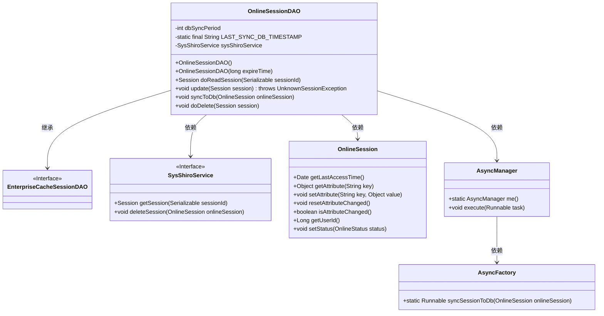

# 基础信息

|      |      |
|------|------|
| 编码语言 | .java |
| 代码路径 | RuoYi-framework/ruoyi-framework/src/main/java/com/ruoyi/framework/shiro/session/OnlineSessionDAO.java |
| 包名 | com.ruoyi.framework.shiro.session |
| 依赖项 | ['java.io.Serializable', 'java.util.Date', 'org.apache.shiro.session.Session', 'org.apache.shiro.session.UnknownSessionException', 'org.apache.shiro.session.mgt.eis.EnterpriseCacheSessionDAO', 'org.springframework.beans.factory.annotation.Autowired', 'org.springframework.beans.factory.annotation.Value', 'com.ruoyi.common.enums.OnlineStatus', 'com.ruoyi.framework.manager.AsyncManager', 'com.ruoyi.framework.manager.factory.AsyncFactory', 'com.ruoyi.framework.shiro.service.SysShiroService'] |
| 概述说明 | OnlineSessionDAO类管理会话同步与删除，支持配置同步周期，自动处理更新和过期。 |

# 说明

OnlineSessionDAO类负责管理会话的同步与删除功能，支持配置数据库同步周期，能够自动处理会话的更新与过期操作，确保会话数据的一致性和及时清理。

# 类列表 Class Summary

| 名称   | 类型  | 说明 |
|-------|------|-------------|
| OnlineSessionDAO | class | OnlineSessionDAO类管理会话同步与删除，支持数据库同步周期配置，自动处理会话更新与过期。 |

## 类 OnlineSessionDAO

|      |      |
|------|------|
| 访问范围 | public |
| 类型 | class |
| 名称 | OnlineSessionDAO |
| 说明 | OnlineSessionDAO类管理会话同步与删除，支持数据库同步周期配置，自动处理会话更新与过期。 |

### UML类图

这段代码定义了一个`OnlineSessionDAO`类，它继承自`EnterpriseCacheSessionDAO`接口，并实现了会话的读取、更新、同步到数据库以及删除等功能。`OnlineSessionDAO`依赖于`SysShiroService`来处理会话的获取和删除，依赖于`OnlineSession`来管理会话状态和属性，并通过`AsyncManager`和`AsyncFactory`实现异步同步会话到数据库的功能。代码通过周期性地检查会话的最后访问时间和属性变化来决定是否需要同步会话到数据库，并在会话过期或停止时删除会话。

### 内部方法调用关系图

```mermaid
graph TD
    A["类OnlineSessionDAO"]
    B["属性: int dbSyncPeriod"]
    C["常量: String LAST_SYNC_DB_TIMESTAMP"]
    D["属性: SysShiroService sysShiroService"]
    E["构造方法: OnlineSessionDAO()"]
    F["构造方法: OnlineSessionDAO(long expireTime)"]
    G["方法: Session doReadSession(Serializable sessionId)"]
    H["方法: void update(Session session)"]
    I["方法: void syncToDb(OnlineSession onlineSession)"]
    J["方法: void doDelete(Session session)"]
    K["调用: sysShiroService.getSession(sessionId)"]
    L["调用: super.update(session)"]
    M["调用: onlineSession.getAttribute(LAST_SYNC_DB_TIMESTAMP)"]
    N["调用: onlineSession.getLastAccessTime()"]
    O["调用: onlineSession.getUserId()"]
    P["调用: onlineSession.isAttributeChanged()"]
    Q["调用: onlineSession.setAttribute(LAST_SYNC_DB_TIMESTAMP, onlineSession.getLastAccessTime())"]
    R["调用: onlineSession.resetAttributeChanged()"]
    S["调用: AsyncManager.me().execute(AsyncFactory.syncSessionToDb(onlineSession))"]
    T["调用: onlineSession.setStatus(OnlineStatus.off_line)"]
    U["调用: sysShiroService.deleteSession(onlineSession)"]

    A --> B
    A --> C
    A --> D
    A --> E
    A --> F
    A --> G
    A --> H
    A --> I
    A --> J
    G --> K
    H --> L
    I --> M
    I --> N
    I --> O
    I --> P
    I --> Q
    I --> R
    I --> S
    J --> T
    J --> U
```

这段代码描述了一个`OnlineSessionDAO`类，继承自`EnterpriseCacheSessionDAO`，主要用于管理在线会话的数据库同步和删除操作。类中包含多个方法，如`doReadSession`用于读取会话，`syncToDb`用于同步会话到数据库，`doDelete`用于删除会话。代码通过`sysShiroService`与数据库进行交互，并在必要时更新会话状态和属性。

### 字段列表 Field List

| 名称  | 类型  | 说明 |
|-------|-------|------|
| dbSyncPeriod | int | Shiro会话数据库同步周期配置项。 |
| sysShiroService | SysShiroService | 自动注入SysShiroService服务实例。 |
| LAST_SYNC_DB_TIMESTAMP = OnlineSessionDAO.class.getName() + "LAST_SYNC_DB_TIMESTAMP" | String | 定义常量LAST_SYNC_DB_TIMESTAMP，值为OnlineSessionDAO类名加"LAST_SYNC_DB_TIMESTAMP"。 |

### 方法列表 Method List

| 名称  | 类型  | 说明 |
|-------|-------|------|
| doDelete | void | 覆盖doDelete方法，删除在线会话并设置状态为离线。 |
| update | void | 重写update方法，调用父类更新操作。 |
| doReadSession | Session | 重写方法，通过服务获取会话信息。 |
| syncToDb | void | 同步在线会话数据到数据库，根据时间差和会话变更判断是否需要同步。 |

