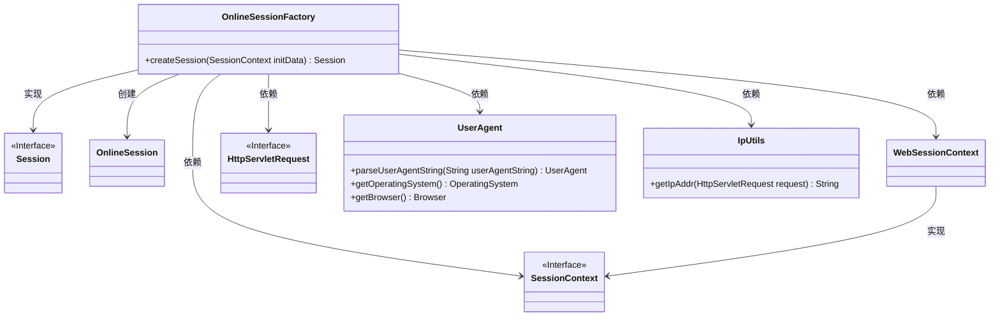
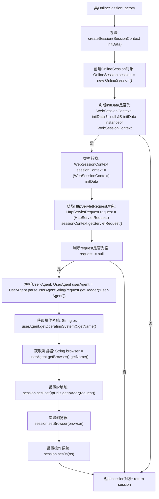

# 基础信息

|      |      |
|------|------|
| 编码语言 | .java |
| 代码路径 | RuoYi-framework/ruoyi-framework/src/main/java/com/ruoyi/framework/shiro/session/OnlineSessionFactory.java |
| 包名 | com.ruoyi.framework.shiro.session |
| 依赖项 | ['javax.servlet.http.HttpServletRequest', 'org.apache.shiro.session.Session', 'org.apache.shiro.session.mgt.SessionContext', 'org.apache.shiro.session.mgt.SessionFactory', 'org.apache.shiro.web.session.mgt.WebSessionContext', 'org.springframework.stereotype.Component', 'com.ruoyi.common.utils.IpUtils', 'eu.bitwalker.useragentutils.UserAgent'] |
| 概述说明 | OnlineSessionFactory实现SessionFactory接口，创建OnlineSession并设置客户端信息。 |

# 说明

OnlineSessionFactory类实现了SessionFactory接口，其主要功能是根据SessionContext创建OnlineSession实例。在创建过程中，该类会设置客户端的IP地址、浏览器类型以及操作系统信息，确保生成的OnlineSession对象包含完整的客户端环境数据。

# 类列表 Class Summary

| 名称   | 类型  | 说明 |
|-------|------|-------------|
| OnlineSessionFactory | class | OnlineSessionFactory类实现SessionFactory接口，根据SessionContext创建OnlineSession，并设置客户端IP、浏览器和操作系统信息。 |

## 类 OnlineSessionFactory

|      |      |
|------|------|
| 访问范围 | @Component;public |
| 类型 | class |
| 名称 | OnlineSessionFactory |
| 说明 | OnlineSessionFactory类实现SessionFactory接口，根据SessionContext创建OnlineSession，并设置客户端IP、浏览器和操作系统信息。 |

### UML类图

**描述：**  
`OnlineSessionFactory` 类实现了 `SessionFactory` 接口，负责创建 `OnlineSession` 对象。在 `createSession` 方法中，它接收 `SessionContext` 类型的参数，并检查是否为 `WebSessionContext` 类型。如果是，则进一步从 `HttpServletRequest` 中提取用户代理信息，并使用 `UserAgent` 和 `IpUtils` 类获取客户端操作系统、浏览器和IP地址，最终将这些信息设置到 `OnlineSession` 对象中并返回。

### 内部方法调用关系图

这段代码的流程图展示了`OnlineSessionFactory`类中`createSession`方法的执行流程。该方法首先创建一个`OnlineSession`对象，然后检查传入的`initData`是否为`WebSessionContext`类型。如果是，则进一步获取`HttpServletRequest`对象，并解析其中的`User-Agent`信息，提取客户端操作系统和浏览器信息，并将其设置到`session`对象中。最后，无论是否成功解析，都会返回`session`对象。

### 字段列表 Field List

| 名称  | 类型  | 说明 |
|-------|-------|------|

### 方法列表 Method List

| 名称  | 类型  | 说明 |
|-------|-------|------|
| createSession | Session | 创建会话时解析用户代理信息并设置客户端操作系统和浏览器。 |

