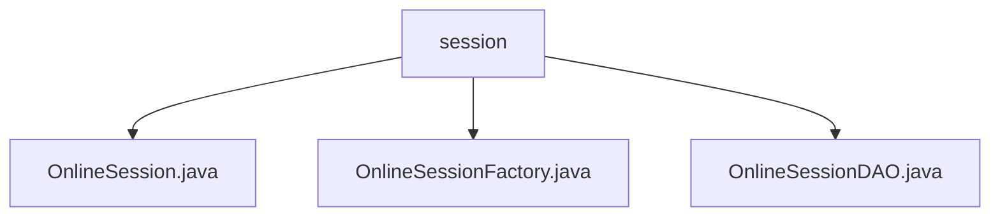

# 基础信息

|      |      |
|------|------|
| 编码语言 | .java |
| 代码路径 | RuoYi-framework/ruoyi-framework/src/main/java/com/ruoyi/framework/shiro/session |
| 包名 | RuoYi-framework.ruoyi-framework.src.main.java.com.ruoyi.framework.shiro.session |
| 概述说明 | OnlineSession类管理用户在线会话信息，包含用户、设备和状态数据。OnlineSessionFactory类根据SessionContext创建包含客户端环境数据的OnlineSession实例。OnlineSessionDAO类负责会话同步与删除，确保数据一致性和及时清理。 |

# 说明

OnlineSession类继承自SimpleSession类，包含用户ID、名称、部门、头像、IP地址、浏览器类型、操作系统信息、在线状态及属性变更标志等关键属性，用于全面管理用户的在线会话信息。OnlineSessionFactory类实现SessionFactory接口，根据SessionContext创建OnlineSession实例，并设置客户端IP、浏览器类型和操作系统信息，确保对象包含完整客户端环境数据。OnlineSessionDAO类负责会话的同步与删除，支持配置数据库同步周期，自动处理会话更新与过期，确保数据一致性和及时清理。

### 包内部结构视图

该流程图展示了RuoYi框架中`shiro`模块下的`session`目录及其包含的三个Java文件。`session`作为根节点，直接连接了`OnlineSession.java`、`OnlineSessionFactory.java`和`OnlineSessionDAO.java`三个文件，清晰地反映了这些文件在项目中的层级关系和依赖结构。

# 文件列表 File List

| 名称   | 类型  | 说明 |
|-------|------|-------------|
| [OnlineSessionDAO.java](OnlineSessionDAO.md) | file | OnlineSessionDAO类管理会话同步与删除，支持配置同步周期，自动处理更新和过期。 |
| [OnlineSessionFactory.java](OnlineSessionFactory.md) | file | OnlineSessionFactory实现SessionFactory接口，创建OnlineSession并设置客户端信息。 |
| [OnlineSession.java](OnlineSession.md) | file | OnlineSession继承SimpleSession，包含用户信息及在线状态。 |

