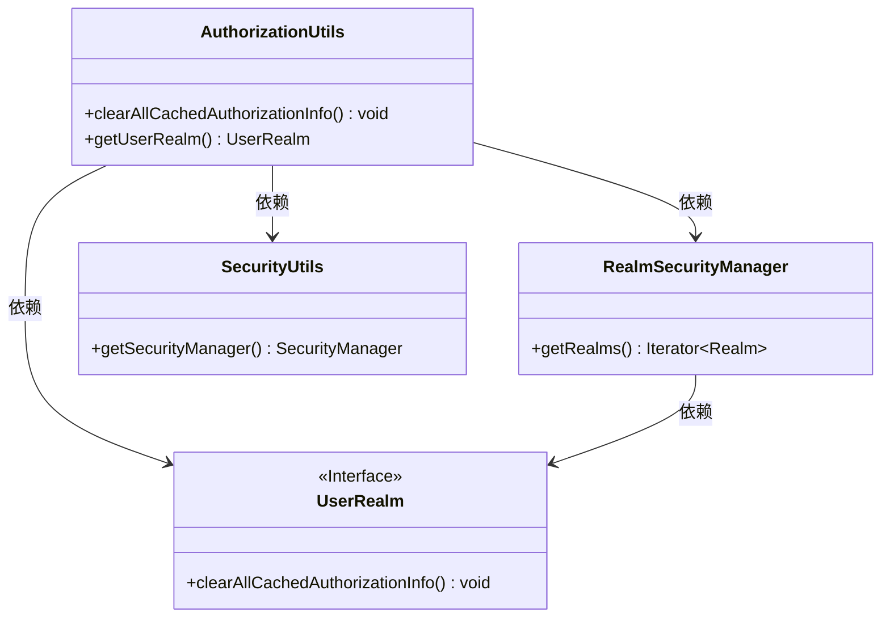
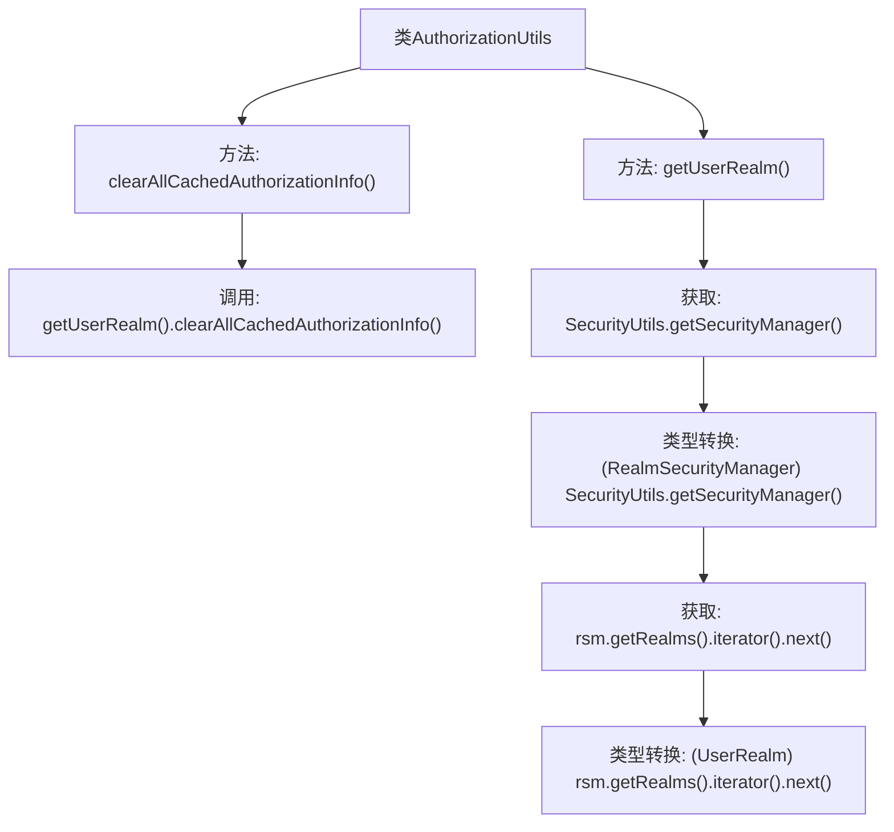

# 基础信息

|      |      |
|------|------|
| 编码语言 | .java |
| 代码路径 | RuoYi-framework/ruoyi-framework/src/main/java/com/ruoyi/framework/shiro/util/AuthorizationUtils.java |
| 包名 | com.ruoyi.framework.shiro.util |
| 依赖项 | ['org.apache.shiro.SecurityUtils', 'org.apache.shiro.mgt.RealmSecurityManager', 'com.ruoyi.framework.shiro.realm.UserRealm'] |
| 概述说明 | 清理用户授权缓存并获取自定义Realm。 |

# 说明

该描述涉及两个主要操作：清理用户授权缓存和获取自定义Realm。首先，清理用户授权缓存意味着删除或重置与用户权限相关的临时数据，以确保系统能够获取最新的授权信息。其次，获取自定义Realm表示从系统中提取或加载一个特定的、用户定义的Realm实例，通常用于身份验证和授权管理。这两个步骤共同确保了系统在处理用户权限时能够使用最新的配置和数据。

# 类列表 Class Summary

| 名称   | 类型  | 说明 |
|-------|------|-------------|
| AuthorizationUtils | class | 清理用户授权缓存并获取自定义Realm。 |

## 类 AuthorizationUtils

|      |      |
|------|------|
| 访问范围 | public |
| 类型 | class |
| 名称 | AuthorizationUtils |
| 说明 | 清理用户授权缓存并获取自定义Realm。 |

### UML类图

**描述：**  
`AuthorizationUtils` 类提供了清理用户授权信息缓存的功能。它通过 `getUserRealm` 方法获取自定义的 `UserRealm` 实例，并调用其 `clearAllCachedAuthorizationInfo` 方法来清理缓存。`getUserRealm` 方法依赖于 `RealmSecurityManager` 和 `SecurityUtils` 类来获取安全管理器和Realm实例。`UserRealm` 是一个接口，定义了清理缓存的方法。

### 内部方法调用关系图

这段代码定义了一个名为 `AuthorizationUtils` 的类，其中包含两个静态方法：`clearAllCachedAuthorizationInfo()` 和 `getUserRealm()`。`clearAllCachedAuthorizationInfo()` 方法通过调用 `getUserRealm()` 方法来获取 `UserRealm` 实例，并调用其 `clearAllCachedAuthorizationInfo()` 方法来清理所有用户授权信息缓存。`getUserRealm()` 方法通过 `SecurityUtils.getSecurityManager()` 获取安全管理器，并将其转换为 `RealmSecurityManager`，然后获取第一个 `Realm` 实例并转换为 `UserRealm`。

### 字段列表 Field List

| 名称  | 类型  | 说明 |
|-------|-------|------|

### 方法列表 Method List

| 名称  | 类型  | 说明 |
|-------|-------|------|
| clearAllCachedAuthorizationInfo | void | 清除所有缓存的授权信息。 |
| getUserRealm | UserRealm | 该方法获取安全管理器并返回第一个用户领域实例。 |

