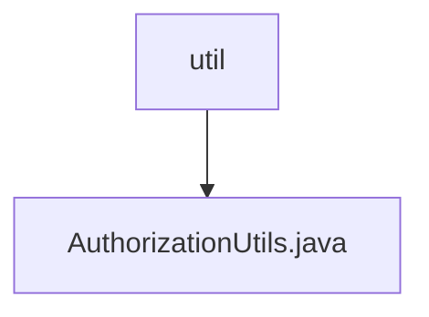

# 基础信息

|      |      |
|------|------|
| 编码语言 | .java |
| 代码路径 | RuoYi-framework/ruoyi-framework/src/main/java/com/ruoyi/framework/shiro/util |
| 包名 | RuoYi-framework.ruoyi-framework.src.main.java.com.ruoyi.framework.shiro.util |
| 概述说明 | 清理用户授权缓存并获取自定义Realm。 |

# 说明

该描述涉及两个主要操作：清理用户授权缓存和获取自定义Realm。首先，清理用户授权缓存意味着删除或重置与用户权限相关的临时数据，以确保系统能够获取最新的授权信息。其次，获取自定义Realm表示从系统中提取或加载一个特定的、用户定义的Realm实例，通常用于身份验证和授权管理。这两个步骤共同确保了系统在处理用户权限时能够使用最新的配置和数据。

### 包内部结构视图

该流程图展示了路径 `RuoYi-framework/ruoyi-framework/src/main/java/com/ruoyi/framework/shiro/util` 及其子文件 `AuthorizationUtils.java` 的层级关系。`util` 文件夹是父节点，`AuthorizationUtils.java` 是其子节点，表示文件位于该文件夹内。

# 文件列表 File List

| 名称   | 类型  | 说明 |
|-------|------|-------------|
| [AuthorizationUtils.java](AuthorizationUtils.md) | file | 清理用户授权缓存并获取自定义Realm。 |

