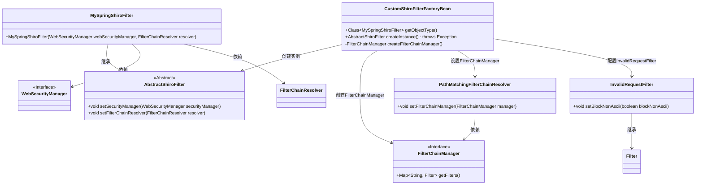
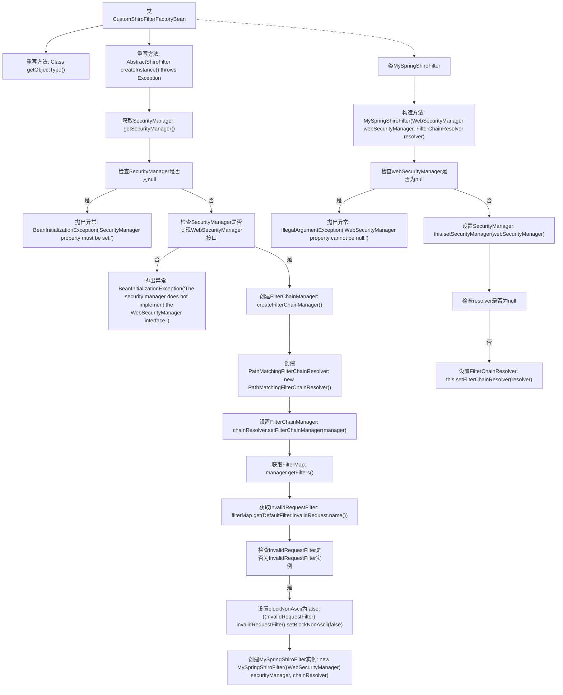

# 基础信息

|      |      |
|------|------|
| 编码语言 | .java |
| 代码路径 | RuoYi-framework/ruoyi-framework/src/main/java/com/ruoyi/framework/shiro/web/CustomShiroFilterFactoryBean.java |
| 包名 | com.ruoyi.framework.shiro.web |
| 依赖项 | ['org.apache.shiro.spring.web.ShiroFilterFactoryBean', 'org.apache.shiro.web.filter.InvalidRequestFilter', 'org.apache.shiro.web.filter.mgt.DefaultFilter', 'org.apache.shiro.web.filter.mgt.FilterChainManager', 'org.apache.shiro.web.filter.mgt.FilterChainResolver', 'org.apache.shiro.web.filter.mgt.PathMatchingFilterChainResolver', 'org.apache.shiro.web.mgt.WebSecurityManager', 'org.apache.shiro.web.servlet.AbstractShiroFilter', 'org.apache.shiro.mgt.SecurityManager', 'org.springframework.beans.factory.BeanInitializationException', 'javax.servlet.Filter', 'java.util.Map'] |
| 概述说明 | 扩展ShiroFilterFactoryBean，重写方法，确保SecurityManager正确设置并修复URL中文校验问题。 |

# 说明

CustomShiroFilterFactoryBean扩展了ShiroFilterFactoryBean，通过重写getObjectType和createInstance方法，确保SecurityManager能够正确设置，并解决了URL中文校验的bug。这一改进使得过滤器在处理包含中文字符的URL时能够正常工作，提升了系统的稳定性和兼容性。

# 类列表 Class Summary

| 名称   | 类型  | 说明 |
|-------|------|-------------|
| CustomShiroFilterFactoryBean | class | CustomShiroFilterFactoryBean扩展ShiroFilterFactoryBean，重写getObjectType和createInstance方法，确保SecurityManager正确设置并跳过URL中文校验bug。 |

## 类 CustomShiroFilterFactoryBean

|      |      |
|------|------|
| 访问范围 | public |
| 类型 | class |
| 名称 | CustomShiroFilterFactoryBean |
| 说明 | CustomShiroFilterFactoryBean扩展ShiroFilterFactoryBean，重写getObjectType和createInstance方法，确保SecurityManager正确设置并跳过URL中文校验bug。 |

### UML类图

这段代码展示了`CustomShiroFilterFactoryBean`类的实现，它继承自`ShiroFilterFactoryBean`，并重写了`getObjectType`和`createInstance`方法。`createInstance`方法负责创建并配置`MySpringShiroFilter`实例，确保`SecurityManager`和`FilterChainResolver`正确设置。`MySpringShiroFilter`是`AbstractShiroFilter`的子类，用于处理Shiro过滤器链的解析。代码中还涉及`FilterChainManager`、`PathMatchingFilterChainResolver`和`InvalidRequestFilter`等类，用于管理和配置过滤器链。

### 内部方法调用关系图

这段代码展示了`CustomShiroFilterFactoryBean`类如何重写`getObjectType`和`createInstance`方法，以及内部类`MySpringShiroFilter`的构造过程。`createInstance`方法负责创建`MySpringShiroFilter`实例，期间会检查`SecurityManager`的有效性，并设置`FilterChainResolver`。流程图清晰地描绘了从获取`SecurityManager`到最终创建`MySpringShiroFilter`实例的整个过程，包括异常处理和关键步骤的调用关系。

### 字段列表 Field List

| 名称  | 类型  | 说明 |
|-------|-------|------|

### 方法列表 Method List

| 名称  | 类型  | 说明 |
|-------|-------|------|
| getObjectType | Class<MySpringShiroFilter> | 重写getObjectType方法，返回MySpringShiroFilter类类型。 |
| createInstance | AbstractShiroFilter | 创建ShiroFilter实例，检查SecurityManager，处理FilterChain，解决中文URL校验问题。 |

