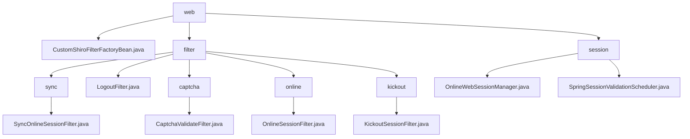

# 基础信息

|      |      |
|------|------|
| 编码语言 | .java |
| 代码路径 | RuoYi-framework/ruoyi-framework/src/main/java/com/ruoyi/framework/shiro/web |
| 包名 | RuoYi-framework.ruoyi-framework.src.main.java.com.ruoyi.framework.shiro.web |
| 概述说明 | SyncOnlineSessionFilter避免重复同步，LogoutFilter处理退出，CaptchaValidateFilter校验验证码，OnlineSessionFilter管理访问，KickoutSessionFilter控制会话数量，CustomShiroFilterFactoryBean解决URL中文校验，OnlineWebSessionManager增强会话管理，SpringSessionValidationScheduler定时验证会话。 |

# 说明

SyncOnlineSessionFilter类确保在线会话数据同步到数据库时，每次请求最多只进行一次同步，避免重复操作，提高效率和数据一致性。LogoutFilter处理用户退出功能，记录日志、清理缓存并重定向用户，确保退出过程安全和系统性能优化。CaptchaValidateFilter类负责验证码校验，支持配置启用状态和类型，提升系统安全性和用户体验。OnlineSessionFilter管理在线会话的访问控制，根据条件允许或拒绝请求，处理登录重定向。KickoutSessionFilter控制用户会话数量，超过限制时强制踢出会话并重定向用户，确保系统性能和用户体验。CustomShiroFilterFactoryBean扩展了ShiroFilterFactoryBean，通过重写getObjectType和createInstance方法，确保SecurityManager能够正确设置，并解决了URL中文校验的bug，提升了系统的稳定性和兼容性。OnlineWebSessionManager扩展了DefaultWebSessionManager，专注于管理在线会话属性并验证会话是否过期，增强了会话管理的灵活性和安全性，确保有效会话的及时清理。SpringSessionValidationScheduler类是一个定时验证会话有效性的工具，支持启用和禁用会话验证功能，允许用户配置和管理会话验证的调度，确保会话在设定时间间隔内进行有效性检查，维护系统安全性和稳定性，适用于需要定期验证会话的场景。

### 包内部结构视图

该流程图展示了RuoYi框架中Shiro模块的目录结构及其层级关系。`web`作为根节点，包含了`filter`、`session`以及`CustomShiroFilterFactoryBean.java`等子节点。`filter`节点下又细分为`sync`、`captcha`、`online`、`kickout`等子目录，每个子目录下包含相应的过滤器类。`session`节点下则包含了`OnlineWebSessionManager.java`和`SpringSessionValidationScheduler.java`两个类。

# 文件列表 File List

| 名称   | 类型  | 说明 |
|-------|------|-------------|
| [CustomShiroFilterFactoryBean.java](CustomShiroFilterFactoryBean.md) | file | 扩展ShiroFilterFactoryBean，重写方法，确保SecurityManager正确设置并修复URL中文校验问题。 |
| [session](session/_module.md) | package | OnlineWebSessionManager管理在线会话，验证过期；SpringSessionValidationScheduler定时验证会话，确保系统安全。 |
| [filter](filter/_module.md) | package | SyncOnlineSessionFilter同步在线会话数据，避免重复同步。LogoutFilter处理用户退出，清理缓存并重定向。CaptchaValidateFilter验证码校验，提升安全性。OnlineSessionFilter管理会话访问控制。KickoutSessionFilter限制会话数，确保性能。 |

