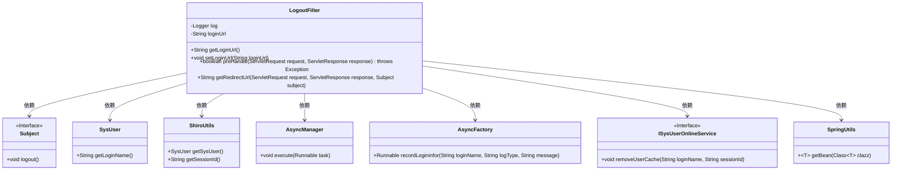

# 基础信息

|      |      |
|------|------|
| 编码语言 | .java |
| 代码路径 | RuoYi-framework/ruoyi-framework/src/main/java/com/ruoyi/framework/shiro/web/filter/LogoutFilter.java |
| 包名 | com.ruoyi.framework.shiro.web.filter |
| 依赖项 | ['javax.servlet.ServletRequest', 'javax.servlet.ServletResponse', 'org.apache.shiro.session.SessionException', 'org.apache.shiro.subject.Subject', 'org.slf4j.Logger', 'org.slf4j.LoggerFactory', 'com.ruoyi.common.constant.Constants', 'com.ruoyi.common.core.domain.entity.SysUser', 'com.ruoyi.common.utils.MessageUtils', 'com.ruoyi.common.utils.ShiroUtils', 'com.ruoyi.common.utils.StringUtils', 'com.ruoyi.common.utils.spring.SpringUtils', 'com.ruoyi.framework.manager.AsyncManager', 'com.ruoyi.framework.manager.factory.AsyncFactory', 'com.ruoyi.system.service.ISysUserOnlineService'] |
| 概述说明 | LogoutFilter实现用户退出，记录日志、清理缓存并重定向。 |

# 说明

LogoutFilter用于实现用户退出功能，其主要操作包括记录用户退出日志、清理相关缓存数据，并在处理完成后将用户重定向至指定的URL。该过滤器确保用户退出过程的安全性和完整性，同时优化系统性能。

# 类列表 Class Summary

| 名称   | 类型  | 说明 |
|-------|------|-------------|
| LogoutFilter | class | LogoutFilter实现用户退出功能，记录日志并清理缓存，重定向至指定URL。 |

## 类 LogoutFilter

|      |      |
|------|------|
| 访问范围 | public |
| 类型 | class |
| 名称 | LogoutFilter |
| 说明 | LogoutFilter实现用户退出功能，记录日志并清理缓存，重定向至指定URL。 |

### UML类图

这段代码定义了一个`LogoutFilter`类，继承自`org.apache.shiro.web.filter.authc.LogoutFilter`，用于处理用户退出登录的逻辑。`LogoutFilter`类包含了退出后重定向的地址`loginUrl`，并提供了`preHandle`方法用于处理退出请求。在`preHandle`方法中，首先获取当前用户，记录退出日志，清理缓存，然后执行退出操作。`LogoutFilter`类依赖多个其他类和接口，如`Subject`、`SysUser`、`ShiroUtils`、`AsyncManager`、`AsyncFactory`、`ISysUserOnlineService`和`SpringUtils`，分别用于用户管理、日志记录、缓存清理等操作。

### 内部方法调用关系图

```mermaid
graph TD
    A["类LogoutFilter"]
    B["属性: Logger log"]
    C["属性: String loginUrl"]
    D["方法: String getLoginUrl()"]
    E["方法: void setLoginUrl(String loginUrl)"]
    F["重写方法: boolean preHandle(ServletRequest request, ServletResponse response)"]
    G["重写方法: String getRedirectUrl(ServletRequest request, ServletResponse response, Subject subject)"]
    H["获取Subject: Subject subject = getSubject(request, response)"]
    I["获取重定向URL: String redirectUrl = getRedirectUrl(request, response, subject)"]
    J["获取系统用户: SysUser user = ShiroUtils.getSysUser()"]
    K["判断用户是否存在: if (StringUtils.isNotNull(user))"]
    L["记录用户退出日志: AsyncManager.me().execute(AsyncFactory.recordLogininfor(loginName, Constants.LOGOUT, MessageUtils.message('user.logout.success')))"]
    M["清理缓存: SpringUtils.getBean(ISysUserOnlineService.class).removeUserCache(loginName, ShiroUtils.getSessionId())"]
    N["退出登录: subject.logout()"]
    O["捕获SessionException: catch (SessionException ise)"]
    P["记录错误日志: log.error('logout fail.', ise)"]
    Q["重定向: issueRedirect(request, response, redirectUrl)"]
    R["捕获异常: catch (Exception e)"]
    S["记录错误日志: log.error('Encountered session exception during logout.  This can generally safely be ignored.', e)"]
    T["返回false: return false"]
    U["获取登录URL: String url = getLoginUrl()"]
    V["判断URL是否为空: if (StringUtils.isNotEmpty(url))"]
    W["返回URL: return url"]
    X["调用父类方法: return super.getRedirectUrl(request, response, subject)"]

    A --> B
    A --> C
    A --> D
    A --> E
    A --> F
    A --> G
    F --> H
    F --> I
    F --> J
    F --> K
    K --> L
    K --> M
    F --> N
    F --> O
    O --> P
    F --> Q
    F --> R
    R --> S
    F --> T
    G --> U
    G --> V
    V --> W
    V --> X
```

**描述：**  
`LogoutFilter`类继承自`org.apache.shiro.web.filter.authc.LogoutFilter`，用于处理用户退出登录的逻辑。它包含两个主要方法：`preHandle`和`getRedirectUrl`。`preHandle`方法负责执行退出登录的操作，包括获取当前用户、记录退出日志、清理缓存、执行退出操作，并在发生异常时记录错误日志。`getRedirectUrl`方法用于确定退出后重定向的URL，如果未指定则调用父类方法获取默认URL。整个流程通过流程图清晰地展示了各个步骤的执行顺序和逻辑关系。

### 字段列表 Field List

| 名称  | 类型  | 说明 |
|-------|-------|------|
| loginUrl | String | 定义了一个私有字符串变量loginUrl。 |
| log = LoggerFactory.getLogger(LogoutFilter.class) | Logger | LogoutFilter类中定义了一个私有的静态日志记录器。 |

### 方法列表 Method List

| 名称  | 类型  | 说明 |
|-------|-------|------|
| setLoginUrl | void | 设置登录URL的方法。 |
| getLoginUrl | String | 获取登录URL的公共方法。 |
| preHandle | boolean | 用户退出时记录日志、清理缓存并重定向。 |
| getRedirectUrl | String | 重写方法获取重定向URL，优先使用登录URL，否则调用父类方法。 |

