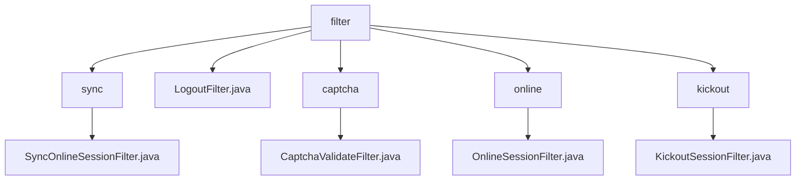

# 基础信息

|      |      |
|------|------|
| 编码语言 | .java |
| 代码路径 | RuoYi-framework/ruoyi-framework/src/main/java/com/ruoyi/framework/shiro/web/filter |
| 包名 | RuoYi-framework.ruoyi-framework.src.main.java.com.ruoyi.framework.shiro.web.filter |
| 概述说明 | SyncOnlineSessionFilter同步在线会话数据，避免重复同步。LogoutFilter处理用户退出，清理缓存并重定向。CaptchaValidateFilter验证码校验，提升安全性。OnlineSessionFilter管理会话访问控制。KickoutSessionFilter限制会话数，确保性能。 |

# 说明

SyncOnlineSessionFilter类确保在线会话数据同步到数据库时，每次请求最多只进行一次同步，避免重复操作，提高效率和数据一致性。LogoutFilter处理用户退出功能，记录日志、清理缓存并重定向用户，确保退出过程安全和系统性能优化。CaptchaValidateFilter类负责验证码校验，支持配置启用状态和类型，提升系统安全性和用户体验。OnlineSessionFilter管理在线会话的访问控制，根据条件允许或拒绝请求，处理登录重定向。KickoutSessionFilter控制用户会话数量，超过限制时强制踢出会话并重定向用户，确保系统性能和用户体验。

### 包内部结构视图

该流程图展示了RuoYi框架中shiro模块的web过滤器结构。根节点为`filter`，其下包含多个子节点，分别表示不同类型的过滤器。每个子节点进一步细化，展示了具体的过滤器实现类。整体结构清晰，层级关系明确，便于理解各个过滤器的分类和实现。

# 文件列表 File List

| 名称   | 类型  | 说明 |
|-------|------|-------------|
| [LogoutFilter.java](LogoutFilter.md) | file | LogoutFilter实现用户退出，记录日志、清理缓存并重定向。 |
| [kickout](kickout/_module.md) | package | KickoutSessionFilter类管理用户会话，超限时踢出并重定向。 |
| [online](online/_module.md) | package | OnlineSessionFilter类管理在线会话访问，处理请求和登录重定向。 |
| [captcha](captcha/_module.md) | package | CaptchaValidateFilter类负责验证码验证，支持启用状态和类型设置，处理表单提交时的验证码校验。 |
| [sync](sync/_module.md) | package | SyncOnlineSessionFilter类用于同步在线会话数据，确保每次请求最多同步一次。 |

